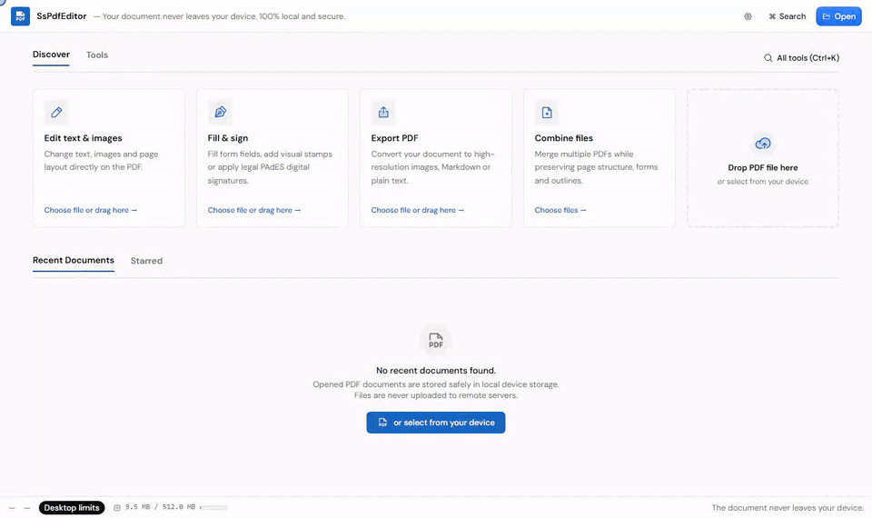
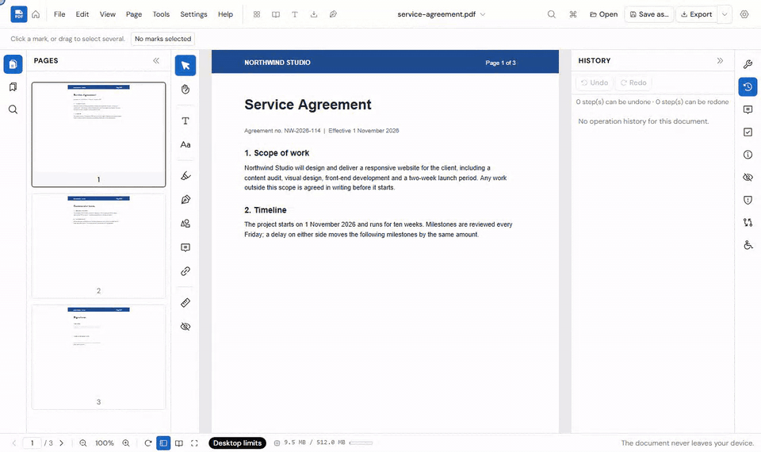
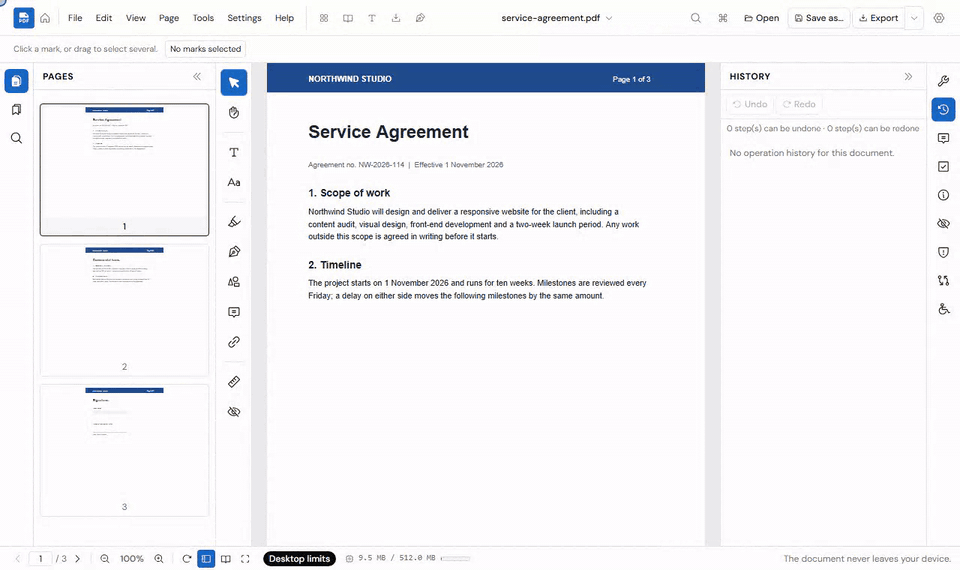
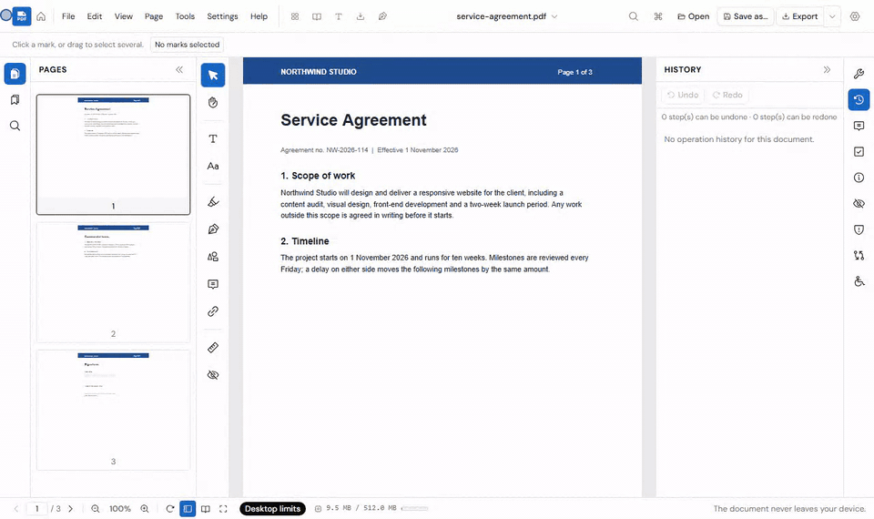
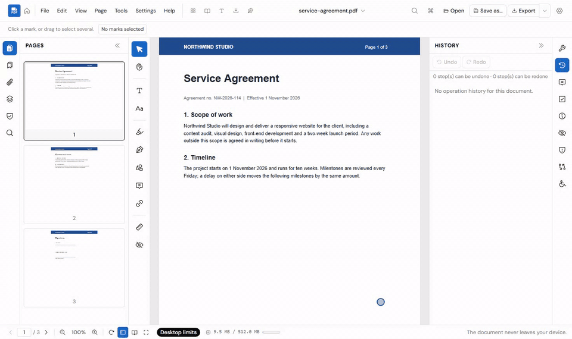
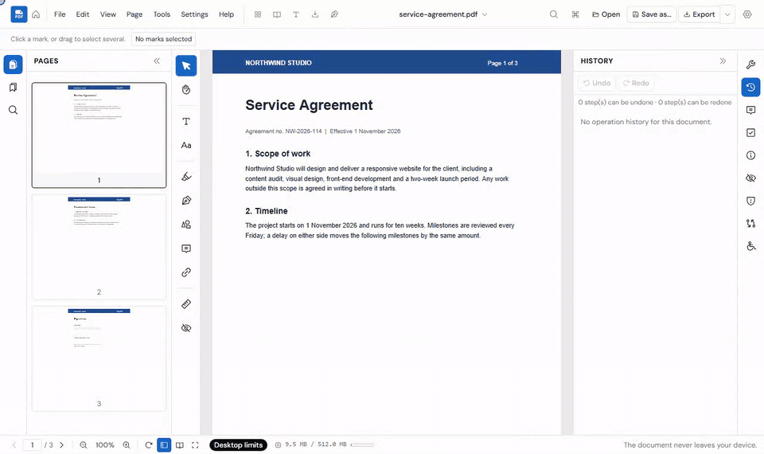
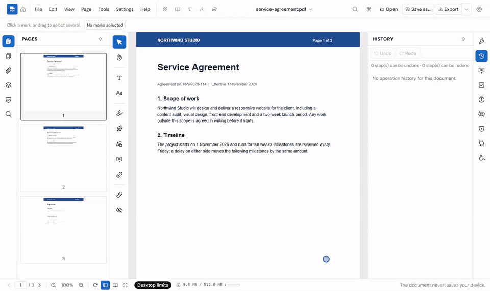
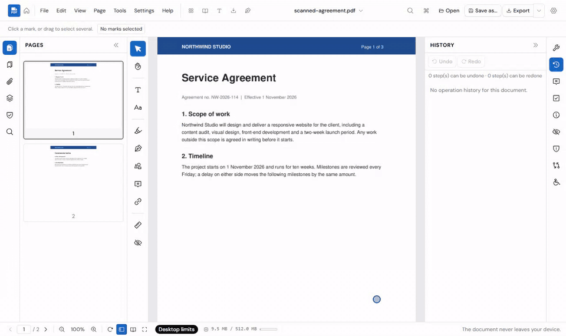
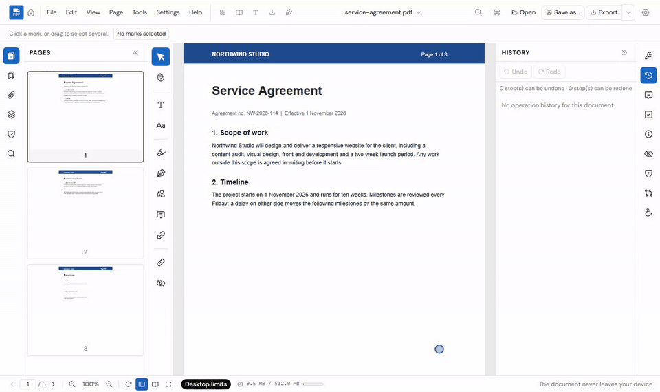
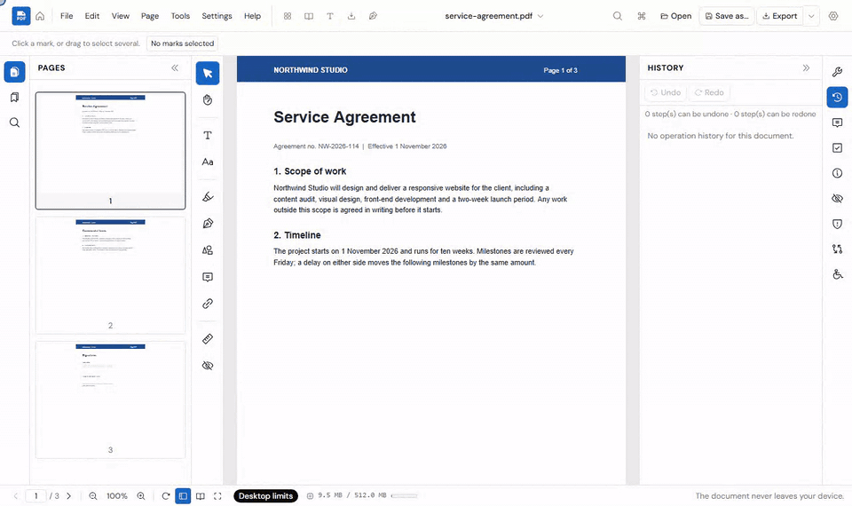

<div align="center">


<h1>SsPdfEditor</h1>

<p><b>A free PDF editor that runs entirely in your browser.</b><br>
Edit, sign, redact and OCR your PDFs — the file never leaves your device.</p>

<p>


</p>

<p><a href="https://pdf.isolmaz.com/editor/"><b>Open the editor</b></a> · <a href="https://pdf.isolmaz.com/">Website</a> · <a href="#quick-start">Run locally</a> · <a href="https://github.com/isolmaz/ss-pdf-editor/issues/new/choose">Report a bug</a></p>

</div>

---

## Features

| | |
| :---: | :---: |
| **Open, navigate, zoom** — thumbnails, outline, tabs<br> | **Search** — every match, across pages<br> |
| **Mark up** — highlight, shapes, ink, typed text<br> | **Edit text** — retype a paragraph in place<br> |
| **Organise pages** — rotate, reorder, undo<br> | **Watermark** — stamp every page<br> |
| **Fill and sign** — forms and PAdES signatures<br> | **Protect** — AES-256 password and permissions<br> |
| **Redact for real** — content removed, then verified gone<br> | **OCR** — make a scan searchable<br> |
| **Measure** — distance, perimeter, area<br> | **Compare** — what changed between two versions<br> |
| **Reading mode** — the page as clean text, read aloud<br> | **Dark theme, Turkish and English**<br> |
| **Command palette and export** — `Ctrl+K` finds any tool<br> | **And more** — see the full list below ⬇️ |

### Everything it can do

| | |
| --- | --- |
| 📖 **Read** | Continuous scroll · search · thumbnails · outline · tabs · recent files · book and presentation modes · magnifier · snapshot · reading mode with read-aloud |
| ✏️ **Annotate** | Highlight · underline · strike-out · squiggly · ink · shapes · notes · stamps · typed text · links · images · move, rotate, resize and delete any mark |
| 📝 **Forms** | Fill · create fields · flags · flatten · calculations · FDF/JSON import and export |
| 📄 **Pages** | New blank document · insert · delete · duplicate · reorder · rotate · extract · split · replace · merge (several files, in any order) · page boxes and auto-crop · labels |
| 🔤 **Text** | Edit in place with reflow · export as text or Markdown · pages to images · images to PDF · Word, Excel, PowerPoint, HTML, text, CSV and EPUB to PDF |
| 🗂️ **Structure** | Outline · attachments · layers · properties and XMP · header/footer · Bates numbering · watermark |
| 🔐 **Security** | True redaction with an audit · AES-256 encryption · remove a password · drawn, typed or photographed signatures and initials · PAdES signing · signature verification |
| 🧰 **Tools** | OCR (TR/EN) · accessibility check and tagging · alt text · text and pixel comparison · batch processing · compression |
| 🖨️ **Print** | Page ranges · N-up · booklet · poster · duplex sheets |
| ⚙️ **Workflow** | Home screen with every tool by task · `Ctrl+K` palette · undo/redo history · local drafts · save over the original or export a copy · simple and advanced modes · offline |

## Quick start

You need **Node ≥ 26** and **pnpm 9.15.9**.

```bash
pnpm install --frozen-lockfile
pnpm fetch:engines --sync   # copies the pinned engines from the pnpm store (no CDN)
pnpm dev                    # http://localhost:5173
```

---

## Contents

1. [Features in detail](#features-in-detail)
2. [Privacy and security](#privacy-and-security)
3. [Document limits](#document-limits)
4. [Honest limits](#honest-limits)
5. [Development](#development)
6. [Quality gates](#quality-gates)
7. [Build and deploy](#build-and-deploy)
8. [Offline use](#offline-use)
9. [Contributing](#contributing)
10. [License](#license)

---

## Features in detail

Every capability below is implemented in this repository. You can reach each one from the
UI: the menu bar, the `Ctrl+K` palette, the tool rail, the docks or the home screen.

### Reading and navigation

- **Home screen.** *Start* opens a PDF (or several, each in its own tab), creates a blank
  document, builds a PDF from images, merges several PDFs in the order you choose or starts
  a batch run, and lists recent documents with search, sorting and stars. *All tools* lays
  every tool out by task; pick a tool first and the editor asks for the file when the tool
  needs one.
- **Viewer.** pdf.js's own viewer stack drives continuous virtualised scrolling, text
  selection and search with match highlighting.
- **View modes.** You get single-page, book and full-screen presentation modes, a
  magnifier lens, and a snapshot tool that combines the visible pages into one PNG.
- **Reading mode.** The page is shown as a text column. Read-aloud uses only speech voices
  installed on the device.
- **Navigation aids.** Thumbnails, the outline and document tabs. The recent-files list
  reopens a document by its identity, never by its file name. In Chromium-based browsers it
  reopens the file itself (the browser asks for permission again); elsewhere it asks you to
  choose the file.
- **The document never moves under you.** Marks, selections, measurements and staged
  redactions scroll and zoom with their page. Tools, progress and notices never shift
  the page.
- **Password-protected files.** The editor asks for the password and opens the file
  read-only. "Create unlocked copy" opens an editable copy in a new tab, and the password
  is kept in memory only.
- **Shortcut list.** It is available in both languages from Help or `Ctrl+K`, even with no
  document open. The list is the binding table itself, so every chord it prints works.

### Annotating, forms, measuring

- **Markup.** Highlight (selected text or freehand), ink, notes, stamps, underline,
  strike-out, squiggly and geometric shapes are all available.
- **Add text.** Click and type. The text is written as a `/FreeText` annotation with
  embedded Noto Sans, so Turkish letters survive in every reader. It stays upright on
  rotated pages.
- **One tool rail.** The rail holds every canvas tool: select, hand, edit text, add text,
  markup, ink, shapes, note, link, measure and redact.
  - The rail, menus, palette, context menu and keyboard all share one armed tool.
  - Text you selected before arming a markup tool is marked at once.
- **One selection for every mark.** This covers session marks, measurements, staged
  redactions and annotations already in the file.
  - Select by clicking, with a marquee or with `Ctrl+A`.
  - Then delete, rotate 90°, drag, or nudge by 5 pt. Every edit can be undone.
  - Selection deletes whole marks only, never page content. To remove page content
    securely, use redaction.
- **Style.** The app sets colour, opacity, thickness and author. Multiply blending keeps
  text readable, and freehand strokes stay continuous in the exported file.
- **Operations in two steps.** Every operation opens in the tools panel. First you set it
  up, then *Preview* runs it and shows a report. The report's own button applies the
  result. Pop-up windows are used only for decisions that block, such as a password,
  unsaved changes, a signature warning, export, print or settings.
- **Save versus Export.** *Save* writes over the file you opened; this needs Chromium
  and its File System Access API. *Export* always downloads a copy. Firefox and Safari
  offer Export only.
- **Forms.** The editor lists the AcroForm fields. You can create fields, set flags,
  flatten them and add simple calculations. Form data can be imported or exported as FDF
  or JSON; exporting downloads only the data file.
- **Measurement.** Measure distance, perimeter and area with a scale, units, a grid and
  snapping. The results are written as real PDF annotations.
- **Small screens.** Below 1024 px both docks start collapsed and reopen as overlays.

### Pages and structure

- **Page operations.** Insert, delete, duplicate, reorder, rotate, extract, split, replace
  and merge.
  - A new document starts as blank pages of A3, A4, A5, Letter or Legal, in either
    orientation.
  - Merging several files builds a new document in the order you set; its metadata comes
    from the first file, and the report says so.
  - Composition goes through pdf.js `extractPages`, so outlines, form fields and page
    labels travel with the pages.
- **Page boxes.** You can edit the Media, Crop, Trim, Bleed and Art boxes. Auto-crop sets
  the box from the ink bounds.
- **Structure.**
  - Page labels.
  - Outline editing.
  - Links, limited by a URI allow-list.
  - Attachments.
  - Layers (OCG).
  - Header and footer, Bates numbering and watermarks.
- **Printing.** N-up, booklet and poster imposition, plus a duplex print-sheet builder.
- **Compression.** There are two modes: a structural re-save, or rasterising the images.
  If the file grows, the report says so.

### Text

- **Text editing with reflow.** Pick a text block and retype it. The editor removes the
  original glyphs and draws the new text in the same box.
  - Editability is measured per block first.
  - A block that cannot be reproduced faithfully is marked **not editable**.
- **Export and import.** Export text as plain text or Markdown. Export pages as images, or
  build a PDF from images.
- **Other documents to PDF.** DOCX, XLSX, PPTX, HTML, TXT/MD, CSV/TSV, EPUB and FB2 are
  converted in the browser by MuPDF's layout engine. The result is real text you can select
  and search.
  - Opening or dropping such a file converts it and opens the PDF in a new tab; a dropped
    image opens as a PDF page. **File → Convert to PDF** offers the page size, orientation
    and margin, and joins several files into one PDF in the order you set.
  - Word goes through mammoth: headings, lists, tables, links and images. Each Excel sheet
    becomes a table of its used range, and each slide becomes a page of the slide's size
    with its text, tables and pictures in reading order.
  - Headings become the outline. `http:`, `https:` and `mailto:` links and links inside the
    document become link annotations. The title comes from the file or its name.
  - Text and CSV that are not UTF-8 are read as Windows-1254, and the report says so.

### Redaction, security, signing

- **True redaction.**
  - Marks become MuPDF redaction annotations, and `applyRedactions` removes the glyphs.
  - The file is then rewritten with `garbage=compact,compress,clean`, and the output is
    re-checked glyph by glyph.
  - An object-level audit reports any remaining terms, earlier revisions and leftover
    structure.
  - A staged mark stays an intent until you apply it. Saving while marks are still staged
    is refused.
- **Encryption.** AES-256 with permission bits; the output is re-opened and verified. The
  encrypted copy is downloaded, not applied to the open document.
- **Simple signatures and images.** Draw a signature, type your name in one of two
  handwriting faces, or take it from a photo of a signature on paper (the paper is made
  transparent). Choose signature or initials and black, blue or navy ink, then click where
  it goes on the page.
  - It is written into the file at once as a `/Stamp` annotation with an image
    appearance, as one step that undo takes back. It stays upright on turned pages.
  - **Add an image** places a PNG, JPEG, WebP, GIF or BMP the same way; transparency is
    kept, and a JPEG that needs no turn or shrink keeps its own bytes.
  - Select a placed picture to move or turn it, or resize it from a corner handle (or the
    arrow keys on a focused handle). Resizing changes only `/Rect`; the image is not
    re-encoded.
  - **Remember on this device** is off by default. When ticked, the picture stays in this
    browser's local storage only, and every saved entry can be deleted from the dialog.
- **Signing.** PAdES B-B from a PKCS#12 identity, with a visible stamp.
  - The verdict has four separate parts: integrity, trust, revocation and coverage.
  - Trust is checked only against certificates you imported.

### OCR, accessibility, comparison, batch

- **OCR.** Turkish and English recognition adds an invisible, selectable text layer with a
  real `/ToUnicode` map. Pages that already have text are skipped by default.
- **Accessibility.**
  - The check reports facts only: no score and no conformance claim.
  - A tagged-PDF writer adds structure tags to the file and verifies the result.
  - `/Alt` and `/TU` writers set descriptions for images and form fields.
- **Comparison.** Compare two documents by text or by pixels; the report always says which
  method it used.
- **Batch.** Run one ordered set of steps over many files, with a report for each file.

---

## Privacy and security

These describe how the build works; they are not promises.

- **No document bytes leave the device.** There is no upload path and no server API. The
  deployed Worker serves static files only.
- **No third-party requests.**
  - Every engine and font is served from this origin, pinned by SHA-256 in
    [`tools/asset-pins.json`](tools/asset-pins.json).
  - The CSP sets `connect-src 'self'`.
- **A strict CSP from one source of truth.** [`public/_headers`](public/_headers) sets:
  - `default-src 'self'`;
  - `script-src 'self' 'wasm-unsafe-eval'`, with no `'unsafe-inline'` and no `'unsafe-eval'`;
  - `style-src 'self' 'unsafe-inline'`, the only relaxation, needed because marks are
    positioned with inline styles;
  - `object-src 'none'`, `base-uri 'none'`, `form-action 'none'` and
    `frame-ancestors 'none'`;
  - `nosniff`, `Referrer-Policy: no-referrer`, a deny-all `Permissions-Policy` and HSTS.

  The dev and preview servers apply the same file. The dev server adds only
  `'unsafe-inline'` for scripts, for React refresh, and logs that it does.
- **Cross-origin isolation.** `/editor/*` is served with
  `Cross-Origin-Opener-Policy: same-origin` and `Cross-Origin-Embedder-Policy: require-corp`.
  The e2e suite runs under exactly these headers.
- **The service worker caches static assets only.** It never stores document bytes.
- **Drafts stay local.** Unsaved work is kept in the origin-private file system (OPFS).
  - A **sensitive session** saves nothing; any document opened with a password starts one.
  - The recent list keeps the file name, size and page count in `localStorage`. In
    Chromium it also keeps a *handle* to the file in IndexedDB — a reference the browser
    asks permission for again, never the file's bytes. A sensitive session keeps no handle.
  - A signature picture is kept only when you tick **Remember on this device**: in
    `localStorage`, at most six, each deletable from the signature dialog. A sensitive
    session does not offer it.
  - Cleanup refuses to delete anything when it cannot fully read which drafts are in use.
- **Deleting a draft is not secure erasure.** It does not overwrite the bytes on disk, and
  the UI never claims that it does.

---

## Document limits

The limits are defined once, in
[`packages/shared/src/limits.ts`](packages/shared/src/limits.ts):

| | Desktop | Mobile |
|---|---|---|
| Warn above | 1 500 pages | — |
| Hard ceiling | 2 000 pages / 300 MB | 2 000 pages / 300 MB |
| Viewing-only above | — | 300 pages / 64 MB |
| Render cache | 512 MB | 128 MB |

- **Viewing-only.** Above this threshold the document still opens and renders, but editing
  is disabled and the UI says why.
- **Undo history.** Kept snapshots are limited to `max(3 × file size, 64 MB)`. The two
  newest versions are always kept, and an evicted step is shown as **unavailable**.
- **Build budgets.**
  - ≤ 250 KiB gzip for the first-paint JavaScript.
  - ≤ 60 KiB for the landing page.
  - ≤ 25 MiB per asset.

---

## Honest limits

- **Converting to PDF.**
  - The conversion keeps a document's content, not its exact look. Page layout, fonts,
    headers and footers are not reproduced. Neither are slide positions and themes, or
    spreadsheet formatting, column widths and charts. Formulas show their saved result.
    Each report says what was approximated.
  - The old binary DOC, XLS and PPT formats, OpenDocument and RTF are not converted, and the
    app says so.
  - An HTML page's stylesheets and images on the internet are not loaded.
- **Simple signatures.** A drawn, typed or photographed signature is a picture on the page,
  not a certified digital signature: it proves nothing about who signed or whether the
  document changed afterwards. The dialog says so; use certificate signing for that.
- **Signing.**
  - Only PAdES B-B is supported: no RFC 3161 timestamp, and no revocation check, since
    there is no network. Revocation is therefore always reported `indeterminate`.
  - An empty trust store reports `not-checked`.
  - RFC 5280 policy processing is not implemented.
  - Supported keys are RSA PKCS#1 v1.5 and ECDSA P-256/384/521, with SHA-256/384/512.
- **Accessibility.**
  - There is no PDF/UA claim.
  - The check does not evaluate reading order, tables, lists, contrast, font embedding or
    alt-text quality.
  - A document that already has a structure tree is not re-tagged.
- **Redaction audit.**
  - The audit scans raw bytes, so it cannot see inside compressed streams or object
    streams.
  - It says so, and when object streams are present it skips the orphan-object verdict.
- **Deleting marks.** Only annotations are deleted, never page content. A deletion rewrites
  the file and can be undone. It is not a forensic scrub.
- **Typed text.** Each save that adds typed text embeds the full Noto Sans font (about
  630 KB), without subsetting. A reader that ignores `/AP` falls back to Helvetica.
- **Protected documents.** These are read-only. To edit one, make an explicit unlocked copy.
- **Text editing.** Only horizontal text is editable. Vertical text, skewed baselines and
  Type3 text are not. Unknown fonts are re-rendered in a substitute font, and the UI says
  so.
- **Drafts.** Drafts carry a schema version. A draft from an older schema is skipped, and a
  malformed journal makes the whole draft unreadable on purpose.
- **Early engine spikes.** Some code comments mention a measurement from an *early engine
  spike*. That prototype was removed before the public release, and each comment states
  what was measured.

---

## Development

### Commands

| Command | What it does |
|---|---|
| `pnpm dev` | Vite dev server for the editor (`pnpm --filter site dev` for the landing, port 5175) |
| `pnpm build` | Builds the landing (`apps/site/dist`), then the editor (`apps/web/dist`) |
| `pnpm assemble:dist` | Composes the deployable `dist/` |
| `pnpm preview` | Serves `dist/` under the production headers (port 4178) |
| `pnpm typecheck` | `tsc -b` over the workspace |
| `pnpm lint` / `check` / `format` | Biome: lint / lint and format check / format write |
| `pnpm unit` | Vitest, then the non-vacuity guard, then the source-level regressions |
| `pnpm e2e` | Playwright against the assembled `dist/` (the signing specs need `openssl`) |
| `pnpm measure:model` | Journal and snapshot measurements (not a gate) |
| `pnpm fetch:engines [--sync\|--update]` | Copies engine binaries from the pnpm store and checks or rewrites the pins |
| `pnpm verify:assets` | Re-hashes every pinned file |
| `pnpm check:licenses` | Dependency licence audit |
| `pnpm audit:regressions` / `audit:model-types` | Regression harness / strict typecheck of the DOM-free modules |
| `pnpm ci:verify` / `ci:full` | The full local gate / the same plus the behaviour harnesses |
| `pnpm worker:deploy[:dry]` | `assemble:dist`, then `wrangler deploy` |

Engine binaries are never committed, and the pre-commit hook blocks them. On a fresh
clone, `pnpm fetch:engines --sync` is therefore required.

### Repository layout

```
apps/
  web/          the editor PWA (served at /editor/)
  site/         landing and legal pages (static HTML, TR + EN)
packages/
  shared/       error contract, limits, i18n (Turkish and English)
  model/        session store, operation journal, drafts, save router
  core/         engine adapters (pdf.js, MuPDF, Tesseract) and every operation
  text-engine/  text model, editability, reflow, fonts
  ui/           React surfaces: viewer, panels, dialogs, tools, printing
public/         _headers, sw.js, 404, manifest, robots/sitemap
tools/          dist assembly, engine pins, licence audit, regression harness,
                git hooks, behaviour checks (spikes/), README clip recorder
e2e/            Playwright specs for the editor flows and the site
docs/media/     the README clips
.github/        issue and pull request templates (no workflows)
```

---

## Quality gates

All gates run locally; the repository has no GitHub Actions workflow.

- **`pnpm ci:verify`** runs these steps in order:
  1. `install --frozen-lockfile`
  2. `typecheck`
  3. `check`
  4. `unit`
  5. `audit:model-types`
  6. `build`
  7. `fetch:engines --sync`
  8. `verify:assets`
  9. `check:licenses`
  10. `assemble:dist`
- **`pnpm ci:full`** adds `ci:behavior`:
  - `tools/spikes/phase3-check.mjs` runs the acceptance sentence end to end in a real
    browser. That sentence is: open, search, highlight, comment, fill a form, delete two
    pages and add one, add a header and footer, save, reopen.
  - `tools/spikes/phase4-check.mjs` runs a text-edit round trip and reads the produced
    bytes back.
  - `tools/spikes/sign-check.mts` signs with an OpenSSL identity, including a one-byte
    tamper case that must break the verdict.
- **`pnpm unit`** is a gate, not a report:
  - [`require-tests.mjs`](tools/audit/require-tests.mjs) fails the run if no tests were
    found.
  - [`regressions.cjs`](tools/audit/regressions.cjs) runs browser-free checks over the
    real sources.
- **Saves are verified.**
  - Save and Export stay disabled until the inspection of the current version has
    answered.
  - Each write is checked against twelve declared facts.
  - A fact that cannot be checked is reported `unverified` or `degraded`, never folded into
    "verified".

---

## Build and deploy

`pnpm assemble:dist` produces exactly what is uploaded:

| Source | Lands at |
|---|---|
| `apps/site/dist` | `dist/` root (landing, legal pages, `/en/`) |
| `apps/web/dist` | `dist/editor/` |
| `public/` | `dist/` root (`_headers`, `sw.js`, `404.html`, manifest, `engines/**`, `fonts/**`) |

The same step also does the following:

- writes `dist/offline-manifest.json`;
- stamps the service-worker version;
- copies `LICENSE` and every bundled licence text into `dist/licenses/`, indexed by
  `INDEX.json`.

A missing licence or version placeholder stops the build.

Deployment is a Cloudflare Worker that serves `dist/` as static assets
([`wrangler.jsonc`](wrangler.jsonc)). There are no Functions, no SSR and no database.

```bash
pnpm build && pnpm assemble:dist
pnpm worker:deploy          # npx --yes wrangler@4.135.0 deploy
pnpm worker:deploy:dry      # same, with --dry-run
```

---

## Offline use

- **Scope.** `public/sw.js` is scoped to `/editor/` and caches static assets only.
- **On request only.** Precaching runs only when you ask for it, in Settings → Offline use.
  It covers the shell, pdf.js, MuPDF and the fonts. OCR is not included.
- **Readiness.** It is checked path by path. A half-downloaded pack is reported as
  `missing`, with the missing paths named.
- **Release isolation.** The cache name carries a release identity, so a new release never
  reads an older cache.

---

## Contributing

Issues and pull requests are welcome. Start with [`CONTRIBUTING.md`](CONTRIBUTING.md) and
the [Code of Conduct](CODE_OF_CONDUCT.md). Report security problems privately, as described
in [`SECURITY.md`](SECURITY.md). For the internal design, see
[`architecture.md`](architecture.md).

---

## License

SsPdfEditor
Copyright (C) 2026 isolmaz <info@isolmaz.com>

This program is free software: you can redistribute it and/or modify it under the terms of
the GNU Affero General Public License as published by the Free Software Foundation, either
version 3 of the License, or (at your option) any later version. It is distributed in the
hope that it will be useful, but WITHOUT ANY WARRANTY; without even the implied warranty of
MERCHANTABILITY or FITNESS FOR A PARTICULAR PURPOSE. See [`LICENSE`](LICENSE) for the full
text.

The project must use AGPL-3.0-or-later because the distribution ships MuPDF, which is
licensed AGPL-3.0-or-later. The editor's **Help → Source code (AGPL-3.0)** command links
to this repository, as section 13 of the licence requires.
