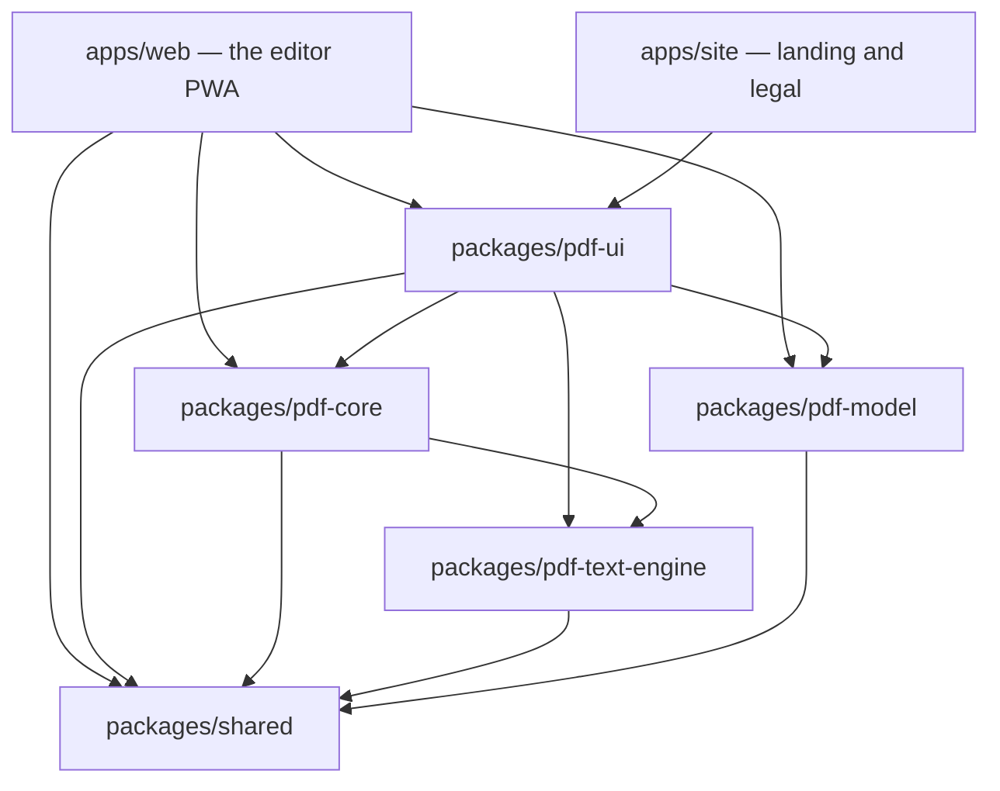
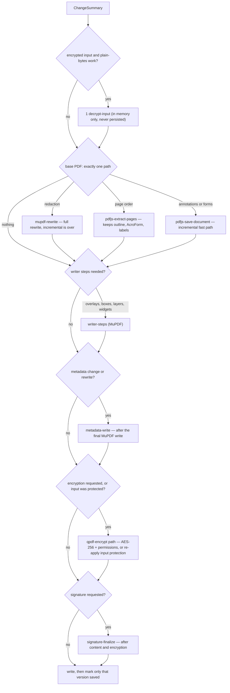
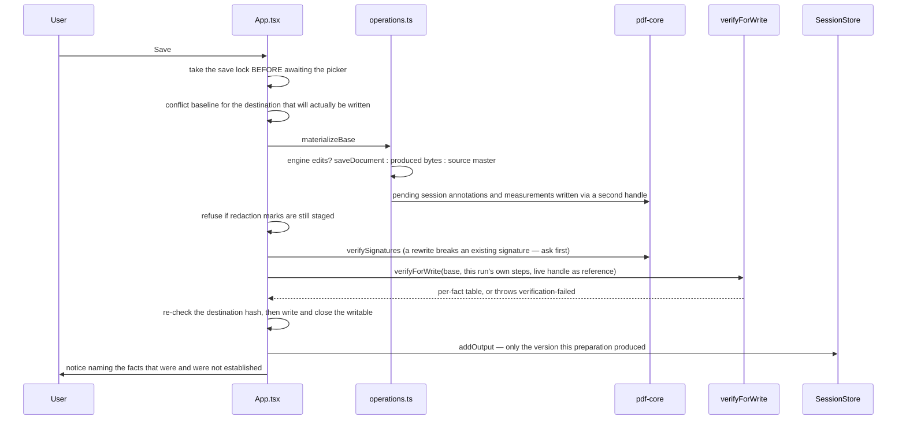

# Architecture

Internal design of SsPdfEditor. [`README.md`](README.md) describes what the product does
and how to run it; this document describes how it is built, which invariants hold it
together, and which parts are honest approximations.

Everything below is drawn from the code in this repository. Where a design rule is
enforced mechanically, the enforcing file is named. Where a claim is a measurement, the
measurement is named.

---

## 1. Design stance

Five rules explain most of the decisions in this codebase:

1. **Three engines, one contract.** pdf.js renders and reads, MuPDF writes (every writer,
   §5.1) and also erases and encrypts, Tesseract recognises (a fourth, Ghostscript, exists
   only to write PDF/A, §5.13). Each is loaded and called only through an adapter in
   `packages/pdf-core/src/engines/`. Outside that directory the engine packages appear in
   three ways, and no app file imports one:
   - `pdf-core` operations import MuPDF and pdf.js **types** for the objects an adapter
     hands them, and `pdf-core/src/text-source.ts` dynamically imports `pdfjs-dist` for its
     operator enum, the one runtime import there;
   - three `pdf-ui` files import pdf.js, because the viewer and the XFA form are drawn by
     its viewer layer: `viewer/PdfViewerPane.tsx` and `dialogs/XfaFormDialog.tsx` load
     `pdfjs-dist/web/pdf_viewer.mjs` and its CSS dynamically, and `ops/xfa-raster.ts`
     imports the `PDFDocumentProxy` type and `XfaLayer` (`pdf-ui` depends on `pdfjs-dist`
     for this);
   - no other component or panel imports an engine package.

   Operations are `bytes in → bytes (or files) out` plus a report
   (`packages/pdf-core/src/ops/types.ts`).
2. **Document state is a data model, not a store library.** Sessions, the operation
   journal, drafts and the save router are plain TypeScript in `pdf-model`, DOM-free and
   Node-testable. React subscribes through `useSyncExternalStore`.
3. **Undo is chronological, across engines.** Every applied operation is a *new whole
   PDF*; the journal records that fact as data and keeps the bytes in a bounded snapshot
   store. There is no per-engine undo stack and no replay of engine payloads.
4. **A save verifies what it can and reports what it cannot.** Before bytes are written,
   the output is compared against the live document over twelve declared facts, an
   operation must declare which of them it may change, and every fact this build cannot
   check is reported `unsupported` or `degraded` instead of being counted as a pass. A
   promised fact that broke throws.
5. **Honesty is a feature.** Operations report what they lost (`OperationNote` with
   `kind: 'lost'`), verification gives each fact a `verified`, `degraded` or `unsupported`
   verdict rather than one boolean badge, signature verification has four independent
   fields, and the accessibility check refuses to produce a score.

---

## 2. Workspace and dependency graph

pnpm workspace (`pnpm-workspace.yaml`): `apps/*`, `packages/*`, `tools/spikes`.



Dependencies point one way: `web → ui → core → text-engine → shared`, and
`model → shared`. `pdf-core` may not import `pdf-ui` or `pdf-model`; `pdf-model` never
talks to an engine at all — that is what keeps it testable in Node. The one deliberate
exception is `apps/web`, which is the only place allowed to wire everything together.

There is **no build step** for the packages: each `package.json` maps its exports straight
at `src/*.ts`, and Vite compiles the TypeScript once, at the app boundary.

### Entry points are chosen for bundle shape, not tidiness

`pdf-ui` declares subpath exports (`./ui`, `./viewer`, `./panels`, `./dialog`, `./tools`,
`./printing`, `./palette`, `./text-edit`, `./scan`, `./tokens.css`) and
`apps/web/src/App.tsx` imports through them. The root barrel is not tree-shakeable in
practice, so importing it for a value pulls the whole surface into the first paint. Two
concrete consequences are recorded in the code:

- `packages/pdf-ui/src/shell/ShellSurface.tsx` is the `./ui` entry and is **only a re-export
  barrel** — it is the deliberate first-paint import surface, not a component. There is
  no `ShellSurface` component; the shell is `apps/web/src/App.tsx`.
- `packages/pdf-core/src/ops/index.ts` re-exports only some of the operation modules; the
  others (sanitize, PDF/A, structure, XFA, scan, conversion and more) are imported by
  subpath, as `pdf-core/ops/<name>`, which `pdf-core`'s `./ops/*` export allows. The one
  omission its code explains is `./sign`: routing signing through the barrel pulled `pkijs`
  + `asn1js` into the entry chunk (measured: 302.66 KiB gzip against a locked ≤ 250 KiB
  budget); the sign dialog imports `pdf-core/ops/sign` directly so the ASN.1 stack keeps
  its own chunk.

Everything heavy is a dynamic `import()`: the pdf.js core, the viewer stack, the dialogs,
the dock panels, the print surface and the palette are all loaded on demand, and
`main.tsx` warms the engine, printer and palette chunks on idle so the first user action
does not pay for the download — but only online: Chromium keeps a failed dynamic import for
the page's lifetime, so a warm-up run offline waits for the `online` event instead.
The writers the shell reaches only from a user action and imports nowhere else —
annotation removal, layer writes, attachments, the redaction audit and the font inventory
— go through `apps/web/src/lazy-ops.ts`: same signatures, loaded on the first call.
That took the entry chunk from 250.6 to 244.9 kB gzip (2026-10-04).

Two more things kept growing it. **Icon weights**: every Phosphor icon carries its
drawing in six weights, and the `weight` prop picks one at render time, so the bundler
keeps all six. `tools/vite/phosphor-weights.mjs` drops `thin` and `light`, which nothing
draws (the editor uses `regular`, `bold`, `fill` and `duotone`; Kumo `regular`, `bold`
and `fill`). **Catalogues**: both language catalogues were in the entry, and only one is
ever shown. Each is now a chunk of its own (`LocaleInfo.load`), and `main.tsx` awaits the
interface language's catalogue before the first render. `main.tsx` imports from
`pdf-ui/ui`, not the `pdf-ui` barrel, which `App.tsx` loads lazily. Together these took the
entry chunk from 366.7 to 280.9 KiB (gzip level 9, 2026-10-06), after the parity work had
grown it past the budget.

The entry chunk is not all of the first paint: the `modulepreload` links the build adds for
it (Kumo's and base-ui's shared chunks, the MuPDF glue) download with it. Measured as the
entry plus every preload, gzip level 9: `main` 392.2 KiB, this branch 337.7 KiB before the
next step and 313.3 KiB after it. That step moved the readers and writers the shell calls
only on an action — form read and fill (`fieldValueText`, which the panel needs on every
render, moved to `ops/form-value.ts`), signature verification, the protection check, the
image list, composition, the session-annotation writer and the comment data formats —
behind `lazy-ops.ts` or a dynamic `import()`, taking the entry chunk from 243.7 to 219.2
KiB. The rest is the editor shell, which loads with the home screen, and the shared UI
chunks; it is still over the 250 KiB budget the README states.

---

## 3. `pdf-shared` — the vocabulary

| Module | Responsibility |
|---|---|
| `errors.ts` | The single error contract. `ToolError` carries a stable code (37 of them, `TOOL_ERROR_CODES`), an i18n message key, an i18n hint key, and `details.engine` / `details.engineMessage` for diagnostics. Raw English engine text never reaches the UI. `toToolError()` is the last line of defence; a lazy chunk the browser could not fetch (each browser's wording) becomes `asset-offline`, never a damaged document. |
| `limits.ts` | Two-tier limits (`LIMITS`), the build budgets (`BUILD_BUDGETS`), `checkDocumentLimits()` as the single verdict function, and `detectDeviceTier()`. |
| `i18n/` | The message catalogue: `MessageKey = keyof typeof tr`, identical key sets in `tr` and `en`, and the language registry (`locales.ts`: id, native name, text direction, fallback, loader). `createTranslator(locale)` looks a key up in the locale, then its `fallback`, then Turkish. Every catalogue is its own chunk: `loadLocale` fetches the interface language's before the first render (`main.tsx`) and another one when the language is switched, and the shell sets `<html lang>` and `<html dir>` from the registry. |

Because `MessageKey` is a union of literal keys, passing an unknown key is a compile
error. That is why operation notes, dialog titles and error text are typed as `MessageKey`
rather than `string`: an untranslated sentence fails `pnpm typecheck` instead of shipping
as English. (A few surfaces build keys from tables or sentence parts the type cannot follow
and use an explicit, marked cast — `MEASURE_KEYS` in `MeasureLayer.tsx`, `A11Y_KEYS` in
`ops/accessibility.ts`, the status tables of `ComparePanel.tsx`. `MeasureLayer` renders the key
id rather than inventing English copy when the catalogue has no entry.)

---

## 4. `pdf-model` — sessions, history, drafts, save routing

### 4.1 Three versions of a document

`source.ts` keeps three things apart, and the distinction is load-bearing:

- **Source** — the immutable master bytes plus the SHA-256 hash and, when the file came
  from a File System Access picker, the `FileSystemFileHandle`. Engines never receive this
  buffer: they get `copyForEngine()`, because pdf.js may transfer (detach) a `Uint8Array`
  it is handed.
- **Working version** — what the journal currently applies to: a `stateId` that is stable
  across undo/redo (unlike `id`, which identifies a transition), an optional
  `ProducedDocument` with the newest produced bytes, and the pending overlay state.
- **Output version** — what was actually written where, including the verification record
  and the output hash.

The rule that falls out of it: the source master is never overwritten by a reconstruction,
and Export/Save distinguish "still the source" from "produced bytes" by
`working.produced === null`.

### 4.2 The operation journal

`journal.ts` holds one `OperationJournal` per document. Entries are **data** — engine, op
kind, JSON payload, schema version, i18n label key and params — never functions, because a
draft goes through structured cloning. `JOURNAL_SCHEMA = 2`.

Guarantees the class actually provides:

- `append()` truncates the redo tail and **returns** the discarded entries, so the caller
  can release the snapshots they pointed at.
- The entry array is replaced with a new array on append, never truncated in place.
  `entries` is handed out by reference and read across `await`; mutating it in place
  rewrote history callers already held.
- `fromJSON()` rejects an out-of-range cursor instead of clamping it — clamping would
  silently restore a different state than the user left.
- `#stepFor` in `session.ts` materialises one of three step kinds: `document` (swap the
  produced snapshot, or the source master when `before`/`after` is `null`), `overlays`
  (canvas-only edits), or `unavailable` when the bytes the step names are no longer held. A history restored from storage
is untrusted: `parseDraft` does not validate journal payloads, so a payload that is not an object or has no
`after`, an unknown op kind and a snapshot the store no longer holds are each refused here (the step is
`unavailable`), not applied.

`DOCUMENT_CHANGE_KIND = 'document.change'` is the single op kind document capabilities write:

```ts
{ before: string | null, beforeOverlays, after: string, engine: string, steps: string[] }
```

One op kind is deliberate. Every capability ends the same way — the working document
becomes a new PDF — and engine-opaque operations revert through the nearest **snapshot**
rather than through a replayable payload. A capability that cannot describe its change as
data therefore cannot be wired in at all.

### 4.3 Snapshot retention

`SessionStore.#remember()` keeps produced documents in a bounded list per tab:

- budget: `max(3 × document size, 64 MiB)`, with `keepNewest = 2` always retained;
- on append, the **abandoned branch is released first** and the budget is applied second
  (`#releaseDiscarded`), because running the budget over a list that still held the
  snapshots the append was about to invalidate counted unreachable bytes as live and
  evicted reachable history to pay for them;
- release is precise: only snapshots that no entry *before the cursor* and no working
  version still names are dropped, so a branch that re-lands on an earlier state keeps its
  bytes. There is exactly one `keepNewest` constant in the tree; a second copy in
  `session.ts` had drifted to a different value.

### 4.4 Save routing

`save-router.ts` picks the paths a change set actually needs and orders them by
dependency. It is not a chain of engines run "just in case".



Contract points the router returns and the report shows:

- `incremental` is true **only** for the single pdf.js `saveDocument` path on an
  unencrypted input, including the steps MuPDF appends to it as one more revision
  (`saveIncremental`): the static-XFA datasets sync, and the annotation settle step and
  sticky notes (`writeAnnotationsToFile`). Any other writer ends the fast path and says
  `incremental: false`; so does an append MuPDF cannot make and turns into a rewrite.
- `rewritesStructure` is true for redaction, writer steps and page composition — those
  normalise object numbering, compression and XMP.
- `reprotects` is true when the input was encrypted and the user did not ask for
  protection to be removed: protection is never silently downgraded.
- Redaction forces the MuPDF full rewrite, because `canBeSavedIncrementally()` is false
  after `applyRedactions()` and an incremental write would keep the erased revision
  reachable through `/Prev`.

### 4.5 Drafts and the vault

`drafts.ts` is DOM-free **policy**; the OPFS implementation is `apps/web/src/drafts.ts`.

- A draft carries **model data only**: id, name, page count, size, dirty flag, the journal
  (with cursor), the working state id, the overlays, and the *engine-side* delta
  (`engineValues`: form values and annotation edits that live in pdf.js's annotation
  storage until a save).
- The master bytes belong to the **source vault**, not the draft. A source with a File
  System Access handle is referenced by an opaque key; a handle-less source is written to
  the vault **once** on open. `sourceKeyFor()` derives the key from the content hash, so
  the same document never writes twice and two tabs share one blob.
- `parseDraft()` treats stored data as untrusted input and validates the journal **as a
  unit**. A filtered array would be worse than a rejected one: the persisted cursor points
  into that array, so dropping one malformed entry silently shifts every later state.
  One bad entry makes the whole draft unreadable, and the caller reports that.
- `encodeEngineValues()` projects storage entries to JSON. Plain objects and `Blob`
  bitmaps survive (bitmaps as base64, under a 2 MiB budget); typed arrays, `Map`s, class
  instances and promises are counted as `dropped` rather than projected into something
  that would decode differently from what was stored.

`vault.ts` is the retention policy and its central rule is **uncertain references
retain**:

- a key may be deleted only when the whole inventory was read successfully and nothing
  references it — no manifest, no open document, no peer window;
- `enumerationFailed` or any `unreadable` manifest makes the plan **refuse**
  (`{ ok: false, reason: 'incomplete-inventory' }`) rather than sweep;
- sensitive documents own nothing (`keysForDraft` returns the source key and snapshot
  keys, and a sensitive document is never persisted at all);
- deletion is logical, not physical — it cannot overwrite the bytes underneath and cannot
  reach a downloaded copy, so the UI must not call it secure erasure.

### 4.6 Trust roots

`trust-roots.ts` stores exactly what the user imported: the certificate DER (base64), a
label and a timestamp, in a versioned file (`version: 1`). There is no built-in CA list,
because shipping one would vouch for certificates the user never chose. base64 is
implemented in the module rather than via `btoa`, so the code runs identically in Node and
the browser. The decoder ignores every character outside the base64 alphabet (line breaks, PEM
indentation), so it has no failure of its own; a stored root that decodes to fewer than 64 bytes is
dropped rather than trusted, and `trustRootFrom` derives the id from the DER, so importing
the same certificate twice is one entry.

---

## 5. `pdf-core` — engines and operations

### 5.1 Engine adapters

| Adapter | Upstream | Threading | Used for |
|---|---|---|---|
| `engines/pdfjs-handle.ts` | `pdfjs-dist` 6.3.289 | its own Web Worker (`/engines/pdfjs/pdf.worker.mjs`); painting on the main thread into a caller canvas | rendering, text, outline, page labels, annotation storage and its save, form field objects, attachments, operators, page composition |
| `engines/mupdf.ts` | `mupdf` 1.28.1 (wasm, ~9.93 MiB) | main thread, imported by **runtime URL** behind a `vite-ignore` marker | redaction, redaction find/audit, encryption, page boxes (auto-crop), page-label writing, text editing's erase stage, structured text extraction, the page layout behind the Word/Excel/CSV export (`ops/page-layout.ts`) |
| `engines/mupdf-write.ts` | `mupdf` (through `engines/mupdf.ts`) | as above | the shared writer vocabulary: open/save (`garbage,compress`, object numbers kept), the producer line, text-as-string, the embedded Noto face; used by document properties (`ops/metadata.ts`), attachments (`ops/attachments-write.ts`), layers (`ops/layer-write.ts`), links (`ops/link-edit.ts`), the outline (`ops/outline-edit.ts`), annotation removal, transforms and the session annotation writers (`ops/annotation-*.ts`, `ops/annotations.ts`), the font inventory (`ops/pdf-fonts.ts`, read-only), stamps (`ops/stamp.ts`), placed pictures and simple signatures (`ops/image-stamp.ts`), the conversion of other formats (`ops/convert.ts`), the image writers (`ops/image-opacity.ts`, `ops/image-edit.ts`, `ops/images.ts`), page boxes (`ops/page-boxes.ts`), blank documents (`ops/create.ts`), composition (`ops/compose.ts`), page insertion (`ops/page-insert.ts`), imposition (`ops/impose.ts`), compression (`ops/compress.ts`), forms (`ops/forms.ts`), the OCR text layer (`ops/ocr.ts`), text editing (`ops/text-edit.ts`) and find and replace (`ops/find-replace.ts`, with the document's own fonts read by `engines/doc-fonts.ts`), form field detection (`ops/form-detect.ts`, rules in `ops/form-detect-rules.ts`); page drawing goes through `appendPageContent` (existing content wrapped in `q`/`Q`, one new stream), `wrapPageContent` (a transform around the existing streams) and `addPageResource` (fresh names in the page's own `/Resources`) |
| `engines/noto.ts` | the pinned Noto Sans files | `fetch` from our own origin, cached per session | the font bytes every writer embeds, whichever engine writes |
| `engines/tesseract.ts` | `tesseract.js` 6.0.1 + `tesseract.js-core` 6.1.2 | its own Web Worker(s) | OCR only |
| `engines/ghostscript.ts` (+ `ghostscript-worker.ts`, `ghostscript-run.ts`) | `@bentopdf/gs-wasm` 0.1.1 (Ghostscript 10.06.0, wasm ~14.8 MiB) | one module Web Worker per conversion, terminated after it | PDF/A conversion only (§5.13) |

**Every writer runs on MuPDF.** They were consolidated from pdf-lib one operation at a time
(2026-09-28/29): each move first got a behaviour test that passed against the pdf-lib writer
(where that writer could run the case at all), then the writer was ported and the same test
had to stay green. The moves, and the defects they fixed on the way:

- document properties (`ops/metadata.ts`);
- attachments (`ops/attachments-write.ts`), which now also keeps the embedded-file name tree
  sorted;
- the font inventory the Document information panel reads (`ops/pdf-fonts.ts`);
- layer writes (`ops/layer-write.ts`), which now also report a layer name that matched
  nothing — the pdf-lib writer returned before adding that warning — and, for a request that
  renames a layer and also sets its state or order, verify the file under the new name;
- link edits (`ops/link-edit.ts`);
- outline edits (`ops/outline-edit.ts`), where two pdf-lib defects are fixed: nested items
  were never chained onto their parent, and a removal kept the removed item in the recount,
  so every bookmark delete was refused by the read-back;
- removing persisted annotations (`ops/annotation-remove.ts`), whose steps are now
  `load` / `annotations.remove` / `save` / `verify` — step ids no longer name an engine;
- moving and turning persisted annotations (`ops/annotation-transform.ts`), steps
  `load` / `annotations.transform` / `save` / `verify`;
- the session annotation writers the engine cannot finish: underline/strikeout/squiggly
  settle step (marker into `/NM`, subtype retag) and marker resolution (`ops/annotations.ts`), shapes and marker strokes
  (`ops/annotation-shapes.ts`) and typed text (`ops/annotation-freetext.ts`). They append
  to `/Annots` only; pdf-lib's `addAnnot` also rewrapped the page's content in `q`/`Q`;
- measurement annotations (`ops/measure.ts`), whose `/M` is now a PDF date (the pdf-lib
  writer stored the ISO string);
- stamps, Bates numbers and watermarks (`ops/stamp.ts`), where the no-print group now carries
  its print state in `/Usage /Print`, the place the `/D /AS` print event reads — the pdf-lib
  writer put `/Print` directly on the group, where no reader looks;
- image opacity (`ops/image-opacity.ts`) and image replacement (`ops/image-edit.ts`), where the
  replacement is written into the object the page already names (`writeObject` +
  `writeRawStream`), and an ICC-based grey or RGB image now reads as grey or RGB samples —
  MuPDF tags device RGB with an sRGB profile, so without that an image replaced once could not
  be cropped or rotated again. A replacement picture with alpha keeps it as the `/SMask` MuPDF
  produced for it; only the old picture's mask is dropped (it used to drop both, so a
  transparent PNG came out on a black ground), and the report says so
  (`op.note.image.maskDropped`);
- a blank document (`ops/create.ts`, steps `create.blank` / `save`): empty pages of an ISO or
  US size in either orientation, with an empty content stream and no resources;
- a placed picture — a drawn, typed or photographed signature, initials, or an image
  (`ops/image-stamp.ts`, steps `load` / `annotations.stamp` / `save` / `verify`): one
  `/Stamp` whose `/AP /N` form draws the PNG (alpha kept as a soft mask) or JPEG over
  `BBox [0 0 w h]`. On a turned page the form carries the counter-turn as its `/Matrix`
  and the `/Rect` extents are swapped, so the picture stands upright on screen. `/Name` is
  `SsSignature`, `SsInitials` or `SsImage`, `/NM` is the marker and `/Contents` the kind.
  Resizing (`resizeImageStamp`, step `annotations.resize`) writes `/Rect` only — readers
  scale the appearance to it — and refuses anything that is not a `/Stamp`, whose geometry
  lives in more keys than the rectangle;
- other documents → PDF (`ops/convert.ts`, steps `convert.read` / `convert.layout` /
  `convert.write` / `save` / `convert.outline` / `convert.links` / `verify`). MuPDF 1.28.1
  opens DOCX/XLSX/PPTX itself, but only as reflowed text: a sheet lost its labels and grid, a
  slide became one paragraph and a Word table a list of cells. So each format is first read
  into HTML — DOCX through mammoth (BSD-2-Clause, `externalFileAccess` off), XLSX and PPTX by
  `ops/convert-ooxml.ts` over JSZip and `@xmldom/xmldom` (a part xmldom cannot read, or that is empty, is
  `corrupt-document`; an attribute is read through `attribute()`, which answers `null` when it is
  absent, because xmldom's `getAttribute` answers `''` and no default would ever apply; one it had to repair, such as a sheet cut off mid-row, is converted and
  named in a `lost` note), text and CSV by `ops/convert-text.ts` (UTF-8, else Windows-1254) — and HTML, EPUB and FB2 go to MuPDF as they are. Every part is
  laid out (`Document.style` adds only the `@page` margin, before `layout`) and run through
  one `DocumentWriter`. The source's outline and links are written afterwards by the
  existing writers (`applyOutlineEdit`, `applyLinkEdit`, schemes other than `http:`,
  `https:` and `mailto:` dropped and counted), and the result is reopened and its page
  count compared. `ops/convert-formats.ts` holds the extension table with no dependencies,
  so the shell can recognise a convertible file without loading the converters;
- PDF → Word, Excel and CSV (`ops/export-office.ts`, steps `office.read` / `office.tables` /
  `office.write` / `verify`; `verify` is reported for Word, read back with mammoth, and for
  CSV, read back with the RFC 4180 parser). A download: nothing is written to the document.
  The ideas are pdf2docx's (MIT; none of its code), the table modes Tabula's.
  `ops/page-layout.ts` reads a page as layout. Characters with font, size, weight and colour come from the
  structured-text walker. Pictures are drawn through their own transform into a transparent
  pixmap: `Image.toPixmap()` gave raw samples, so an `/SMask` picture became a grey box with
  black corners, and the draw device did not apply the mask either, so `softMasked` folds it
  into the alpha. Ruling lines and drawn marks come from one pass of a JS `Device`.
  - **Tables.** MuPDF's own `table-hunt` was measured first: it took a page of Word
    paragraphs for a two-column table and found nothing in a ruled spreadsheet grid. So
    ruled tables are found from merged horizontal and vertical rules ("lattice"; a missing
    rule between two cells merges them). Tables without rules come from runs of rows that
    each hold two or more pieces of text, their columns being the gaps that run through
    every row ("stream"). Prose set in columns is told apart by its long pieces, and by its
    blocks: two columns that each hold a text block of three or more lines with a median line
    of 20 characters or more are two columns of text whose lines share baselines, not a table
    (read row by row across them, a reader would take the columns in turn no more), provided
    the block is the column's own (it holds no piece of the other column) or its lines wrap
    (each but the last holds words and fills the column's width): a table of 20-to-30-character
    cells is often one block of both columns, with cells of every length, and stays a table. A line is cut
    into segments where a gap between visible characters is wider than about two spaces
    (`lineSegments`), and a segment is placed — outside a table, in a table, in a cell — as a
    whole, by its centre, except that a segment is cut where a column edge of its table lies in
    a gap of spaces between two visible characters (two cells that one line reads across the rule
    with a single space): no word is ever cut at the edge of a table or between two cells.
  - **Drawings.** Curves, polygons that are not rectangles, shadings and pictures seed
    regions that grow over every mark they touch. A region holding a line of prose is left
    to the text, and so is one crossing a table or covering most of the page. The region is
    rendered at 144 dpi as one picture without its text (`renderRegion` runs the page through a
    device that hands everything but text to a draw device): the text on a drawing stays text
    in the flow. A drawing that has text on it, like a raster picture that text stands on, is
    anchored behind the text (`wp:anchor`, `behindDoc`) to a paragraph one point high that
    holds its place in the flow, and takes no room there: the anchor hangs from that paragraph
    (`positionV relativeFrom="paragraph"`), and that paragraph stands right before the items that are
    on the drawing (a quarter of their area under it), its space before being a paragraph of its own
    above it, since Word and LibreOffice measure the anchor from different places of a paragraph.
    The offset is the distance the flow puts between the holder and the first of those items less
    the one the PDF has between the drawing's top and that item, so the labels and the text after
    the drawing follow it wherever the flow puts it, a card in the next column after the one before
    it included. When the items on a drawing are not one run in the flow (another drawing's text
    comes between them) the drawing is an inline picture before the first of them instead, and
    no text lands on white paper; a picture no item stands on (a stamp over a corner of two lines)
    stays inline where MuPDF read it. Only that run of items is laid out without the `MAX_GAP`
    clamp. The first item after the run starts at or under the feet of the run's pictures (those of
    drawings side by side, with no horizontal overlap, are all kept, each seen from the newest
    holder; a picture that lies on a bigger one, a photograph on a full-page background, drops it:
    the text after it is on the background, not under it), also when it is another
    column's and beside them in the PDF, since the flow would print it over the drawing; its gap
    below the feet is clamped again. Gaps
    inside the drawing's height are not clamped to `MAX_GAP`, and the first item below it starts
    at or under its foot. Above
    2000 marks a page counts as one drawing, since growing it mark by mark is quadratic.
  - **Word (flow).** Each page is a section with the page's size, orientation and margins. Blocks
    are cut into paragraphs where a line ends short, a gap opens, the size changes or a
    bullet or a number (one or two digits and `.` or `)`, then a space) starts. A hyphen that
    breaks a word before a lower-case letter is removed, even when it is set in another style than
    the letters before it (the join reads the line's last characters across its runs).
    Lines that share a row and follow each other along it (MuPDF cuts the dots of a leader into
    a line each) are joined first. A character belongs to one table (ruled before spread, the
    smallest first), so a nested or overlapping table does not write its words twice. Tables that
    stand next to each other with nothing between them (a row of key caps drawn as grids) get a
    hairline paragraph between them: Word and LibreOffice fuse tables that touch into one. An inline
    picture is shrunk to fit the page's text area less one body-size line.
    Paragraphs of several lines that start a third of the way across are a second column,
    and alignment and indents are measured in a paragraph's own column. Sizes at least
    1.3× the body size (1.15× when bold) become `Heading1`–`3` by rank. `w:lang` is the
    catalog's `/Lang`. The package is written by hand and read back with mammoth, whose
    word count must equal the words written. A picture MuPDF could not draw, and one inside a
    ruled table (whose cells carry text only), is left out of the file and counted in a `lost`
    note (`op.note.exportOffice.picturesLost`).
  - **Word layout** (`OfficeExportOptions.docxLayout`: `flow`, `page-images` or `layout`; the UI's
    `layout` field and the Export dialog's second select default to `layout`, the exact layout, and
    the dialog lists it first). Two of the three skip the flowing reader. `page-images` skips the layout reader: `ops/docx-pages.ts` draws each
    page with MuPDF (`page.toPixmap`, RGB, no alpha so white paper, annotations and widgets
    included; pdf.js is not used, so the path runs in Node tests) at 200 dpi of the page's size as
    `getBounds` gives it (after `/Rotate` and the crop box), lower only when a page would exceed 40 megapixels; the note reports the lowest dpi used (`dpi`).
    The picture is drawn from the page's corner at one scale on both axes (`Matrix.translate`
    then `scale`), and its pixel count is the one a renderer draws the page's extent into
    (`coverPixels`: the side in whole twips, `wordSide`, at that scale, rounded up), so the
    picture is copied pixel for pixel instead of resampled; the section and the anchor are the
    same whole-twip size, so the page keeps its size within a twip, and the anchor is lifted
    one twip (`LIBREOFFICE_LIFT`), which cancels the twip LibreOffice puts an anchored picture
    above its place.
    JPEG (quality 92) when the `fillImage` boxes a `Device` pass sees cover at least half of the page, PNG otherwise (a small logo keeps the text lossless). Each page is a
    section of the page's size with every margin 0 and `w:orient` when wide, holding one
    paragraph (exact 1 pt line, 1 pt run) with a `wp:anchor` picture at the page's corner
    (`behindDoc`, `wrapNone`; children in the schema's order). **The 22-inch rule:** Word refuses a
    page side above 22 in (1584 pt, 31 680 twips), so `wordPageScale` shrinks both sides of a larger
    page by `min(1, 1584/w, 1584/h)`; the pixels are still those of the original size, and the
    report names the pages and the smallest ratio (`op.note.exportOffice.pageScaled`). The XML both
    writers share (escaping, package parts, `zipped`, the section and the anchor) is in
    `ops/docx-drawing.ts`. The file is read back with mammoth like the flowing one; it holds no
    words, so none must be found.
  - **Word exact layout** (`docxLayout: 'layout'`, "Text and pictures, exact layout"). The page is
    rebuilt from what it draws, not from reading order: `ops/layout-scene-read.ts` runs a MuPDF
    `Device` over the page and records a scene (text runs with their fonts, sizes, colours and
    links; filled and stroked paths; images; the regions it cannot express); `ops/docx-layout-text.ts`
    groups the runs into paragraphs and writes each as a positioned text box, and
    `ops/docx-layout-shapes.ts` writes the paths as DrawingML `custGeom` shapes and the pictures as
    anchors; `ops/docx-layout.ts` assembles the package (one section per page, margins 0, every
    object a `wp:anchor` in front of or behind the text). A text box is written as
    `mc:AlternateContent` with a `wps:txbx` choice and a VML (`v:textbox`) fallback; mammoth reads the
    fallback back, so the `verify` step still compares the words written with the words found.
    Text that runs up or down the page (MuPDF's line direction, which holds for one character too) is a
    vertical text box (`bodyPr vert="vert270"` / `"vert"` on the visual box): LibreOffice ignores
    `a:xfrm rot` on a text box. A line's baseline is its characters' origin (`LayoutChar.baseline`);
    the box top is that minus 0.8 × the exact line height, and the box starts `TEXT_LEFT` (0.1 pt)
    left of the first glyph origin, where LibreOffice puts it. The 22-inch rule above applies too: a
    larger page is scaled down (`wordPageScale`) and everything on it with it. XML shared with the
    picture layout is in `ops/docx-drawing.ts`. The pipeline, per page and then per document
    (`writeLayoutDocx`, which gives the event loop a turn between pages):
    1. **Scene read** (`readPageScene`). One `Device` pass in paint order. Paths become
       `SceneShape`s (fill and stroke with alpha, dashes, caps, joins; hairlines drawn 0.25 pt);
       images become `SceneImage`s drawn through their transform with the soft mask folded in and
       cut to the clip (JPEG 90 when opaque and over 256 colours, else PNG, at most 2000 px a
       side). Clips are a stack: an upright rectangle only shrinks the box content is cut to; a
       clip of straight edges (`Polygon`, winding or even-odd; Antenna House wraps every table
       rule in one) leaves a shape or picture alone when its box lies wholly inside the
       polygon (`POLYGON_SLACK` 0.5 pt) and rasters it otherwise; any other clip (a curve, a
       stroke, text, an image mask), a soft mask, a blend-mode group, a tiling pattern, a
       shading and a stencil mask put what they cover in a raster *island*. Islands within 8 pt
       merge and sit in the paint order at their first contribution; each is rendered once at
       144 dpi by MuPDF **without its text** (and without what Word draws itself over or under
       it), so the text above stays editable. A page of more than 1500 shapes and islands
       becomes one raster. Links (external URIs only) and the text (`readPageLayout`) are read
       in the same pass. Three limits keep one odd drawing from costing the export: a filled
       rectangle reaching further than five page sides off the page is cut to the page and any
       other shape that far out is an island (Word's offsets are 32-bit); an even-odd fill of
       more than 1500 subpaths is an island (finding its holes is quadratic); and a colour of
       a space the binding cannot pass on never throws (a DeviceN of two inks goes through as
       it is; of five or more inks it is converted to RGB first, one 8-bit pixel of the space
       run through MuPDF's own tint transform, so a CMYK-and-spot fill keeps its hue). A page the reader
       fails on for any other reason is written as `readPageRaster`'s one picture of the
       page under its text boxes and links.
    2. **Text boxes** (`textBoxes`, `ops/docx-layout-text.ts`). MuPDF's lines (pieces of a
       justified line are joined again when their gaps are equal) become paragraphs while the
       size agrees (±1 pt), the baseline pitch is regular (0.5…1.6 × size) and the left edges,
       centres or right edges agree (2 pt); a bullet starts a paragraph. Alignment is centre,
       right, justified (at least two full-width lines) or left. Paragraphs that stack at the
       gap Word's exact line spacing would give, and share an edge, are one box. A run is a
       stretch of one family, size (0.5 pt), weight, slant, colour and link. Its family is the
       embedded face when the font was embedded, otherwise `wordFontName`: a name table, then
       sans → Arial, serif → Times New Roman, monospaced → Courier New (by name, else by the
       font's flags, the serif flag judged for the family as a whole). A line carries a `RunFit`
       (each character's natural advance in the face Word draws and where the PDF starts it),
       and `fitLine` turns that into `w:spacing` per character, in twentieths of a point: a
       word's letters share the residual between their natural width and the PDF's
       origin-to-origin span, the space after it takes whatever lands the next word on its
       place, and the pen is tracked as LibreOffice truncates each portion to whole twips, so
       the error never adds up past 0.05 pt. A word needing more than 0.5 × size a letter keeps
       the font's own spacing; a face narrower or wider than the PDF's gets a `w:w` scale.
       A justified paragraph is written `w:jc left` (`paragraphXml`): with the words fitted,
       LibreOffice's own justification stretched the fitted spaces a second time. The trade-off
       is that a justified paragraph is no longer justified once edited. The justified box is as
       wide as the PDF's lines; only a box with a squeezed line (spaces under 0.278 × size) gets
       the room that line needs at natural spaces, +1.5 %, because LibreOffice wraps a line
       wider than its frame despite `wrap="none"`; any other box is 3 % + 2 pt wider than its
       text for the same reason.
    3. **Shapes and pictures** (`sceneItemXml`, `ops/docx-layout-shapes.ts`). A shape is a
       `wps:wsp`: `prstGeom rect` for an upright rectangle, otherwise `custGeom` with the points
       in EMU relative to the box; a box thinner than its stroke (a rule) is widened to the
       stroke around its centre. DrawingML has no fill rule, so an even-odd fill is one nonzero
       path whose subpaths alternate in direction by nesting depth (crossing subpaths cannot be
       written). A picture or raster is a *rectangle filled with the picture* (a `wps:wsp` with a `blipFill`, `prstGeom rect` and no outline), not a `pic:pic`: LibreOffice paints a `pic:pic` in front of every shape of the page whatever its `relativeHeight` (translucent panels laid over a photo vanished behind it), while shapes stack among themselves by it. Like a shape it has a VML `mc:Fallback` (`v:rect` with a `v:fill type="frame"` of the same relationship id, position, size and `z-index`) for readers of VML only. `DocxRegistry` hands out the
       relationship ids, `wp:docPr` ids and `relativeHeight`, starting at Word's own base
       251658240 (stacked from 1, LibreOffice paints the page-sized background over everything
       after it), so calling in paint order keeps the paint order: first the scene's items,
       then the text boxes.
    4. **Parts.** `embedFonts` (`ops/docx-fonts.ts`, before the first page is read, so every
       page's text can look its face up) records, per page, the Unicode → glyph pairs and
       advances each visible font draws (a `Device` whose `fillText`/`strokeText` see them;
       invisible text is `ignoreText`, and text drawn at opacity 0, as this app's OCR layer is, is not recorded); finds the programs in the page's and its forms'
       resources (`FontFile2`, `FontFile3` as a bare CFF or OpenType; Type 1 is not
       embedded); and rebuilds each with `trueTypeForWord` / `cffForWord`
       (`ops/docx-font-sfnt.ts`): a new Unicode `cmap` of exactly the drawn pairs, a `name`
       table (family, style; a second program of one family and style, such as another subset
       of the face, is `Family 2`), the `OS/2` and `post` a PDF subset lacks (its ascent and
       descent read from `hhea`, else `head`), and the style bits made to agree with the names. The font's licence bits are kept: `OS/2`
       `fsType` 2 ("restricted licence") or 0x0200 (bitmaps only) makes the builder return `null`
       and the font keeps its fallback, and an OpenType-CFF font is rebuilt with its own `fsType`, as does any font that cannot be rebuilt (the export goes on). A ligature
       glyph arrives from MuPDF as its first character with the glyph and the next ones with
       gid −1, so a glyph is held until the next shows it stands alone and is never mapped as
       its first letter. The fonts are written as `word/fonts/fontN.odttf` XORed with the key
       of their `w:fontKey` GUID (ECMA-376 Part 1 §17.8.1; the GUID is derived from the bytes, so
       the same export gives the same file), `word/fontTable.xml`, and `word/settings.xml`
       with `embedTrueTypeFonts` and `saveSubsetFonts`. `word/styles.xml` makes the font most of
       the text is set in the document default. A noted run (OCR) is a `w:commentRangeStart`…
       `commentReference` range and one `w:comment` in `word/comments.xml` (author
       `SsPdfEditor`, a `CommentReference` style in `styles.xml`). Counts go to the notes
       `layout`, `layoutRasters`, `fontsEmbedded`, `pageScaled`, `noText` and `unreadable`.
    5. **Scans (OCR).** After the scene is read, `isScanPage` decides: no visible character
       on the page and pictures (not shapes) covering at least half of its area, so a scan with
       or without an invisible text layer. For such a page `readScanPage`
       (`ops/docx-layout-ocr.ts`) replaces the scene's items and the text boxes:
       - *Words.* The invisible layer's, when the page has one (`layerWords`: words cut at
         blanks from the layer's characters, boxes from the baseline and size, confidence 100,
         no recognition run); else `OfficeExportOptions.ocr.recognize` (the UI passes
         `recognizePage`, Tesseract, quality `best`, the languages ticked in the form's
         `ocrLanguages` field, default `tur`+`eng`, in automatic page segmentation (mode 3:
         columns, blocks and lines are found, which the text boxes are built from; the 90 %
         flag threshold of `docs/ocr-evaluation.md` was measured in the engine's default
         single-block mode 6) on the page rendered by MuPDF at the scan's
         own resolution, that of its largest picture, bounded to 150–300 dpi and 200 when
         unknown (at most the page images' pixel budget, `cappedPerPoint`). Without `recognize`
         and without a layer `readScanPage` returns `null`, the page keeps its pictures, and
         `ocrUnavailable` lists it; a recogniser that throws (a language pack missing, offline,
         a crashed worker) does the same, and only the reader's own cancel stops the export.
       - *Underlines.* Rules under words make Tesseract misread them (a link's underline cuts
         the descenders). `findUnderlines` looks, for every word of at least two letters or
         digits and at least 1.2 × its height wide, at the rows from 0.35 × its height above its
         bottom edge to 0.45 × below it: a stretch of rows inked over at least 90 % of the word's
         width, at most 0.16 × its height thick (2 px at least), with plain rows (under 60 %
         inked) on both sides, is a rule. It is followed left and right to where its ink ends (a
         gap of 3 px ends it) and kept only when it lies under words and does not reach beyond
         them by more than 0.8 × their median height (a divider or a card's border is longer),
         when the words it lies under are one group (no two further apart than 1.5 × their
         height: a link of several words, not the cells of a row a table border runs along) and
         no line of the design meets either end of it (ink at least 0.7 × their height long
         straight up or down from the end: the side or corner of a cell or a card). A ruled
         table's borders stay in the picture.
         When there are rules, `eraseRules` paints them out (their rows and one more on each
         side, in the colour of the ring around them, except in columns a descender crosses) and
         **the page is recognised a second time** on the cleaned image; the first read is kept if
         the second fails. The rules are handed on to `ocrTextBoxes`: a word the rule lies under
         (over at least 60 % of its width, at its bottom) is an `underline` run, written with
         `<w:u w:val="single"/>` in the text colour. Only a page that has rules is read twice.
       - *Second look* (`ocr-refine.ts`, only when `OcrOptions.readWord` is given; the UI passes
         `recognizeWord`: one word as a single-word page, `best`). Each word of at least two
         letters or digits is cropped from the page, drawn as large as makes it 100 px high but
         at most three times (Catmull-Rom, grey, 6 px margin; a box whose crop would pass a
         million pixels is not read) and treated in turn. The words that need it are taken in
         this order — those with a gap in their ink, then the least sure, then the capitals —
         and no more than 150 crops are read per page; words `misreadWords` would drop as a
         graphic are not read. If the second look throws (a worker that crashed, no memory for
         the English one), the first read stands; the reader's cancel still stops the export,
         and the export releases its OCR workers when it is done:
         1. *Split at ink gaps.* `inkRuns` finds the columns that hold ink (the lesser side of the
            midpoint between the box's darkest and lightest pixel; none when they differ by less
            than 60, or the box is under 10 px high); a gap of at least 0.4 × the box's height
            splits the word ("+90 555 010 20 30" run together as "+905550102030"). Each piece is
            read alone with all the languages and becomes a word of its own with the box of its
            ink; one that is under 50 % sure or holds a space keeps the word whole.
         2. *Reread.* A word under 95 % sure is read again with all the languages. The new
            reading replaces it only if it is surer and has the same shape — letters as letters,
            digits as digits, every other character as itself, no space — so a correction never
            drops a dot or changes "HTML5" into "HTMLS".
         3. *Capitals.* A word with a run of two capitals or more is read with English alone (when
            English is among the languages but not the only one: `OcrOptions.englishAlone`): it
            has no dictionary word "sol" to pull the Q of "SQL" to an O, and its capitals replace
            the first reading's when both are the same length. Each read sets its own mode for
            that call only (8 for a word, 3 for an export page) and the shared worker is left in
            the engine's default single-block mode (6), which "Make searchable" reads in.
       - *Rules for what Tesseract returned.* `dropDuplicates` keeps, of two words overlapping by
         more than 30 % of the smaller box (one word read at two segmentations), the one whose
         box is larger (the surer when equal); the dropped ones are still erased from the
         background. `markWords` finds the marks Tesseract read as words of their own: a word of
         one or two characters under half the height of a word of three or more characters,
         lying above it (or below it) within 0.6 × that word's height (0.2 × overlapping it at
         most) with its centre between 0.6 × that height left of the word's left edge and its
         right edge, is the dot of an İ, an accent or a cedilla — if it is one character or
         punctuation only, and no word of three or more characters stands on its own text line
         (the "is" of a body line under a heading is a word); it is not text and is erased
         with the word. `dropEdgeMarks` drops words of one or two characters in the outer 3 % of the page
         width (the scanner's dark edge). `misreadWords` names what Tesseract made of an icon,
         a chart or a rule of the design: a symbol or one letter in punctuation under 60 % sure,
         or a ringed or registered-mark glyph taller than 1.5 × the page's typical word (neither
         when a sure word of its line stands within 2 × the typical height on both sides: a
         separator of the text, `|` `—` `•`); an opening bracket with at most one letter or
         digit after it (`(`, `[x`: the corner of an external-link icon) that no closing bracket
         follows on its line ("(5 pages)" is text); a symbol of one or two
         characters other than `|`, taller than 1.3 × the words of its line and narrower than
         0.5 × its height (a bar between items); a one- or two-character stem taller than
         1.5 × typical and narrower than 0.35 × its height; and a word of letters only under
         25 % sure. `ocrBackground` runs a first time without them; a misread word that lies
         over a picture region is dropped (`dropMisreads`), the graphic staying in the picture,
         and the background is computed again when any was dropped; a misread word outside
         every region stays text.
       - *`ocrBackground`.* Each word's box (plus 0.15 × its height on every side; 0.4 × above
         for a word with İ Ğ Ö Ü Â Ê Î Ô Û, 0.4 × below for one with Ç Ş ç ş Ģ ģ, where the
         mark can lie outside the box Tesseract gave the letters) is filled with the median
         colour of the 3 px ring of pixels around it. A scan saved as JPEG has faint ripples up
         to a block away from the ink, so `growOverRipples` then grows the box over them, one
         side at a time and up to 16 px, while the next row or column holds nothing but pixels
         within 17 levels of the fill (the ink of the next word, a rule or a card's edge is
         stronger and stops it) and no stretch of 8 pt (or 0.8 of the box's side, if shorter)
         lies at one level 3 or more off the fill: that is a band, a card or a highlight, which
         the box must not paint into the page around it, not noise. The words dropped as duplicates or as marks are erased like
         the rest. The page colour is the commonest colour left
         (16 levels a channel); pixels more than 12 levels from it form regions, joined when
         closer than 3 pt and dropped under 8 pt on both sides; each region is cropped from the
         erased image as one PNG, and is *solid* (a card, a band, a photo) when at least half
         its box differs, the rest being loose marks. The page becomes a page-sized rectangle
         of the page colour, the regions pictures above it, and the page's own vector shapes
         stay above those.
       - *`ocrTextBoxes`.* Tesseract's lines are cut where two words are further apart than
         1.5 × the size (a gutter) or a solid region's edge runs between them; lines become
         paragraphs when they share a region, sit 0.7–2 × the size apart, have sizes within a
         ratio of 0.75–1.33 and left edges or centres less than 0.8 × the size apart.
         *Reading order* is by recursive cuts (`readingOrder`): the paragraphs are split at the
         widest horizontal gap no box crosses (the part above first) and at the widest vertical
         one (the part to the left first), a vertical cut counting only where the two parts
         stand side by side, their vertical extents overlapping by a third of the shorter one
         (columns, not a heading beside a block below it). The horizontal cut is made first when
         its gap is at least 0.6 × the vertical one and at least 2.5 × the page's median line
         size, so a column gutter still outweighs the space between a heading and its list (a
         sidebar is read before the main column), a grid of cards is read row by row, and two
         columns whose paragraph breaks line up (a blank line is about 1.5 × the size) are not
         interleaved. Two exceptions keep the row first: a vertical gap narrower than a gutter
         (1.5 × the size: the space between the cells of a table), and a vertical cut with no
         paragraph of more than one line on one side (a column of line numbers or labels beside
         a text is read along with it). What no gap divides is read in rows (`inRows`): top
         to bottom, an item joining a row when it overlaps a member by half of the smaller
         height, each row left to right.
         A line's size is the median of its words' sizes, each from the word's height by what
         it holds (capitals and ascenders 0.745, x-height letters 0.53, marked capitals 0.92,
         descenders 0.235 of the size; calibrated on Noto Sans and Arial); a height inflated by
         a speck (more than 1.3 × the size the word widths give) is set at 1.1 × the width-based
         size; a line within 0.88–1.1 × of its paragraph's upper-quartile size is set at that
         size, and sizes are rounded to half-points.
         The colour is the median of the word's ink pixels (those at least 60 % as far from the
         local background as its strongest pixel).
         *Bold* is per word. The stroke of a word is the mean of the shortest 60 % of its
         horizontal ink runs (ink: at least half the strongest contrast; the stems, not the
         long bars and joins), in em. A word is bold when its own stroke is at least 1.22 × the
         page's median line stroke (`BOLD_WORD`), judged only for a word with at least 60 ink
         runs (`BOLD_EVIDENCE`); a word with fewer (a short one) is bold when its line is
         (the line's pooled stroke at least 1.3 × the page's median, `BOLD_RATIO`) or when
         the words on both sides of it are.
         *Italic* is per line, from the sharpness of its ink under a shear: the ink mask of the
         line's words is sheared back by each of the tangents 0, 0.05 … 0.35 (rows above the
         middle moving left, undoing a lean to the right), and the sum of squared column sums
         (largest when the stems stand in single columns) is compared. The line is italic when
         the sharpest shear is at least 0.1 and its sharpness beats the unsheared reading's by
         5 %; the line's runs are then italic and fitted with the italic face. The family is the one of Arial,
         Times New Roman and
         Courier New whose per-word width ratios agree best (judged from 8 words of three
         letters up; Arial wins unless another's spread is under 0.8 × its), measured with
         the metric-compatible standard fonts MuPDF carries (`standardAdvance`). The page's words
         OCR is at least 90 % sure of are then drawn again, in the stand-ins and in the regular
         of every open family of `ocr-font-catalog.ts` (`matchFamily`, `ocr-font-match.ts`: ink
         overlap and proportions, the median over up to 40 words); an open family sets the page
         only when it is ahead of both the runner-up and the best stand-in by 0.05
         (`CLEAR_MARGIN`), otherwise the stand-in chosen by widths stays (and offline, or with
         a file missing, it stays too). The page is then set again with that family's own
         advances, its runs name it, and the package embeds the faces the runs use (regular,
         bold, italic, bold italic) like a PDF's own fonts (`EmbeddedFonts.plus`). The whole
         program is embedded, only its `cmap` reduced to the characters the runs use, so
         each face costs its file size in the DOCX (about 0.1–1 MB; up to four faces per
         family); `fsType` (installable) and the copyright and licence name records (IDs 0, 7,
         13, 14) are kept. The family is loaded once per export and Word is given a name no
         PDF font of the document has ("Roboto 2" beside a PDF's own "Roboto"), chosen
         before the runs are set. The report names the family (`ocrFont`). Each word
         carries where the scan has its letters (`RunFit`), so the writer fits it like a PDF's
         text; a box more than 25 % narrower or 35 % wider than the word's natural width is
         not trusted and its letters are set at the natural pitch from its left edge. A word
         with a letter or digit under `lowConfidence` (0.90, `LOW_CONFIDENCE` in
         `packages/pdf-ui/src/ops/office.ts`, the threshold of `docs/ocr-evaluation.md`) is a run
         of its own with a `note`, written as a comment and listed in `ocrLowConfidence`; the
         pages read are listed in `ocrPages`.
  - **Excel.** A cell is a number only when it reads one way (`cellNumber`). The workbook
    is not read back (the XLSX path reports no `verify` step; only Word and CSV do). CSV rows are read back through `parseCsv`. A CSV text
    cell that a spreadsheet would evaluate (`csvFormulaLike`: a leading `=`, `+`, `-`, `@`,
    tab or carriage return, and not a number by `cellNumber`) is written with a leading `'`
    (CWE-1236); XLSX needs no such guard, since its text cells are `inlineStr`.
  - **mupdf.js 1.28.1 defect.** Device callbacks get their `Shade` and `Image` in wrappers
    that take no reference but are registered with the class finalizer. Under forced
    garbage collection the engine asserted (`remove non-existent hash entry`) and the next
    render failed (`Unexpected mesh type 0`). `borrowed()` takes those wrappers off the
    finalizer. Paths, stroke states and text are kept by the binding and need nothing, and
    the walker's fonts and images were measured sound;
- images → PDF (`ops/images.ts`, steps `images.create` / `images.embed` / `save`), where two
  pdf-lib-era defects are fixed: EXIF orientations 6 and 8 were turned the wrong way (an
  upright phone photo came out upside down) and `contain`/`cover` squashed a turned photo into
  the unturned aspect ratio. Every orientation is now one unit-square matrix, and the embedded
  JPEG's own tag is set to 1, because MuPDF-based readers apply it and would turn the picture
  a second time;
- page boxes, resize, scale, shift, content rotation and auto-crop (`ops/page-boxes.ts`), where
  a content transform wraps the page's streams through `wrapPageContent` and auto-crop now
  measures on the document it edits instead of opening a second copy, and a page that needed no change is counted once in the unchanged-pages note (it used to be counted twice);
- the rotation pass and the merge's metadata step after pdf.js `extractPages`
  (`ops/compose.ts`), steps `compose.rotate` / `metadata` / `save`; `compose.rotate` is now
  declared to the save verification (it may change `rotation`), where `pdf-lib.setRotation`
  was an unknown step;
- page insertion and replacement (`ops/page-insert.ts`), steps `pdfjs.extractPages` / `metadata`
  / `save`, with the base Info carried by `copyDocumentInfo` (raw keywords and PDF dates kept as
  written) and matched image pages drawn as form XObjects. One defect is fixed: inserting chosen
  pages of another document inserted its *first* pages instead (the plan's slot index was
  handed to the engine as the page number), so "insert pages 3-4 of this file" put in 1-2;
- imposition and the print layout (`ops/impose.ts`), where each source page is a form XObject
  (`pageAsForm`, resources grafted once per document). Two poster defects are fixed: every row
  of tiles but the last came out blank (the vertical offset had its sign reversed, so the top of
  a poster was never printed), and the enlargement took the larger of the two scales, which cut
  the page's right or bottom edge off the grid — it now fits the whole page. A poster also refuses a fractional tile count (1.5 columns or rows) as `range-invalid`, (the range check alone let 1.5 through);
- compression (`ops/compress.ts`): the structure mode is a MuPDF rewrite with deduplication,
  lossless font/image compression and object streams, and no longer regenerates form-field
  appearances (pdf-lib did, and warned); the raster mode replaces the selected pages **in
  place** (`assembleRaster`) instead of rebuilding the file, so the other pages, the outline
  and the rest of the catalog are kept. Its `assemble` step now declares what it really
  changes on those pages (`rotation`, `cropBox`, `annotations` besides the content);
- forms (`ops/forms.ts`): the field tree is walked by the writer itself (inherited `/FT`, `/Ff`,
  `/V`, `/DA`), and every text, choice, check and radio appearance it writes is drawn with the
  embedded Noto Sans (`/NotoForm` in `/AcroForm /DR`). MuPDF's own appearance synthesis was
  measured and not used: it places the baseline outside the widget box. Two defects are
  fixed: a field whose dictionary is also its widget reported no page (`pageIndex: null` for
  most real forms), and creating a text field always failed ("No /DA"). A calculation's numbers follow the
  documented grammar (`[0-9]+('.'[0-9]+)?`) and a malformed one (`1.2.3`, `1..2`) is refused, not read as a
  shorter number;
- the OCR text layer (`ops/ocr.ts` `writeOcrLayer`, step `ocr.layer`), one content stream per
  page where the pdf-lib writer opened one per word. A word Noto Sans can spell uses it; any
  other uses Tesseract's glyph-less design rebuilt in `engines/glyphless-font.ts` (Type 0
  over Identity-H, every CID drawing one empty glyph, `/ToUnicode` CID *n* → UTF-16 unit *n*).
  Tesseract's own copy of that font sits in its wasm data, which the build split at zero runs,
  so it could not be lifted out whole;
- the text-edit insert half (`ops/text-edit.ts`), steps `load` / `text.font` / `text.draw` /
  `save` after MuPDF's erase: a file font or Noto is embedded (`embedFontFile`) and cut to
  the glyphs drawn before the save (`subsetEmbeddedFaces`, below), a
  standard-14 face is drawn through WinAnsiEncoding (`standardFace`) only when WinAnsi can
  spell the line, and a `doc:<name>` face is the page's own font (`engines/doc-fonts.ts`,
  §5.8); and the page geometry of the text source (`text-source.ts`);
- the batch runner's page count (`ops/batch.ts`), measured through `openForWrite`, so a
  password-locked item fails on its own with `encrypted-unsupported`;
- signing and signature verification (`ops/sign.ts`, `ops/signature-status.ts`); the Node
  gate `tools/spikes/sign-check.mts` loads the engine through `node-mupdf-hook.mjs`, which
  resolves the served engine URL to the installed package;
- accessibility (`ops/accessibility.ts`): the check, the tagger (marked content spliced into
  the page's own decoded bytes, the structure tree written with MuPDF) and the alt-text
  writer; images and pages are identified by object number. The structure model and editor
  (`ops/structure*.ts`) and the PDF/UA check and fixes (`ops/pdfua.ts`) read and write the
  same way and re-open their own output.

`openForWrite` refuses a document that needs a password (`encrypted-unsupported`), as pdf-lib
did; one encrypted with an owner password only now opens and keeps its encryption on save.

pdf-lib is gone from the product: `engines/pdflib.ts` is deleted, no workspace the build
bundles declares it, and its licence texts left `dist/licenses/`. The unit tests write their
fixtures with MuPDF's object model, and so do the behaviour checks and the README recorder, through
`tools/spikes/mupdf-fixture.mjs` (text, images, links, outline, fields, metadata, XMP,
attachments; plus a reader for what an exported file carries) — no workspace declares
pdf-lib any more, and the lockfile has none. `@pdf-lib/fontkit`, the font parser the text
model measured with, is gone too (2026-10-04): glyph lookups and advances come from MuPDF's
`Font` over the same bytes, and the four header numbers from `readFontHeader` (§6).

**Font subsets.** `embedFontFile` embeds a whole program (Noto Sans is 629 KB) and records
every glyph id its `encode` hands out. Before saving, the typed-text, stamp, OCR and text-edit
writers call `subsetEmbeddedFaces`, which replaces each face's `/FontFile2` with a subset of
those glyphs and gives the face a tagged name (`ABCDEF+NotoSans`). MuPDF's `subsetFonts`
subsets a whole document, and run on the real one it also cut and renamed the fonts the
document came with. A form's `/DR` font would then lose the glyphs a reader types a new
value with. So the face is grafted into a scratch document whose one page draws exactly the
recorded glyphs, that document is subset, and the program is copied back. Glyph ids are
kept (Identity-H draws by id), so nothing already drawn changes. This was checked by
rendering each writer's output against the same file with the whole program put back: no
pixel differed, and pdf.js extracted the same text. The form writer's `/NotoForm` stays
whole on purpose. A face that cannot be subset keeps its whole program, because the subset
is a saving, never a condition of the write.

Two binding rules every MuPDF writer relies on are written down in `engines/mupdf-write.ts`:
a plain JS string becomes a PDF *name* (text goes through `newString`), and a missing key is
the shared `PDFObject.Null`, which throws on `resolve()` — and a stream is only a stream by
its indirect reference.

There is **no shared engine interface**. The one shared handle type is
`PdfDocumentHandle`, implemented only by `openWithPdfjs`; the other adapters are function
modules, and the MuPDF writers share `engines/mupdf-write.ts`. The single cross-engine
vocabulary is `OperationEngine = 'pdfjs' | 'mupdf' | 'tesseract' | 'model' | 'ghostscript'`.

Every adapter obeys the same two rules:

- **The caller's buffer is never handed to an engine.** `openPdf()` and `openWithPdfjs()`
  work on a disposable copy, because pdf.js may detach what it is given.
- **Engine errors are mapped once.** `mapMupdfError` (MuPDF's
  plain `Error`s whose message carries the MuPDF text) and the pdf.js exception classes
  all become `ToolError`s with a stable code; the verbatim engine string survives in
  `details.engineMessage` for diagnostics only.

`PdfDocumentHandle.saveDocument()` returns the document's own bytes (`getData()`) when the
engine's annotation storage is empty: there is nothing to serialise, and pdf.js otherwise
re-serialises and warns that `getData` was meant — measured on every export without a form
edit.

`openWithPdfjs()` settles when its `signal` aborts, whenever that happens: before or during
the chunk load, or during the document load. pdf.js does not settle `loadingTask.promise` when
the task is destroyed after its setup (only a pending password request is rejected), so an
open cancelled mid-load used to leave its caller waiting for ever. The load now races an
abort promise; the abort rejects with `aborted` (`ToolError`) and still destroys the loading
task, which owns the worker and the transport.

**Notes** (`writeNoteAnnotations`, `ops/annotation-shapes.ts`) are `/Text` sticky notes:
the comment is their `/Contents`, and their `/AP` is a folded-sheet icon in the mark's colour
(never fainter than 60 %), with the alpha in the appearance's `/ExtGState` as well as on `/CA`.
They went through the engine before as empty `/FreeText` shells, whose appearance typed `()`:
the note drew nothing in any other reader, nor in the app once the file was reopened. Shapes
carry their alpha the same way, since pdf.js and PDFium paint the `/AP` and ignore `/CA`, and their
stroke width is the annotation's own `/BS /W` (and `/Border`), not only a number inside the
appearance stream: a reader that rebuilds the appearance draws the border, and reopening the
file here reads back the thickness that was drawn. The
viewer's `imageResourcesPath` points at `PDFJS_ASSETS.images` (`/engines/pdfjs/images/`,
pinned by `fetch-engines`), where pdf.js finds the `annotation-<name>.svg` icon it lays over a
file's own `/Text` note.

**Typed text** (`ops/annotation-freetext.ts`) is the one annotation writer that draws words:
the engine's `FREETEXT` writer uses a WinAnsi base font with no `ş ğ ı İ`, so the `freetext`
kind is written through MuPDF with the embedded Noto Sans in its `/AP`. `planFreeTextLayout()` (pure) wraps the text inside the box — breaking a
word wider than the box between characters rather than letting the reader clip it — and the
writer re-opens its output and requires every mark back as a `/FreeText` named by its marker and
an appearance, or throws `verification-failed`. It reports the `annotations.freetext` step,
which `OPERATION_TABLE`'s `annotations.*` entry declares. On a page with its own `/Rotate`
the overlay stores the box unturned about the centre the user typed at and carries the
counter-turn as the mark's rotation; `writeAnnotationsToFile` hands it to
`transformPdfAnnotations`, which turns the geometry and the appearance together, so the file
shows the text upright the way it was typed.

`assets.ts` centralises the same-origin asset paths (`/engines/**`, `/fonts/noto/**`; the catalog of open fonts names its own paths under `/fonts/`). The
Tesseract paths are all passed explicitly to `createWorker` — worker, core (the SIMD+LSTM
`.wasm.js` **file**, not a directory, so the build variant is not chosen at runtime) and
language data — precisely because tesseract.js otherwise falls back to its CDN defaults.

### 5.2 The operation contract

`ops/types.ts`:

```ts
OperationContext  { signal: AbortSignal; onProgress? }
OperationOutcome  { bytes: Uint8Array; report: OperationReport }
OperationReport   { engine; steps[]; notes[]; inputBytes; outputBytes; pageCount; incremental }
OperationNote     { kind: 'lost' | 'preserved' | 'changed' | 'warning'; key: MessageKey; params? }
OutputFile        { name; bytes; mime }        // a produced file that is not the document
PageRect          { pageIndex; rect: [x0,y0,x1,y1] }
```

`steps` is not decoration: the step ids an operation reports are the vocabulary the save
verification uses to decide what the operation was allowed to change (§10). Notes carry
`kind: 'lost'` for anything the user must be told about, and the report panel renders lost
notes first.

Every long operation is cancellable through `OperationContext.signal`; `throwIfAborted()`
and engine-specific abort handling are checked between phases, and a cancelled OCR run
terminates its worker rather than abandoning it. No operation in the package is a stub.

### 5.3 The signature stack

Signing is the strictest part of the codebase, because a signature covers the bytes it was
made over.

**Writing (`ops/sign.ts`).** PAdES B-B: a `/Sig` field with `/SubFilter
/ETSI.CAdES.detached`, a visible or invisible appearance, and a detached CMS. The byte
mechanics are arranged around one number, `/ByteRange`:

1. `/Contents` is reserved as 16 KiB of zero bytes (written as a hex string of zeros) and
   `/ByteRange` as four integers of a fixed 10-digit width (`2000000000`).
2. The document is serialised **once** through the MuPDF writer base (no object streams,
   no appearance regeneration); an encrypted document is refused, since its placeholders
   would be encrypted too.
3. The `/Contents` placeholder is located in the produced bytes (uniqueness enforced); the
   real ByteRange is computed from those offsets and written over the same digits, with a
   length-equality assertion.
4. The two covered segments are hashed and signed, and the CMS is written into the
   placeholder after a size check against the reservation.
5. The produced bytes are re-read by **the same verifier the properties panel uses**; if
   the verdict is not `integrity: 'valid'`, the operation throws `verification-failed`
   rather than returning an unverifiable file.

A signed file is a *new version*: the shell never pretends the working document is the
signed one, and the save path warns before a rewrite that would break an existing
signature. What a save does to signatures is decided per file that can carry them
(`signatureWarning` in `apps/web/src/save-plan.ts`): the file the session opened and the
version it produced (e.g. by signing), each against its own bytes. Output identical to a
file → nothing to say about it; output that extends it → "a revision follows" (still
valid); anything else → "the signature will break"; the worst fate wins, and an unsigned
file is never warned about. Judging only the opened file warned on every export of a
document signed in the session; judging only the produced version missed an edit that had
already broken the opened file's signature.

**CMS (`signature-cms.ts`).** `pkijs` + `asn1js` for structure, WebCrypto for crypto — no
network. Signed attributes are `contentType`, `signingTime`, `messageDigest` and
`signingCertificateV2`; the attribute SET is DER-sorted (X.690 §11.6) and the bytes signed
are the DER of the attributes re-tagged to the universal `SET OF` tag (RFC 5652 §5.4) —
both measured against `openssl cms -verify`. Algorithms come from the key: RSA PKCS#1 v1.5
(with the explicit ASN.1 NULL parameter RSA requires) or ECDSA P-256/384/521, with
SHA-256/384/512.

**Identity (`signature-pkcs12.ts`).** PKCS#12 only, parsed with `checkIntegrity: true`, so
a wrong password or a damaged container cannot be signed with. The key is imported
**non-extractable** with `['sign']` only, and the container bytes are dropped after
parsing. There is no OS keychain integration.

**Verification (`ops/signature-status.ts`).** Signatures are found by **scanning the raw
bytes** for `/ByteRange` and the `/Contents` whose own offset falls inside the gap; a scan
entry is only accepted when its integers agree with the object graph's (read with MuPDF).
MuPDF hands numbers over as 32-bit floats, so above 2^24 (a file over 16 MiB) "agree" means
the scanned integers round to what the object graph read; the scan's exact integers are what
is hashed, and ranges that differ but round alike pair with nothing (`unchecked`). Only a
top-level `/Prev` of each trailer is followed when the revisions are counted; a chain that stops
short of the signature's revision falls back to counting the `%%EOF` markers after the covered range, and an
inline signature dictionary reached through both `/Fields` and a page's `/Annots` is one signature.
A file whose bytes never name `/ByteRange` is answered without loading an engine — the
verdicts are asked for as soon as a document opens. The ASN.1 walk is
hand-rolled and bounded (64 signatures, 1 024 revisions, 4 096 nodes). Two cryptographic
checks run: the digest of the concatenated ByteRange versus the `messageDigest` attribute,
**and** the CMS signature over the signed attributes verified with the signer certificate's
public key — the second exists because a digest alone can be recomputed by an attacker. An
algorithm WebCrypto cannot provide yields `unchecked`, not `invalid`.

The verdict has four independent fields, never one badge:

| Field | Values |
|---|---|
| `integrity` | `valid` / `invalid` / `unchecked` |
| `trust` | `trusted` / `untrusted` / `self-signed` / `indeterminate` / `not-checked` |
| `revocation` | `not-revoked` / `not-revoked-outdated` / `revoked` / `revoked-after-signing` / `partial` / `indeterminate` — from lists already on the device only (§5.3.1); `indeterminate` when none speaks for any certificate |
| `coverage` | `covers-whole-document` / `covers-partial` / `unknown`, computed from the ByteRange |

plus `changesAfterSigning`, derived from the `startxref`/`/Prev` revision chain.
`adbe.pkcs7.detached` and `ETSI.CAdES.detached` are the accepted SubFilters;
`adbe.pkcs7.sha1` is reported `unchecked` because its digest relation differs. `ETSI.RFC3161`
entries are document timestamps and get their own check (§5.3.2). Four more facts ride along:
`timestamp` (the RFC 3161 token, when there is one), `revocationChecks` (one answer per
certificate), and `validationTime` with its `validationTimeSource`.

**Trust (`signature-trust.ts`).** Path building follows the RFC 5280 §6.1 shape: candidate
issuers matched by name and AKI/SKI, DFS bounded by depth 8 and 32 candidates, each link's
signature verified over the child's `tbsCertificate`, validity windows checked against the
supplied clock, and `basicConstraints` cA / `keyUsage.keyCertSign` / `pathLenConstraint` /
`nameConstraints` enforced. **Policy processing (RFC 5280 §6.1.5) is deliberately not
implemented**, and a critical extension outside the applied set forces `indeterminate`
rather than being ignored. A certificate or extension whose DER cannot be read, and name constraints that cannot be read or evaluated,
give `indeterminate` (`malformed` / `unsupported-critical-extension`), never a pass. The verdict carries
`notBefore` as well as `notAfter`, so the panel shows the start date of a certificate that is not yet valid.
With no roots imported the answer is `not-checked` with reason
`no-roots` — an absence of evidence is never reported as `untrusted`.

#### 5.3.1 Revocation from lists already on the device

`signature-revocation.ts` (loaded lazily, like `signature-trust.ts`; `pkijs` + WebCrypto, no new
dependency). There is **no network**: a "not revoked" answer can only come from a list somebody
handed the app — a CRL the user imported (stored beside the trust roots in the app's OPFS
settings directory, `pdf-model/revocation-lists.ts`, `revocation-lists.json`, versioned, with the
dates shown in the panel), a CRL or OCSP response in the signature's CMS (the Adobe
`adbe-revocationInfoArchival` attribute, read from the signed *and* unsigned attributes, and
`SignedData.crls`) or in the document's `/DSS` (`Certs`, `CRLs`, `OCSPs`, read by reference and
bounded to 256 entries / 16 MiB). The signer certificate and every certificate above it, up to
but not including a self-signed root, are checked.

- **Who may speak for whom.** The chain is rebuilt from *signatures* (each certificate's issuer
  is the pool member whose key verifies it), and a list is accepted for a certificate only when
  it is signed by that verified issuer: the CRL's issuer name must match, its signature must
  verify, the issuer's `keyUsage` must allow `cRLSign` when present and the issuer must be valid
  at `thisUpdate`. An OCSP response must be signed by the issuer or by a delegate the issuer
  signed with `id-kp-OCSPSigning`, and its `CertID` (issuer name and key hash, serial) must match.
  This is what stops a PDF from embedding a CA with the real CA's name and a CRL saying nothing
  is revoked (measured: such a CRL is rejected as `invalid-list` and cannot hide a real revocation).
- **Answers.** `good` (a verified complete list does not name the certificate), `revoked`
  (date and reason from the list; `removeFromCRL` entries are not revocations) or `unknown` with a
  reason: `no-list`, `no-issuer`, `invalid-list`, `unsupported-list` (indirect CRL, unknown
  critical extension), `list-scope` (delta, `onlySomeReasons`, a partition the certificate does not
  name). A `good` carries `coversValidationTime` (was the list issued at or after the signature?)
  and `stale` (past its `nextUpdate` today). A lasting revocation outranks everything; otherwise
  the newest statement decides. The summary is `partial` when nothing is revoked, something was
  cleared and something has no list (typically the CA above the signer). When every certificate
  was cleared, the summary is `not-revoked` only if each list speaks for the validation time:
  a list issued before it, or a `stale` list while the validation time is not a trusted
  timestamp, makes it `not-revoked-outdated` (a warning, not a pass). The signer's own claimed
  time can be back-dated to sit before an old list that still names nothing, so only a
  current list proves anything then.
- **Before or after the signature.** A revocation is compared with the *validation time*. It is
  called `revoked-after-signing` — harmless to the signature — only when that time is a trusted
  timestamp; the signer's own `signingTime`/`/M` can be back-dated and never earns the excuse.

#### 5.3.2 RFC 3161 timestamps

`signature-timestamp.ts` verifies a token offline: it is a `SignedData` over a `TSTInfo`; the
`messageImprint` equals the hash (the token's own algorithm) of the data it covers — the
signature *value* for a signature timestamp (unsigned attribute `id-aa-signatureTimeStampToken`),
the `/ByteRange` bytes for a document timestamp (`/SubFilter /ETSI.RFC3161`); `messageDigest` and
the CMS signature verify with the TSA certificate found by its `sid`; that certificate has
`id-kp-timeStamping` and was valid **at `genTime`**. Failures are separate reasons (`imprint-mismatch`,
`bad-signature`, `tsa-key-usage`, `tsa-validity`, …); an algorithm WebCrypto cannot provide is
`unchecked`. The TSA's chain is validated by `signature-trust.ts` at `genTime` (its critical
`extKeyUsage`, which RFC 3161 mandates, is passed as a leaf extension the caller enforces) and its
certificates go through §5.3.1. `status` says what the token is; `trusted` says whether its time
may be used: valid, chained to an imported root, nothing revoked.

`signature-validation.ts` orders it: the timestamp first, then the validation time
(`timestamp` > `timestamp-untrusted` > claimed `signing-time` > `clock`), then trust (validated at the
trusted timestamp's time, so a certificate that expired later reads as valid — the panel says
so) and revocation. The helper shared by every signed structure (`verifyDataSignature`) lives in
`signature-trust.ts`. Probes with a real OpenSSL PKI (CA, intermediate, signers, TSAs, an OCSP
responder, CRLs) and tokens built with pkijs where OpenSSL refuses to make them were run end to end.

### 5.4 Redaction

Redaction removes content; it does not paint over it.

```mermaid
sequenceDiagram
    participant UI as RedactionLayer / dialog
    participant M as MuPDF adapter
    participant V as verifyRedaction
    participant A as auditRedactedDocument
    UI->>M: marks in app space (unrotated, y down from CropBox top)
    M->>M: createAnnotation('Redact') + setRect(rectToPageSpace(box, rotation))
    M->>M: structured-text coverage probe (empty marks are reported)
    M->>M: applyRedactions(black_boxes=false, lineArt=remove-if-touched, image/text method)
    M->>M: save garbage=compact,compress,clean (single revision, no /Prev)
    M->>V: produced bytes
    V-->>UI: re-opened, per-glyph check; a glyph >=50% covered fails verification
    UI->>A: needles read from the pre-redaction text inside the marks
    A-->>UI: residual terms, earlier revisions, orphan objects, structural markers
```

Details that matter:

- Marks travel in **app space** (unrotated user space, top-left origin, Y down from the
  unrotated CropBox top) and are converted through the verified four-rotation table. A
  rectangle stored in PDF user space is accepted silently by MuPDF and removes *nothing* —
  this is the single most expensive discovery recorded in the spikes.
- `black_boxes: false` is deliberate: a black bar would advertise the redaction and could
  be lifted. The erase is a content-stream operation.
- Line art touched by a mark is removed, because a rule that runs through the box would
  reveal where the covered text started and ended. (Text replacement uses the opposite
  setting — a different operation with a different contract.)
- The write uses `garbage=compact,compress,clean`, measured to leave a single revision
  with the erased stream's object dropped and the survivors renumbered.
- `verifyRedaction()` re-opens the **produced** bytes, inverts the page's actual transform
  and walks the structured text per character; a page where any non-whitespace glyph is
  ≥ 50 % covered throws `verification-failed`.
- `auditRedactedDocument()` is a raw-byte scan and **documents its own blind spot**: it
  cannot see inside deflated streams or object streams. It emits a `/FlateDecode` row and
  suppresses the orphan-object verdict entirely when `/ObjStm` is present, instead of
  implying a clean file.

### 5.5 OCR and accessibility

**OCR (`ops/ocr.ts`).** pdf.js renders the page at a DPI validated to 150–300 (outside the
range it fails rather than clamping) → Tesseract recognises it in a worker cached per
`quality|languages` → `writeOcrLayer` (MuPDF) writes an invisible text layer with Noto Sans,
one content stream per page, positioned through the page's unit viewport so the page's
rotation cancels exactly once. The font is embedded as the **complete** programme,
Identity-H with a `/ToUnicode` CMap — which is what makes the words selectable and
searchable at all. Noto Sans has no Arabic, Hebrew or CJK glyphs: such a word encoded as
glyph 0 and came back as nothing, so those words use the glyph-less font, whose codes are the
text's UTF-16 units. A right-to-left word is written in visual order (grapheme clusters
reversed), the order extractors undo with the bidi algorithm; written logically it came back
reversed. Words of Devanagari, Arabic, Hebrew, Korean and the glyph-less font get a space
beside them, because MuPDF found no gap between them and joined `नमस्ते दुनिया` into one
word. All of this is measured through both MuPDF and pdf.js extraction.

There are 27 languages (`OCR_LANGUAGE_CODES_ALL`). Turkish and English ship both models and
are in the offline package; the others ship `4.0.0_best_int` only. The `4.0.0` packs add the
legacy engine's data, which the LSTM-only worker never reads; for Chinese that is 27 MB, over
the 25 MiB asset limit. A `fast` run that includes one of them runs at `best`
(`effectiveOcrQuality`, one worker reads every language from one directory), and the report
says so. `existingText: 'skip' | 'overwrite'`
decides what happens to pages that already have text, and overwriting is reported as a
warning because it is additive. A worker that fails to start (a missing core, language pack or worker script) is mapped to
`ocr-language-missing` or `asset-missing` rather than surfacing as a raw error, and a failed
start is not cached. Cancellation is a real `worker.terminate()`, and the
`finally` awaits worker termination, so "memory is back" is true when the function
resolves.

The same recogniser reads the scanned pages of the exact Word layout (`recognizePage`, quality
`best`, passed to `exportOffice` as `ocr.recognize`; see "Word exact layout" in 5.1). That path
also reuses this operation's invisible text layer instead of recognising again. Why Tesseract is
the only engine, and the 0.90 confidence threshold, are measured in `docs/ocr-evaluation.md`.

**Accessibility (`ops/accessibility.ts`).** Three operations, and the first one is
deliberately not a score:

- `checkAccessibility()` returns findings with states `problem | ok | unchecked`, the
  checks that ran, and the checks that **did not** — reading order, tables, lists,
  contrast, font embedding, alt-text quality. There is no percentage and no conformance
  verdict.
- `tagDocument()` splices `/P <</MCID n>> BDC … EMC` into the page's original content
  bytes at instruction boundaries (existing bytes are copied verbatim, so nothing else can
  move), after matching text-showing operators to text-model blocks by tracking `q/Q`,
  `cm`, `BT`, `Tm`, `Td`, `TD`, `T*`, `TL` and `Tf`. It then writes `/StructTreeRoot` →
  `/Document` → one element per MCID with the parent tree a tagged PDF needs, and
  **re-opens the output** to compare marked-content sequences against the tree's MCRs. A
  document that already has a `/StructTreeRoot` is refused rather than merged.
- `setImageAlt()` writes `/Alt` on the image XObject and `/TU` on form fields; an empty
  alt text is refused, because decorative content would belong in an `/Artifact`, which
  the tags editor below writes.

`tagDocument()` places each block's shows into marked-content sequences that stay inside
one text object and one `q` level (`nestingOf`, `expandToNesting`); a block spread over
several text objects becomes several sequences with one element owning all their MCIDs
(`treeOrder` groups claims by block). A `plan` option (`TagPlan`: per-page order, roles and
figure alt text) lets the reading-order editor tag an untagged file in the order and with
the types the user chose; every drawing of an image is a figure.

**PDF/UA and the tags editor.** Six modules and three panel views.

- `ops/struct-roles.ts` — the standard structure types, the types the editor offers
  (`EDITOR_ROLES`) and `resolveRole` through `/RoleMap`.
- `ops/structure-model.ts` — `readStructureModel` reads `/StructTreeRoot` into a pure model
  (elements, MCID / MCR / OBJR kids, `/Alt`, table attributes, role map, bounded by
  `STRUCT_NODE_LIMIT`). `StructEdit` (`move`, `role`, `alt`, `scope`, `group`, `unwrap`,
  `artifact`) is applied by the pure `applyStructureEdits`; `structureSignature` is the
  read-back fingerprint. A refused edit throws `StructEditError` with a stable `reason`; a move into or out of
  an element that is not editable (a direct structure element), or a group inside one, is refused as `not-editable`.
  The panel's tagging language is a required `language` prop, and the shell passes the interface locale.
- `ops/content-scan.ts` — a content-stream scan that records marked-content spans, paint
  operators (text, path, image, form) and their coverage (`tagged | artifact | conflict |
  unmarked`), shared by the checker and the editor.
- `ops/structure.ts` — `readStructure`, `readPageLayout` (the box and text of each MCID on a
  page, from the stream and MuPDF's structured text), `readTagCandidates` (the blocks of an
  untagged page, from the same planner `tagDocument` uses) and `editStructure`, which
  applies a draft of edits through the MuPDF object API (`/StructTreeRoot`, `/K`, `/P`,
  `/ParentTree`, BDC/EMC rewriting for artifacts) and then **re-reads the file**: the
  signature of the tree must equal what `applyStructureEdits` predicted and no artifacted
  MCID may remain marked. Steps: `load`, `tags`, `tags.artifact`, `producer`, `save`,
  `verify`.
- `ops/ua-xmp.ts` — textual edits of the XMP packet (`dc:title`, `pdfuaid:part`) that
  leave every other byte of the packet alone.
- `ops/pdfua.ts` — `checkPdfUa` and `fixPdfUa`. The 34 rules (`UA_RULES`) each carry a
  Matterhorn checkpoint group and an ISO 14289-1 clause, and end `pass | fail | manual | na
  | unchecked`: `unchecked` means the file could not be examined for that rule (no tree,
  a tree over `STRUCT_NODE_LIMIT`, an unreadable page), never a pass. Rules that only a
  person can decide (reading order, alt-text quality, contrast, language of passages) are
  `manual`. Colour contrast is explicitly not measured. `fixPdfUa` writes the title (XMP
  and Info), `/Lang`, `DisplayDocTitle`, `MarkInfo`, page `/Tabs /S`, `/Contents` of a link,
  `/TU` of a field, `/Artifact` wrappers for unmarked drawn paths (`artifactPathsOnPage`)
  and `Link`/`Form`/`Annot` elements with `OBJR` plus `/StructParent` and the `ParentTree`
  entry (`tagAnnotations`; a parent tree that is not a flat `Nums` array is left alone).
  Every fix is read back. `mark-pdfua` writes `pdfuaid:part = 1` only after re-checking the
  saved result of the other fixes and finding every automated rule passing; otherwise it is
  refused with a count. Steps: `ua`, `ua.artifact`, `ua.id` (declared in
  `apps/web/src/operations.ts`; `tags` and `tags.*` likewise).

The panel (`panels/AccessibilityPanel.tsx`) has three views behind one tab strip — Report
(the older check, tag button and alt list), PDF/UA (`PdfUaView.tsx`) and Tags
(`TagsView.tsx`). The open view and the selection live in `panels/reading-order-store.ts`,
an external store (`useSyncExternalStore`), because the panel is re-mounted for every
revision of the document and the overlay lives three components away. The overlay
(`ReadingOrderLayer.tsx`) is mounted in the viewer's `overlay` slot while the accessibility
tab is open and draws numbered boxes from the store, mapping `/Rotate` itself; it reads no
file. `TagsView` keeps the user's work as a list of `StructEdit`s (the tree on screen is
`applyStructureEdits(base, edits)`, the same function the writer verifies against) and
writes once on **Apply**; for an untagged file it shows the content order and applies
`tagDocument({ plan })` plus the artifact fix. The Dock's `wide` prop gives the tab a
wider panel. Produced bytes go to the shell through `applyAccessibility` like every other
result, with the writer's real step ids.

### 5.6 Encryption, batch and compare

`ops/security.ts` uses MuPDF as the crypto engine: AES-256 with a permissions bitmask,
and both `protectDocument()` and `unlockDocument()` **re-open their own output and
verify** (cipher and permissions for protect; page count plus a text sample for unlock),
because a mis-authenticated MuPDF save writes undecryptable garbage instead of failing.
The Security dialog's `resultKind` is `download`: the encrypted copy is handed over, never
applied to the open document (a protected file is read-only in the editor, so applying it
ended in a password prompt). A run may also overrule its dialog's `resultKind` for one result
with `OpRunResult.deliver` — the form-data **export** uses it to download its data file from a
`replace` dialog instead of replacing the document with it.

`ops/batch.ts` is not a second save router: every step names an existing operation, and
the order comes from the same dependency phases `save-router.ts` uses. Page-set changes go
through `openWithPdfjs` + `composeDocument` — the same route as the interactive page
actions — so there is no third composition path. Bounds: 256 items, per-item failures are
captured as mapped `ToolError` codes and the run continues, and cancellation is a report
rather than an exception.

`ops/compare.ts` offers two independent answers and always names the method: a line-level
LCS over text extracted by the **existing** text exporter (changes listed in document order, with word-level detail inside
changed pairs, and an explicit `truncated` reason when a bound is hit), and a pixel
comparison rendered at 40 DPI through an injected canvas surface (a page only one document has is not
rasterised), so the module stays DOM-free.

### 5.7 Removing annotations — selection's writer

`ops/annotation-remove.ts` is what "delete a mark" means once the mark is in the file.
`removePdfAnnotations(bytes, { targets }, context)` is all-or-nothing and it never touches
page content: it writes no content stream, no page box and no page list, so what a reader
sees as the page is unchanged. Removing text or images is redaction's job (§5.4), and the two
must not be confused — deleting an annotation is not a forensic scrub.

A target is a **pdf.js annotation id on a stated page** — the pair `readAnnotations()`
reported. The id is pdf.js's spelling of an object reference (`17R`, `17R5`), parsed back to
`objectNumber`/`generationNumber` and matched against the indirect reference the stated
page's `/Annots` array holds, which is what keeps a stale target from deleting a different
annotation that shares its id. An id pdf.js synthesised for a direct dictionary (`annot_12`)
is refused rather than guessed at. A `/Widget` is refused outright, because a widget is a form
field's visible half and erasing it would silently drop the field from the document's form —
`flatten` or the form writer is the tool for that — and `/Widget` and `/Popup` are also
excluded from the selectable target universe for the same reason (§8.7).

Two dependency rules complete the picture, and both are about not leaving a file broken:

- **A comment's popup goes with its comment, and only when the file proves the ownership** —
  the popup's `/Parent` names the target. A popup that was the target instead clears its
  owning parent's `/Popup` key, because the parent survives.
- **An object is deleted only when nothing else points at it.** Replies (`/IRT`), another
  page's `/Annots` and a popup's `/Parent` are all read as references first; a reference that
  would dangle is left in place, and a surviving annotation's dictionary is never rewritten
  to make the delete look clean. A page that loses its last annotation loses its empty
  `/Annots` array too. An annotation a page lists twice in `/Annots` loses every entry and is
  reported once.

The write is MuPDF's rewrite (`engines/mupdf-write.ts`), which regenerates no appearance
stream — regenerating field appearances would rewrite the form the operation promises to
leave alone — and keeps object numbers, so every survivor keeps its pdf.js id. The report
says `incremental: false`, because the rewrite re-serialises the file and the incremental
fast path ends here. Steps reported: `load`, `annotations.remove`, `save`, `verify`, which
are the ids `operations.ts` declares in `OPERATION_TABLE` (§10.1).

**The read-back is the contract.** The produced bytes are re-opened and compared with what
the call predicted: every requested id is gone from its page, every other annotation of every
touched page is still there under the same id, no page gained an annotation, and each page's
`/Annots` entry count is its count before minus what was removed from it. A mismatch throws
`verification-failed` and the caller keeps the original file. An empty request returns the
input bytes untouched with a report, so "nothing selected" is not a rewrite.

### 5.8 Find and replace

`ops/find-replace.ts` replaces a text across the pages in scope. It reads every page once
through the text model (`readDocumentText`, one MuPDF document for all pages, then
`buildTextPage`), plans every match (`planFindReplace`, pure: every font question goes
through a `FaceSource`), and hands one `TextEditRequest` to the text editor's writer
(`applyTextEdit`), so the erase, the draw and the pdf.js verification are the text tool's
own. Steps: `text.find` (declared read-only in `OPERATION_TABLE`) and the writer's.

**Matching.** A block is a list of units — glyphs, word gaps and line breaks — and the search
compares NFKC-normalised code points, so `fi` matches `fi`; a match that would begin or end
inside one glyph is skipped and counted. A line-end hyphen before a lower-case letter is read
as hyphenation and joins the word. Without match case, `I` matches both `i` and `ı`, `İ`
matches `i`, and `ı` matches only `ı` — folding `ı` to `i` would make Turkish `sık` and `sik`
one word. Whole-word mode refuses a letter, digit or mark on either side.

**Placement**, per line of matches:

1. **Line** — a match that changes width with more text after it (within the column: a gap
   wider than 1 em is a tab stop) erases from the match to the end of that stretch and draws
   the replacement plus the rest again, moved by the difference, each run in the face that
   draws it exactly (`sameFace`: the page's own font, or the standard face it already was). Every erase box stops
   where the lines above and below begin (`eraseBox`), so at tight leading MuPDF's redaction does not take a
   neighbouring line's glyphs along.
   Text after a tab stop stays while the moved text still ends a word gap before it. A
   deletion takes the following word gap along.
2. **In place** — the replacement at the first glyph's origin, size and colour, in the room
   up to the next word, or at a line end up to the nearest thing to its right: another
   block, or another line of the same block on the same band (MuPDF reports a table row as
   one block whose cells are lines sharing a baseline). Up to 20 % smaller to fit. A whole
   centred or right-aligned line stays centred or right-aligned.
3. **Paragraph** — a match across lines, or a line that cannot take the change, lays the
   block out again word by word (`placeParagraph`): every original run keeps its font, size
   and colour, the alignment is read from the lines (a left-aligned block is justified when every line that does not
   end a paragraph reaches the block's right edge; a centred or right-aligned block keeps its alignment, and
   a line's offset from the left edge is not taken for an indent), paragraphs and first-line indents are
   kept, and the paragraph grows into the free space below it before it shrinks (down to
   85 %). A block whose text cannot be drawn again run by run falls back to the text tool's
   one-face reflow (`planTextEdit`). A table-like block is never re-laid: a match that fits
   nowhere is drawn down to 60 % or left alone (`noRoom`).

**Faces.** A replacement uses the page's own font when it has a code for every character
**and** that font object already draws each of them — a subset holds only the glyphs its
producer used, and a glyph on the page is proof the file has it. The proof is kept per font
object, not per name: subset tags are unique only within the file that made them, so a merge
can put two subsets with different glyphs under one name. Otherwise Noto Sans when the old
text was Noto Sans, a standard face of the same family, weight and slant when WinAnsi can
spell it, and Noto Sans after that. A substitute is sized so that it would draw the old text
as wide as the old font did, within ±15 %.

**The document's own fonts** (`engines/doc-fonts.ts`). A font is usable when new codes can
be found for it: a `/ToUnicode` CMap inverted (single-code-point entries), or a simple font's
base encoding (`WinAnsiEncoding`, `MacRomanEncoding` through the platform's own decoder,
`StandardEncoding`) with `/Differences` read for `uniXXXX`, single letters and the common
glyph names (only the table's own names map: `constructor` or `__proto__` is not a glyph). Composite fonts must use `Identity-H`; Type3 fonts are not used. Widths come
from `/Widths` or `/W`/`/DW`, and a word gap the font has no space glyph for is drawn as a
`TJ` adjustment. MuPDF reports a font under its own spelling (`NimbusSans-Bold` for
`/BaseFont /Nimbus#20Sans#20Bold`), so names are compared without case, spaces or
punctuation, and the subset tags must agree. The writer finds the font again by name in the
page it draws on; the erase stage re-attaches a used font to the page's `/Resources` after
the redaction (`TEKeep`), because the redaction drops resources nothing draws with any more
and the compacting save would then drop the font itself.

**A MuPDF hazard this works around.** Resolving an image XObject of a page and then applying
redactions to that page made MuPDF 1.28.1 save the image as a dictionary without its stream:
every later render logged `format error: object is not a stream` and the picture was gone.
Reading the font dictionaries does not do this, so the erase stage reads page-level fonts
only (`pageFonts(page, { forms: false })`).

**Colours** come from the glyphs themselves: `readPageText` and `readDocumentText` take each
character's fill colour from MuPDF's text walk, and a block's colour is the one most of its
glyphs use. pdf.js's page-dominant colour is the fallback for a block MuPDF reported none
for; reading that one colour for every block turned a red heading black when it was edited.

**Reading order.** The writer draws each line where it stands in the content stream, not
after it (`drawInReadingOrder` in `ops/text-edit.ts`): a drawn run that shares a baseline
with a run the page keeps **of the same line** is spliced in right after that run's text
object (before it, when nothing stands to its left), inside `q … Q` with the inverse of the
matrix in force there and a reset text state. Extractors, search and screen readers follow
the stream, and a shorter word used to come back as every line's head first and all the
moved rests at the end of the page. The line is the one the drawn text continues
(`TextEditInsertLine.lineSpan`, its left and right edge): a run of the column or table cell
beside it shares the baseline but not the span, and splicing after it read the two columns
interleaved, line by line. Text with no run of its own line to follow (a match that starts
its line with nothing kept after it, a paragraph Edit Text redraws), or a page whose content
cannot be read, is drawn in one stream after the page's own. The splice point is the end of
the anchor's text object, so a producer that writes several lines in one `BT … ET` (LaTeX
does) still reads that object's line heads before the rests drawn after it. A line that only
closed the gap a shorter word left is not counted as "did not fit in place".

**Verification.** The writer's checks apply, with two corrections this operation needed: a
replacement that contains the old text (`2024` → `2024–2025`) is not "erased text still
present" — the lines the operation drew are subtracted before the count — and text drawn word
by word is recognised as the operation's own at each word's position, not only at the line's
start.

### 5.9 Scanning with the camera

A scan turns photographs into a PDF in four layers, each with one job: pure pixel code in
`pdf-core/src/ops/scan-*.ts`, the PDF operation (`ops/scan.ts`), the camera and screens in
`pdf-ui/src/scan/`, and the shell's two doors. Everything heavy is one lazy chunk
(`ScanDialog`, about 15 KiB gzip with the detector and the warp); the entry chunk carries only
the dictionary keys (about 3 KiB gzip). The scan modules are deliberately not re-exported by
`ops/index.ts`: like `ops/sign`, they are imported by their own path so the barrel cannot pull
them into the first paint.

**Pure pixel code** (RGBA typed arrays, no DOM, runnable in Node):

- `scan-geometry.ts` — corners, ordering by angle round the centroid, the 3×3 homography from
  four point pairs (Gaussian elimination), and `estimatePageAspect`.
- `scan-detect.ts` — `detectPage`. The picture is reduced to 400 px, grayscale, a 5×5
  Gaussian, Sobel gradients, non-maximum suppression and hysteresis. Each edge pixel votes in a
  Hough accumulator only for lines whose normal is within 6° of its gradient, and a peak is
  read over three neighbouring distance bins (a side whose distance falls between two bins, or
  whose gradient the 400 px reduction jitters — a page turned 45°, a hard-edged one — split its
  votes and fell under the floor at 4° and one bin); the twelve strongest separated lines, plus the four edges of the frame (a page that runs out of the
  picture), are combined four at a time as two pairs of opposite sides. A candidate must be
  convex with angles of 45–135° and cover at least 12 % of the picture, and is scored by the
  geometric mean of how much of each side lies on an edge of the right direction, squared, times
  the square root of its area — so the page's outer border beats the text block inside it and a
  frame-sized quad that nothing supports. Each side of the winner is refitted by least squares
  through its supporting edge pixels (a fraction of a pixel; the Hough bin alone would be a few
  pixels of the photograph). It also returns `null` when the 400 px working raster is under 16 px either way (a long thin strip). Below a score of 0.2 it returns `null` and the UI offers the inset
  default.
- `scan-image.ts` — `warpPage` maps the rectangle onto the corners and samples bilinearly (a
  box prefilter first when the source is much larger than the output); a quarter turn is a
  rotation of the corner order, so it costs nothing; the sampled rectangle is pulled 0.4 %
  inside the outline so a corner a pixel off does not leave a line of desk. The output size
  comes from the quad's edges **corrected for perspective**: the longer of two parallel edges
  of a trapezoid is nearer, not wider, so reading the ratio off the edges stretches the page.
  `estimatePageAspect` is Zhang and He's whiteboard method: with square pixels and the principal
  point at the picture's centre, the quad alone gives the focal length and then the rectangle's
  true ratio; with perspective along one axis only the constraint degenerates and a typical
  lens (0.75 × the long side) is assumed. Filters: grayscale; black and white by an adaptive
  threshold on an integral image (plus a floor for solid dark blocks); enhanced, which divides
  by a smooth estimate of the paper's brightness (cell maxima, a wide maximum filter, a box
  blur) and by the paper's colour measured once, then applies a contrast curve. It is one gain
  for all channels at a point, because estimating each channel's background separately turned
  the surroundings of a red stamp cyan.

**The operation** (`ops/scan.ts`, `scanPagesToPdf`). The straightened JPEGs are composed by
`imagesToPdf`, which gained one option, `fitLongSidePt`, so a `fit` page is A4-sized on its
long side instead of the picture's pixel size in points. The scan contract on top: a picture
the embedder skipped (`imagesToPdf` reports it as a warning and carries on) fails here, because
a missing page is a lost scan, and the output is read back with pdf.js: the page count must
match and every page must have the proportions asked for. Steps: `scan.compose` (declared in
`OPERATION_TABLE` as a new document, like `images.create`), then `images.create`,
`images.embed`, `save`.

**The camera and the screens.** `useCamera` maps `getUserMedia`'s exceptions to six problems
(denied, none, in use, insecure, unsupported, failed), asks for 4096 px and the rear camera, and
takes a still with `ImageCapture.takePhoto` only when the camera's photo size is more than 1.25×
its video (otherwise the video frame). The preview outline reruns the detector on a 400 px copy
of the frame a few times a second and smooths the corners; the stream stops when the camera
screen is left (unmounting releases it, and the tracks of a stream whose `getUserMedia` answers after that are
ended at once). A page keeps the photograph as a `Blob`, a 1400 px decode for everything on
screen and its corners as fractions of the picture, so the same outline serves the on-screen
preview and the full-size decode the PDF is made from, one page at a time. Editing the corners of an existing page confirms with Apply (`scan.crop.apply`), a new page with Done, and the
notice for a photo that could not be opened stays on screen while the next one opens. `CornerEditor` draws
the handles as 44 px targets with pointer capture, a 4× magnifier, arrow-key movement, and a
red outline (and a disabled "add") for a folded quad.

**Doors.** `ScanDialog` has two modes. `document` (home card, File menu, palette, tool grid:
command `file.scan`, opened through `openDialog('scan-camera')` because it is not an operation
dialog) makes the PDF and the shell opens it as a new tab through the same `openProducedTab` the
other standalone operations use; when the shell does not open the PDF (another operation
running, a limit, a failure), `onDocument` resolves with the reason and the dialog shows it and
stays open with its pages, because the shell's notice would sit behind the modal; with the
"offer OCR" box ticked the existing OCR dialog opens
on the new tab afterwards (not a second recogniser). `pages` serves the new `scan` field kind
of `OperationDialogSpec`: the Insert pages dialog's source "Scan with camera" holds the JPEG
files the scanner returns and feeds them to the existing image path of `insertPages`.

**Permission.** `public/_headers` sets `Permissions-Policy: camera=(self)` (it was `camera=()`):
the camera is allowed for the app's own origin only; microphone and the rest stay off.

**Verified** with Chromium's fake camera (`--use-fake-device-for-media-stream
--use-file-for-fake-video-capture` with a y4m of a photographed page) and with photo files;
the aspect estimate against a synthetic pinhole camera at known angles. The limits are in the
README's "Honest limits".

### 5.10 XFA forms

A PDF form can carry **XFA** in `/AcroForm /XFA`: an array of `(name) stream` pairs
(`preamble`, `config`, `template`, `datasets`, `postamble`) or one stream holding the whole
XDP. The template says how the form looks and behaves; `datasets/xfa:data` is the form's
data. An XFA-aware reader draws the **data**, not the AcroForm widgets, so the two have to be
kept in step. Neither engine runs XFA: MuPDF ignores it, and pdf.js can lay a template out
(`enableXfa`, `page.getXfa()`, `XfaLayer`) but runs no scripts.

**What was found out first** (probes against two hand-built files, one static and one
dynamic, and a real browser):

- Before this part the editor opened both silently: a static form showed its AcroForm, a
  dynamic one showed the "Please wait…" page, and `flattenForm` refused any XFA document.
- pdf.js decides the kind exactly as `describeXfa` does: XFA plus AcroForm fields is static
  (not `isPureXfa`, drawn from the PDF), XFA with no fields is dynamic (`isPureXfa`, its page
  list is the template's). Its own save patches static datasets by field *name*
  (`writeXFADataForAcroform`) and writes dynamic ones from the annotation storage.
- The industry answer for a static form is either to sync the data (SetaPDF-FormFiller) or to
  drop the XFA (iText `removeXfaForm`, PDFBox flatten); a viewer that is not XFA-aware shows the
  AcroForm, one that is shows the data. The editor does **both, by the user's choice**: every
  write keeps the data in step, and *Remove XFA* is one dialog away.

**Files.**

| File | Role |
|---|---|
| `ops/xfa-data.ts` | Pure XML (xmldom): the binding of AcroForm names to data nodes through the template, the sync plan, the date picture, data import and export markup. DOM-free, Node-testable. |
| `ops/xfa.ts` | MuPDF packet I/O: read both layouts, write `datasets` (create it when missing), remove the XFA, `syncXfaInDocument`. Imported by `forms.ts` **lazily** (`import('./xfa')` only when the form has `/XFA`), so the XML parser stays out of the entry chunk. |
| `ops/xfa-form.ts` | The operations: `inspectXfa`, `syncXfaDatasets`, `removeXfa`, `exportXfaData`, `importXfaData`, `finishXfaFill`. |
| `ops/xfa-flatten.ts` | `buildFlattenedXfa`: pictures to a PDF, the OCR text-layer writer over them, read-back. |
| `pdf-ui/src/dialogs/XfaFormDialog.tsx` | The XFA viewer dialog (pdf.js `PDFViewer` over its own `enableXfa` document). |
| `pdf-ui/src/ops/xfa-raster.ts` | The browser half of the flatten: XFA HTML to pictures and word boxes. |
| `pdf-ui/src/ops/xfa.ts` | The three declarative dialogs `xfa-remove`, `xfa-data`, `xfa-flatten`. |

**Static forms.** The binding is XFA's *normal* data binding. An AcroForm field name is a SOM
path (`form1[0].#subform[0].Name[0]`); named subforms create data groups, unnamed subforms,
areas and page areas do not, and `[n]` is the occurrence among same-named siblings, so the
node is `form1/Name`. Where the template resolves the field, its items give a check box's on
and off values and its `<format><picture>` says what the widget shows; a plain
`date{DD/MM/YYYY}` picture is reversed to the ISO date the data stores. A field with
`bind match="none"|"global"`, a `dataRef`, a numeric or text picture, or whose data node is a
group is **skipped and counted**, never guessed. A radio group is one data node that the
chosen button decides. Three writers keep the data current, all through the same plan:

1. `fillFormFields` (the form panel, FDF/JSON import, calculations) syncs the fields it wrote
   — `xfa.datasets` is added to its steps and `xfa.note.synced`/`notSynced` to its notes;
2. `materializeBase` runs `syncXfaDatasets` over the bytes pdf.js produced for inline widget
   edits (`lazy-ops.ts`; a document without XFA comes back as the same array, unwritten).
   The sync is appended as an incremental update (`saveIncremental`; a rewrite only when
   MuPDF cannot append), so the bytes pdf.js kept, and a signature over them, stay intact;
3. `importXfaData` replaces the data (the first `datasets` element of an XDP stream, the one every reader takes) and fills the
   widgets from it, then writes the imported datasets back when the fill spelled a value its own way (a form with no template packet), so
   the read-back holds what was imported.

`flattenForm` now accepts a static form (the XFA is removed because it would redraw every
field from its data) and refuses a dynamic one with `xfa-dynamic`.

**Dynamic forms.** The main viewer is untouched: it never opens a document with `enableXfa`,
because pdf.js then reports the template's page list and the page model, MuPDF and the save
verification would disagree about how many pages there are. The XFA viewer is a dialog that
opens the frozen working bytes in **its own** pdf.js document with the renderer on. Typing
writes into that document's annotation storage; *Save to document* asks pdf.js for
`saveDocument()` (an incremental update that rewrites `datasets`) and `finishXfaFill` checks it
before the host applies it as a working version: the file opens, the page count and every
packet other than `datasets` are unchanged, and the number of data values that moved is
reported (none moved: nothing is applied). *Export data* reads the same bytes. *Flatten* opens
a third document with the renderer on, renders each page's `getXfa()` tree with `XfaLayer`
off-screen, rasterises it through an SVG `foreignObject` with the CSS the viewer uses and
Liberation Sans (pdf.js's standard-font data, embedded) for the form's sans faces, measures the
words from the live layout and writes pictures plus the OCR layer's invisible text. The result
is read back (pages, sizes, a sample word in the text layer) and opens in a new tab.

**Declared steps** (`OPERATION_TABLE`): `xfa.datasets`, `xfa.remove`, `xfa.export` change none
of the twelve facts; `xfa.flatten` builds a new document.

**Verified** with two hand-built files (the repository has no public XFA sample, and pdf.js's
test PDFs are not shipped): a static form with text, check box, list and multi-line fields, and
a dynamic form with text, number, check box, list and multi-line fields.

- Static: an inline widget edit, a form-panel edit and a data import each reach the `datasets`
  (read back with MuPDF); the single-stream layout and a form with no `datasets` packet work;
  *Remove XFA* leaves no `/XFA` and the same fields and values.
- Dynamic: filled in the XFA dialog, saved, exported, reopened **in a fresh page** — the typed
  values are in the form; a datasets packet that did not exist is created by pdf.js and passes
  `finishXfaFill`; the flatten opens as a normal one-page PDF showing the typed values.

**Limits.** No script runs. The binding is normal binding only; the skipped cases are listed
above and in the README. pdf.js's renderer decides what draws (a form that needs scripts for
its layout draws as stored). The flatten is a picture: its resolution is fixed at 108, 144 or
216 dpi, and its fonts are the browser's. A real-world Designer file was **not** tested — only
files built to the XFA 3.3 schema; the first one with an unusual binding will show up in the
report's `notSynced` count. The sync costs one extra MuPDF open per version for a document with
pending inline edits (the form inventory already opens one).

### 5.11 Sanitize

`ops/sanitize.ts` removes, in one step, what a document carries that its pages do not show
(Acrobat's "Sanitize Document"). Steps: `sanitize.javascript`, `sanitize.files`,
`sanitize.metadata`, `sanitize.private`, `sanitize.thumbnails`, `sanitize.layers` and
`sanitize.unused`, plus the links, comments and forms steps the selection adds (all declared in
`OPERATION_TABLE`).

**One sweep, two uses.** `sweep()` walks every object (`sanitize-graph.ts`: reached from the
trailer or not — a byte scan cannot see inside object streams) and counts what each selected
category finds, and removes it when `mutate` is set. The operation runs it mutating on the
input, saves with `garbage=compact,compress`, **re-opens the output and runs the same sweep
read-only**: every selected category must count zero, or the operation throws
`verification-failed`. `found`, `removed` and `left` in the report are measured, never assumed,
and a counter and a remover cannot disagree because they are one function. The sweep sees only
the latest revision, so the input goes back unchanged ("nothing found") only when it has one,
nothing selected is present and no form field is left to flatten (flatten mode with no fields and nothing else to
remove reports "nothing found" instead of rewriting the file):
a file with earlier revisions is always rewritten, since an incremental update that freed an
attachment or a script leaves its bytes in the revision before it (`revisionsDropped` note),
and the output must have a single revision.

**Actions are decided per type** (ISO 32000-1 §12.6.4), wherever one hangs (`/A`, `/PA`,
`/AA`, `/OpenAction`, and each `/Next` chain, followed to `ACTION_DEPTH` = 24; a chain that loops
back counts each action once). JavaScript, Launch, ImportData, SubmitForm,
Rendition, RichMediaExecute and a `file:` URI are "active" (default on); other URIs and
GoToR/GoToE are "external links" (default off); GoTo, Named, Hide, ResetForm, SetOCGState and
the media actions stay. A Link whose external action went and that has no other destination is
removed with it; one whose script went stays, unless external links are removed in the same
run.

**Hidden layers** (`sanitize-layers.ts`). Visibility is read from the default configuration
(`/BaseState`, `/ON`, `/OFF`, an `/AS` View usage state) and from OCMD membership policies; a
`/VE` visibility expression is `undecided` and left alone. Page and form-XObject content is
rewritten with the accessibility tokenizer (`readContentInstructions`): inside a hidden
`/OC … BDC … EMC` region only ink is dropped; graphics-state operators, `q/Q`, `BT/ET` and
clipping stay, and a region is cut only if it is closed, its text objects are balanced and no
path is left open. Anything else stays and is reported (`layersLeft`). Resource names no longer
used are pruned and OCGs nothing refers to are dropped.

**The MuPDF hazard.** Calling `.resolve()` on the reference of some stream objects (a tiling
Pattern's content stream) makes the save lose that stream. The graph helpers therefore operate
on references (`isDictionary`, `get`, `forEach`, `put`, `delete` resolve internally) and never
resolve anything that may be a stream.

**The picture does not change** unless the selection changes it: when nothing selected draws,
up to 40 evenly spread pages are rendered before and after and compared by pixel digest; a
difference is `verification-failed`. With comments, links, forms or file attachments selected
the report says the pages were not compared.

**Said plainly:** there is no "embedded search index" category (Acrobat's location is not
publicly specified; whatever it is stored as falls under files, private data or unused
objects); 3D and RichMedia scripts are reported, not edited; a signature does not survive the
rewrite and the report says so; an XFA form carrying `<script` is dropped whole, except a
dynamic one (no AcroForm fields besides signatures): its page is only the placeholder, so a
run that would drop its XFA is refused with `xfa-dynamic` before anything is written, as
removing or flattening one is.
### 5.12 Form field detection

`ops/form-detect.ts` finds the places a flat page asks to be written in and offers them as
form-field candidates; `createDetectedFields` turns the kept ones into real AcroForm
fields through `createFormFields` (`ops/forms.ts`). Nothing is learned or downloaded: it is
a rule set over what MuPDF reports.

**Reading.** `readDetectionPage` takes, per page, the stext lines and characters
(`readPageLayout`), the table finder's rulings, and one `mupdf.Device` pass that collects
filled and stroked rectangles, circles (four or more curves and at most one line), rounded
rectangles, dots and ink. Dotted leaders are rebuilt from runs of dots and periods. All of
it is in MuPDF's displayed space (top-left origin, `/Rotate` applied) and is converted once
with `displayToAppRect` into the app space of section 9; the widget `/Rect` is then derived
with `topLeftRectToUserSpace`, and a turned page gets `/MK /R` so the widget text reads
upright. The pure rule set, `ops/form-detect-rules.ts` (`detectPageFields`), sees only that
`DetectionPage` value and is the unit-testable part.

**Rules.** A text candidate comes from an underline or dotted leader with a label to its
left or above, a blank gap after a colon label, an empty box, an empty table cell next to a
label cell (for a header grid, an empty body), or a comb of equal cells (the `comb` flag).
A checkbox comes from a small square or a ☐ □ ❑ glyph; circles of the same size form radio
groups by their row or column and their labels; a Signature / İmza label with a line is a
signature field. The safeguards that keep ordinary documents from reading as forms: runs of
prose are never labels, a line of heading size (1.25 times the body) is not a label, labels
under 0.55 of the body size are dropped, a region covered in ink is "crowded" and skipped,
page numbers, figure captions and footnote markers are not labels, a captioned box needs 15
pt free under its caption, a table needs a quarter of its cells empty before neighbouring
cells count as labels, and a filled outline inside an outline is one stroked shape (how
browsers print borders). A candidate over an existing widget is dropped. Confidence is
`high` (a label and a drawn place agree) or `medium` (inferred, such as a colon with a gap).

**Names.** The name is the nearest label, cleaned (`cleanLabel`: the periods of an
abbreviation removed, leader runs and colons dropped) and made unique (`uniqueName`, which
also avoids the names already in the file). A radio group takes the group's label as its
name and each member's own label as its option; a group left with one member is created as
a checkbox.

**Scans.** A page is a scan when its largest single picture covers at least 55 %
(`SCAN_SHARE = 0.55`) of the page area. If such a page has text and its own drawing gives
fewer than 3 horizontal rules, `rasterRules` renders it at 2x, thresholds it (Otsu) and
merges dark horizontal runs into rulings that feed the same label rules. It finds
underlines and cell rules only; boxes, squares and circles are not looked for in pixels. A
scan page with no text at all is reported in `needsOcr`, and the panel says to run OCR
first.

**The review.** `FormDetectPanel` and `FieldCandidateLayer` hold no document state. The shell
keeps the detection per document version (`currentDetect` is null when the working id
changes, so any landed write closes the review) and the set of removed ids. Applying goes
through `writeFileAnnotation`, so the step is journaled and one undo takes every field back.

**Verification.** `createDetectedFields` re-reads the saved bytes with `readFormWidgets`
and checks, for every created field, its name, kind, page and rectangle (within 0.75 pt),
and that the document's field count grew by the number created; otherwise it throws
`ToolError('verification-failed')` and nothing is written. The steps are `load`,
`form.createField`, `verify`, `save`.

**Measured on 15 generated fixtures** (flat forms built with MuPDF, forms printed from
Chromium with the DOM as ground truth, three turned pages, a synthetic OCR-layered scan,
and documents that are not forms). The fixtures were written next to the rules, so these
figures are optimistic and are not a claim about real-world forms. Every vector fixture
with a form scored 100 % precision and 92 % to 100 % recall (the misses: an unlabelled
second address line, and a select whose only text is its placeholder); the scan scored 100 %
precision and 67 % recall. Documents that are not forms (an article, a résumé, converted
Word, PowerPoint, HTML, EPUB and text, a 100-page book) gave no candidates, except a
"Notes:" colon, a spreadsheet's TRUE cell, and the signature captions of a certificate and
an invoice.
### 5.13 PDF/A: conversion and checker

`ops/pdfa.ts` (`convertToPdfA`) converts to PDF/A-1b, 2b or 3b; `ops/pdfa-check.ts`
(`checkPdfA`) says whether a file claims PDF/A and which rules it breaks. The dialog `pdfa`
(`pdf-ui/ops/pdfa.ts`, result opens in a new tab announced by its own `pdfa.done` /
`pdfa.doneAlready` notice) and the dock panel `PdfAPanel` use them.

**Why Ghostscript.** Producing PDF/A rewrites colour, fonts and structure; it is not a flag.
MuPDF cannot convert colours on write, cannot embed a font the file does not carry and cannot
flatten transparency, so building it ourselves would have meant a second PDF writer. Ghostscript
10.06 (AGPL-3.0, the licence of this project) does all three as a mode of `pdfwrite`
(`-dPDFA=1|2|3`): colours go to the output intent's space, a font the file lacks is replaced by
an equivalent from Ghostscript's own set (the only honest way to embed one that is not there,
and the report counts them), part 1 flattens transparency, and the XMP packet is written from
the Information dictionary. veraPDF 1.30 accepted its output on every fixture below.

**Delivery.** `@bentopdf/gs-wasm@0.1.1` is a dev dependency pinned exactly.
`tools/fetch-engines.mjs` copies `gs.js` (38 KB) and `gs.wasm` (15.5 MB) into
`public/engines/ghostscript/`, their SHA-256 are in `asset-pins.json`, `verify-assets.mjs`
re-hashes them, and the package's `LICENSE` is registered in `assemble-dist.mjs`
(`check-licenses.mjs` lists `AGPL-3.0-only` as allowed; the combined work is AGPL-3.0).
Nothing loads until a conversion runs: `ghostscript.ts` starts a module worker
(`new Worker(new URL('./ghostscript-worker.ts', import.meta.url), { type: 'module' })`;
`worker.format: 'es'` in `vite.config.ts`), the worker imports `gs.js` by URL behind a
`vite-ignore` marker (the same runtime-URL rule as MuPDF) and the document travels by transfer.
The worker is terminated when the run ends, and an abort terminates it at once. The CSP is
unchanged (`worker-src 'self' blob:`, `'wasm-unsafe-eval'`). A loader, worker or wasm the
browser cannot fetch is `asset-offline` (`ghostscriptFailure`; the readiness screen does not
list this engine, so the hint says to connect and reload, not to download it there); running
out of memory is `out-of-memory`; anything else the engine throws is `pdfa-failed`.
`public/sw.js` caches `/engines/*` on first use, so the converter works offline after one run
(measured in the built app with the network switched off), but it is **not** in the "prepare
offline" manifest (15.5 MB).

**The output intent without a shipped profile.** A PDF/A file needs an `/OutputIntents` entry
with an ICC profile (veraPDF 6.2.4.3 otherwise). `ghostscript-run.ts` runs a short PostScript
program that copies the engine's own `%rom%iccprofiles/default_rgb.icc` (sRGB) out of its
read-only file system into `/tmp/srgb.icc`, and `PDFA_def.ps` embeds it, with the document's
title, author, subject, keywords, creator and dates (`/DOCINFO`) and `/Lang`. The profile is the
one the engine converts with, so the intent describes the colours it produced. The Producer
cannot be set: Ghostscript writes `GPL Ghostscript 10.06.0`, and the report says so.

**Pipeline.** (1) `checkPdfA` on the input; a file that already claims the part, breaks no
rule and leaves no rule unchecked (the same bar as step 4) is returned as it is
(`incremental: true`); a file whose content could not all be read is converted.
(2) `prepareForPdfA` (`ops/pdfa-prepare.ts`). (3) Ghostscript with `-dPDFA=N
-dPDFACompatibilityPolicy=1 -sColorConversionStrategy=RGB -dAutoRotatePages=/None
-dUseCropBox` and no downsampling. (4) `checkPdfA(output, { part })`:
**a file that breaks a rule, or any rule that could not run, throws `pdfa-not-compliant`** and
no bytes are offered. (5) Read-back: page count equal; the share of the input's words the output
still extracts on up to 12 sampled pages (`wordRecall`, warning under 90 %); a 360 px grey render
of up to 6 pages compared block by block (`comparePage`, warning over 5 % mean or 50 % in one
16 × 16 block). The render leaves annotations out (their counts are compared by subtype,
`annotationCounts`), because MuPDF draws a rescaled sticky-note icon differently from other
viewers. The baseline is the input, or the prepared file when form fields were flattened (their
values are drawn into the page then).

**What preparing is for.** Each step exists because a fixture lost something without it. An annotation
written inline in `/Annots` is first made an object of its own, so it gets its appearance like any other and one
that cannot be drawn is really removed from the file.
Ghostscript drops every widget and field value (fields are flattened first, `forms.ts`); it
copied an `OpenAction` script into a stray catalog `/A` key (forbidden actions are removed from
the catalog, pages, annotations and outline); it drops annotations without the Print flag, links
and sticky notes included (the flag is set, and a missing appearance is drawn through MuPDF by
rewriting a property with its own value so the annotation is dirty: `setRect(getRect())` would
move it, since the argument is in page space); it loses the character mapping of a MacRoman
TrueType font without `/ToUnicode` (one is built from the encoding). The `/ToUnicode` pass reads
the fonts in a **second document**: reading a page's fonts resolves its images and MuPDF 1.28.1
then saves them without their streams (the hazard of §5.8), which broke every picture of a page
until the read was moved out of the document that is written. Attachments are removed for parts
1 and 2 and kept for part 3 with `/AFRelationship` and a media type; owner-password encryption
is dropped (a file that needs a password is refused).

**The checker** runs 20 rule groups over the object graph (every object, so nothing hides in an
unreferenced stream) and the content streams (`pdfa-content.ts`: a tokenizer with a
graphics-state stack that follows `q`/`Q`, `cs`/`CS`, `Do`, `sh`, `BI`, patterns and `gs`):
`header`, `trailer`, `encryption`, `structure`, `streams`, `xmp`, `xmp-claim`, `xmp-schemas`,
`xmp-info`, `output-intent`, `device-colour`, `transparency`, `fonts`, `images`,
`graphics-state`, `actions`, `annotations`, `forms`, `layers`, `embedded-files`, each with its
ISO 19005 clause per part (`PDFA_CLAUSES`) and a state `pass | fail | na | unchecked`. XMP is
parsed with `@xmldom/xmldom` (`pdfa-xmp.ts`); `parseXmp` never throws, and both of its tree walks are
iterative, so a deeply nested packet cannot hit the call-stack limit. In parts 2 and 3 `transparency`
reports a page that uses transparency with no output intent and no `/Group /CS`, and every use of an image
is read (findings are still once per page). Where it differs from the standard is documented in
the file header (a font only used for invisible text is exempt in parts 2 and 3; a JavaScript
name tree is reported even if nothing runs it). Every report carries `notChecked`: font
programs, ICC bodies, exact syntax, XMP value formats, the PDF/A of embedded files, and the
accessibility rules of level A. The panel prints that list and the sentence that this is not a
full veraPDF validation on every run, and `op.note.pdfa.limits` does the same in the operation
report. The per-rule sentences are `pdfa.rule.<id>` and `pdfa.violation.<id>` in both
languages; the identifiers printed beside a violation (a font name, a PDF key, a diagnostic
phrase) are technical details and are not translated.

**Calibration.** veraPDF 1.30.2 was run as a development-only reference (not shipped) over the
fixtures: generated files for each rule (non-embedded and custom-encoded fonts, transparency,
CMYK, LZW, JavaScript forms, attachments, annotations, layers, tags, labels, rotation and crop
box), hand-mutated PDF/A files (wrong part, no output intent, no XMP, an external namespace, a
missing Print flag) and three real documents, each input and each output at parts 1, 2 and 3:
267 file and level pairs, **267 agree on pass or fail**. Every conversion output (48 from the
generated and real fixtures, plus the three of a 139-page scan) passes veraPDF. Measured behaviour worth knowing: part 1 turns a page that
uses transparency into a picture (a 98 KB file became 4.2 MB, its text no longer extractable,
its links gone) and the report says so; a font with ligatures and no `/ToUnicode` loses part of
its text mapping.

---

## 6. `pdf-text-engine` — the text model

Pure by construction: plain data in, plain data out. No pdf.js, MuPDF or React
import; no DOM, no file or network access, and no dependency besides `pdf-shared`.

**Font metrics (`fonts.ts`).** `metricsFor(glyphs, bytes, text?)` takes the glyph lookups
as an argument — `GlyphSource`, the shape of MuPDF's `Font` (`encodeCharacter`,
`advanceGlyph`) — so the engine that embeds a face is the one that measures it.
`readFontHeader` reads the rest from the bytes: `unitsPerEm` (`head`) and
ascender/descender/line gap (`hhea`), every offset bounds-checked, WOFF/WOFF2 and
collections refused. Advances are scaled from em to font units and rounded. Over every
code point of both Noto faces this matches what `@pdf-lib/fontkit`, the parser it
replaced, reported: same coverage, same advances, same header numbers
(`text-source.test.ts` keeps fontkit's figures as the expected values).

The pieces, in the order the text-edit pipeline uses them:

1. **Text model (`model.ts`)** — `buildTextPage()` turns an extractor's per-character
   output into blocks → lines → words → glyph boxes, computes each block's style from the
   median glyph size and baseline distance, and classifies its alignment. A whitespace
   character the extractor reports is a word boundary by itself; the ink-gap test (0.15 em)
   is the fallback for producers that position words without one. The gap test alone glued
   italic words together, because a slanted glyph's bounding box reaches across the space.
2. **Editability (`editability.ts`)** — `measureEditability()` answers the only question
   that has an answer: *can this block's face be reproduced?* The verdict ladder is
   first-match-wins and documented: no glyphs → not editable; rotated or reversed →
   not editable (the write path draws horizontal lines only); skewed → not editable (a
   "small" skew is exactly what a user notices as damage); Type3 → not editable (it is
   vector artwork in a font wrapper); base-14 → editable but **substituted**; an embedded
   programme this package does not ship → **substituted**; a shipped face matching on
   family, weight and italic → **editable**.
3. **Reflow (`reflow.ts`)** — block-local reflow with `measureLineWidth()` and a font
   metric table: greedy line breaking inside the block's own box, left/centre/right/justify
   alignment, first-line indent, leading and paragraph spacing, hyphenation only when asked
   (at a code-point boundary with at least two characters on each side of the break; a word
   that still does not fit is placed whole and shows as an overflow) and an auto-shrink walk
   in 0.5 pt steps down to a floor (`minFontSize`, never below 1 pt). Empty text occupies no
   height.
4. **Fonts (`fonts.ts`)** — `createFontCatalog()`, `matchFont()`, `metricsFor()`,
   `describeFontName()` (subset prefix vs base-14 detection) and `DEFAULT_FONT_CANDIDATES`.
5. **The writer's request (`plan.ts`)** — `planTextEdit()` produces the serialisable
   `TextEditRequest` that `pdf-core`'s `applyTextEdit` consumes: one erase rectangle per
   line (padded, capped at half the distance to any neighbouring block so an erase can
   never reach another block's ink, merged where the block's own line boxes overlap), and
   the reflowed lines as `{text, x, y, fontSize, color, fontId, words}` with `y` the
   **baseline** start and `words` carrying justification. The reflow box is the block's
   ink in its **original** face, so `fittedBox()` widens it when the matched face (usually
   Noto Sans, ~6 % wider than Helvetica) would break a line the reader kept whole: by what
   the widest hard line needs, away from the side the alignment anchors, within the page,
   clear of any block beside it and by at most 25 %. A line longer than that wraps inside
   the box the others widened; it does not cancel their widening. Without it, editing one
   line of a six-line list rewrapped all six.

**Coordinate space is fixed for the whole package**: unrotated PDF user space with a
top-left origin, unit = point, rects as `[x0, y0, x1, y1]` ascending with `y` measured
downwards. The writer does the rotation maths; nothing here is emitted in rotated page
space.

---

## 7. `pdf-ui` — the surfaces

### 7.1 State and data flow

`pdf-ui` is a controlled React library: **props and callbacks, no context, no store**. A
repo-wide search finds no `createContext`/`useContext`. The only module-level state is
what a preference needs — theme and locale in `localStorage`, and the interface mode stored by
`apps/web/src/interface-mode.ts` and handed down by the shell as a prop. There is no module-level
translator. Text comes from a required `t: Translator` prop on every surface; none carries
fallback text of its own. `ThemeSelector` and `LanguageSelector` render one layout (the
segmented control the settings dialog shows).

Document state lives in `pdf-model`; UI state lives in `apps/web/src/App.tsx`; engine
state lives inside the pdf.js viewer. The **one reverse channel** is the viewer's
imperative `ViewerApi`, handed back once through `onReady` and stored both in a ref and in
state (state, so the lazy tool layers re-render when it arrives).

### 7.2 The viewer and its overlays

`src/viewer/PdfViewerPane.tsx` mounts pdf.js's own `PDFViewer` stack — continuous
virtualised scrolling, buffered page rendering, the text layer with real selection and
`PDFFindController` for search with highlighting — over the `PdfDocumentHandle`. Zoom is
written as `viewer.currentScaleValue`; scroll and virtualisation belong entirely to
pdf.js; hand-tool panning writes `scrollLeft`/`scrollTop` directly.

`ViewerApi` is the seam everything else positions against:

- `pointToPage(clientX, clientY)` — viewport point → page index + point in unrotated user
  space with a top-left origin, via pdf.js's `PageViewport.convertToPdfPoint` plus a Y
  flip. This is MuPDF's page space, which is what redaction marks are expressed in.
- `pageGeometry(i)`, `pageRect(i)`, `containerRect()` — the three reads an overlay needs
  to place a mark. `containerRect()` answers the **origin of the scrolled content**
  (padding box minus the scroll offsets), so `pageRect − containerRect` is a page's offset in
  the content and does not change while the reader scrolls.
- `captureEngineValues()` / `applyEngineValues()` — the engine-side delta a draft carries.
- `captureAnnotationEntries()` / `dropAnnotationEntry()` — adopting recovered annotation
  records without letting `saveDocument()` write them twice. Form values share that storage
  but are not annotation editors, so they are filtered out and left alone.
- `refreshOptionalContent()` — redraw after changing the file's layer visibility.
  Native editor creation is disabled; controlled overlays own new marks.

The overlays render **inside the viewer's scroll container**, through the pane's `overlay`
slot: a host at the scrolled content's origin, sized from the active slot by a
`ResizeObserver`, so the compositor scrolls them with the pages. They used to be absolute
siblings of the pane, placed from `getBoundingClientRect()` once per React render; nothing
re-rendered on scroll, and a drawn mark stayed where it was on screen while the page scrolled
away (measured: a 150 px wheel scroll moved the page and not the rectangle). The host has no
z-index of its own (the highlight root multiplies against the page canvas and a stacking
context would isolate it); the scroll container is `isolate`d instead, which keeps every
mark layer below the find bar and the shell chrome. A zoom, spread change, resize or rewrite
changes the slot's box, and the pane reports that through `onLayoutChange` so the shell
re-renders the layers once. The same observer re-applies a preset zoom (`page-width`,
`page-fit`, `auto`) when the container width changes. Until the stack on screen has painted
its first page the host is `visibility: hidden` and the pane shows a "preparing pages"
status — a rewrite of the same document keeps the frozen pixels and never goes back to it.

The layers: `AnnotationLayer` (the creation gestures and the marks they produce),
`MeasureLayer`, `RedactionLayer` and `TextLayer`. The text layer stores block rectangles
in the model's page space and places them at render, so its boxes follow zoom and scroll. Each layer documents the projection factor
it uses: `MeasureLayer` keeps its own scale (`page.width / displaySize(geometry).width`) and
its docblock records that the annotation layer's projection does not multiply by zoom — the
kind of drift that produces "at 150 % a mark is drawn at two-thirds of its offset".

`MarkInteractionLayer` is the fifth and it is deliberately *not* an intercepting sibling: its
root is `pointer-events-none` and it listens on `window` in the capture phase rather than
putting a `<div>` over the canvas. That is what keeps pdf.js's own text selection and the form
widgets alive — a full-canvas listener turns every drag into a marquee and makes every field
unclickable. A press becomes the mark tools' only when it is over a page, off every protected
control (`PROTECTED_TARGETS`) and — in select mode — where the browser reports no text at all
(`caretPositionFromPoint`/`caretRangeFromPoint`, then the `.textLayer span` under the point).
The same layer draws selection outlines, staged redactions, the marquee and movement
previews in a `pointer-events-none` overlay. A single selected target the shell marks
`resizable` (a file `/Stamp`) also gets four corner buttons — the only part of the layer that
takes the pointer, and outside the page surfaces, so the window listeners leave their presses
alone. A drag scales the box about the opposite corner with its aspect kept and commits one
`onResize`; the arrow keys on a focused handle grow or shrink it by 5 %.

`StampPlacementLayer` arms one picture: a translucent copy follows the pointer over the pages
at its final size (a signature 160 pt wide, initials 60 pt, an image at 0.75 pt per pixel,
never more than 60 % of the page), clamped inside the page, and a click on a page surface
answers the page, the centre in app space and the upright size. Escape cancels it.

Every annotation this app writes is named `pdf-editor-ann:<id>` (`/NM`), and its
`/Contents` — what every reader prints — holds the author's words alone. The engine (pdf.js)
cannot write `/NM`, so its marks carry the marker at the head of `/Contents` for one step and
`settleEngineMarks` moves it into the name before the file leaves. That step and the sticky
notes are appended to the engine's incremental update, so adding a highlight or a note never
rewrites the file; `readAnnotations` reads the
names back through MuPDF (pdf.js does not report `/NM`) into `ExistingAnnotation.marker`. A
file that needs a password gives no names: the bytes pdf.js holds stay encrypted and MuPDF
refuses them, and the file opens read-only, so its comments are listed from pdf.js alone
rather than failing the read.
Files written before the name carried it still have the marker in `/Contents`: `markerOf` and
`commentText` read that too, and `viewer/marker-text.ts` watches the scroll container with a
`MutationObserver` and rewrites such popup text through `commentText`, so the page never shows it.

New annotation gestures are controlled by `AnnotationLayer`; pdf.js editor creation is
disabled. Text selection remains native. Pen/marker gestures store one continuous point
list, and highlight visuals blend with the page using Multiply in a non-isolated root.
The blend belongs on the outer SVG, not inside its isolated stacking context.

Tool/property changes leave the viewer mounted. Pending-only history reuses the document
handle and restores overlays without reopening the PDF. A byte rewrite in the same tab
uses two viewer slots: the old painted stack stays frozen until every replacement page
intersecting the viewport has emitted `pagerendered`. A superseded, unfinished replacement
does not discard that painted predecessor. `pagesloaded` is not a paint guarantee.
The pane's `onDocumentReleased` callback releases retired engine handles instead of a
fixed timeout. Page, requested zoom, spread and both scroll offsets are restored; carried
form state is reapplied to the replacement.
DOM-based tools and printing follow `[data-active-viewer]`, not the first slot. Pages retain
pdf.js's content-box sizing: Tailwind's border-box reset otherwise shrinks the canvas but
not the text layer, separating the rendered text, pointer coordinates and mark geometry.
Pending measurements remain mounted when selection replaces the ruler tool. Recovered
measurement copies are normalized at `materializeBase`, so every writer path avoids
duplicating marks already present in the PDF.

### 7.3 Dialog specs

Every capability the menus can run is described by exactly one `OperationDialogSpec`
(`dialogs/types.ts`): `{ id, titleKey, fields, run(params, context) → { files, report,
noticeKey }, resultKind, destructive, changesPageGeometry }`. Fields are a 15-variant
union (`pageScope`, `radio`, `select`, `number`, `text`, `choice`, `multiline`, `password`,
`checkbox`, `checkboxList`, `color`, `image`, `files`, `scan`, `readOnlyText`), and validation is
`fieldErrors()` from `dialogs/fields.tsx`. A `choice` (a select of document data) with
nothing picked keeps the run waiting, but only shows "no items to select in this document"
when the document's list really is empty. A run's `noticeKey` is the sentence the shell
shows whatever the result kind (replace, new tab, download); without one it says what
happened to the file. A field marked `advanced` is rendered in one closed "advanced
options" section after the essential fields (it opens itself while one of its fields is
invalid); short controls — number, colour, select — share a row two by two
once the form's container is wider than 28 rem (a container query, because the same list
renders in the panel and in a modal). A select shows its option's **label** in the trigger
(`renderValue`): Kumo's trigger prints the raw value otherwise, and a stamp position read
"bottom-right". A file field is a labelled button over a hidden input that lists what was
picked, in the product's words rather than the browser's "Choose File".

**One host.** `OperationForm` (`dialogs/OperationForm.tsx`) is the whole of an operation's
surface — title, the two numbered steps (`DialogSteps`: settings, then review/result), the
fields, progress with a working cancel, the destructive second confirmation, the error with
its diagnostic, the report — and `App.tsx` shows it in the right dock's tools panel for
**every** operation. It replaced a modal `OperationDialog` and a separate inline runner that
had drifted: the runner had no destructive confirmation, and its "Close" applied the result
while the modal's discarded it. The first-step button reads *Preview* (`op.apply`) because it
runs the operation and shows the report; only the result's own action
(`RESULT_ACTIONS[resultKind]`: apply to the document / open in a new tab / download) changes
anything, and "Close" discards. Modals remain for decisions that block: password, unsaved
changes, signature warning, export choice, print, settings and the shortcut list.

The host (`handleDialogResult`) applies a result and closes the form itself once the result
has landed; the panel must not also go "back". Going back cancels the operation in flight,
and the panel used to do exactly that right after handing over its result, so every result
applied from the panel was aborted before it reached the document
(`e2e/editor-stability.spec.ts` fails with that call reinstated).

`ops/index.ts` registers **37** dialog ids against lazy `import()` loaders, so a
capability's field tables and page-scope logic stay out of the first paint. `App.tsx`
opens a dialog by id, and an id the registry does not know is a silent no-op — so the id
passed from a surface has to be the id the registry declares.

**Standalone operations** start a document instead of changing one (`standalone: true`, known
synchronously through `isStandaloneDialog`): a blank document (`new-document`,
`pdf-core/ops/create.ts`), a PDF from images (`images-to-pdf`), several PDFs merged into a
new one (`merge-files`, the first file as the base of `mergeDocuments`) and other documents
converted to PDF (`convert-to-pdf`, several files converted one by one and merged in order). They run with no
document open, their context carries no bytes, and their one result opens in a new tab. A
tab's tools panel is frozen against that tab and dismissed when it changes, so these get a
modal host instead (`dialogs/StartDialog.tsx`, the same `OperationForm` body) and their own
result path (`handleStartResult`). Before, `images-to-pdf` went through `openDialog`, which
returns without a tab — the command was enabled with no document and silently did nothing.

A multiple `files` field is an ordered list: a new pick appends, and each entry can be moved
up or down or removed, so the order of a merge or of the pages built from images is the
user's.

The command palette runs **one command per opening**: Enter reaches both the input's own
handler and the list's item activation, and a keyboard-chosen command used to run twice — a
tool toggle armed and disarmed itself, and an operation's second run was refused as
"another operation is running". Enter runs the highlighted command only while it is still in
the filtered list (matched by id): the primitive does not clear its highlight when a query
filters every item out, and Enter on "No matching commands" used to run whatever had been
highlighted before — the first command, "Create a blank document". The empty state's
"Advanced mode" button hands focus back to the input, since the button disappears with it.

Shortcut help is not a document operation: `CommandHost.showShortcuts` opens app-owned state,
and `ShortcutsDialog` loads through `pdf-ui/dialog` even without an open PDF. Its rows and
the command hints derive from the same `SHELL_SHORTCUTS` table in `useShortcuts.ts` that
dispatches keyboard actions, keeping the displayed bindings and their behavior together. The page keys (`PageUp`, `PageDown`,
`Home`, `End`) stand aside while focus is inside a composite widget (menu bar, menu, listbox,
tree, grid, tab list, or a list marked `data-owns-page-keys` such as the form panel's field
list), which owns them.

`useOperationRun()` owns the run state machine
(`idle → running → done | error | cancelled`), the `AbortController`, and the mapping from
a thrown `ToolError` to translated message + hint text.

### 7.4 The armed tool, its properties and the responsive shell

**The armed tool is one value.** `CanvasToolId` (`packages/pdf-ui/src/tools/ToolProperties.tsx`) is the union of
everything a canvas gesture can be — `select`, `hand`, `highlight`, `underline`, `strikeout`,
`squiggly`, `ink`, `shapes`, `note`, `redact`, `measure`, `link`, `text`, `freetext`, `stamp`
— and the shell holds exactly one at a time. `stamp` is armed only with a picture to place
(the signature dialog or the image picker) and any other tool drops that picture. The tool rail (`apps/web/src/components/ToolRail.tsx`) is a
column **in the layout** beside the document and shows every one of them; the four
text-markup looks share one button that is pressed for any of them and arms the look used
last. It floated over the sheet before, covered page text below 1024 px, and offered seven
tools, so a tool armed from a menu had no pressed button anywhere. It replaced five parallel flags
(`annotationTool`/`textTool`/`redactionActive`/`measureMode`/`leftTool`), which could
disagree: the rail's pressed button, the menu's check mark, the palette's check mark and the
layer that actually owns the pointer now read the same value. Each command's `checked` field
carries it to the menu (rendered as a `menuitemcheckbox` with `aria-checked`) and to the
palette, and arming the armed tool again puts it away — so one command is both start and stop
and `checked` is never a lie. Sub-choices that are not a second tool stay separate: the
measurement mode is `null` unless the ruler owns the pointer. The ruler's overlay swallows
every pointer event, so Escape is its way out: the first press ends the chain being clicked, and
Escape on an empty chain ends the tool (the shell's `onStop` returns to `select`).

**The tool strip shows only supported controls, in a fixed-height row.** It opens with one
sentence saying what the pointer does now. Text markup (including highlight), ink and shapes
carry colour, opacity, thickness and author; the markup looks are picked here; shapes also
expose geometry; notes carry colour and author; typed text carries its own colour and size.
Selection offers delete, quarter-turn rotation, drag movement, 5 pt directional nudges and
clear. Redaction shows the staged area count and Apply; the measure tool's own settings
render in the same row. A protected document shows the read-only notice and "create
unlocked copy" there instead. The row is 36 px whatever it holds and scrolls sideways rather
than wrapping: its height used to follow the armed tool and moved the document by up to
24 px on every tool change. Notices and progress float over the document
(`apps/web/src/components/ActivityOverlay.tsx`) for the same reason: as rows in the flow
they pushed the page down on every operation. A notice closes itself after 9 s unless the
pointer rests on it.

**Layout is a discovery problem, not a permission one.** Below 1024 px
(`COMPACT_VIEW_QUERY`, `(max-width: 1023px)`) both docks start collapsed and reopen as
overlaid panels, so the canvas keeps the width and the tools stay one click away. The page
and view controls (`PageNavigation`) live in the status bar's navigation slot, never over
the page. The header keeps identity, menus, five task buttons (three toggles that show real state — tools
panel, reading pane, text-edit tool — and the one-shot convert and sign actions), the document
switcher, the file actions and one settings button — language, theme, the interface mode,
privacy, storage and offline preparation are in `SettingsDialog`. Tooltips are one wrapper
(`components/Tooltip.tsx`) over Kumo's primitive: it portals to `document.body` so a
scrolling rail or a clipped panel cannot crop it, uses the declared contrast/inverse token
pair, never takes the pointer, and declares `role="tooltip"` itself — the primitive renders an
anonymous popup. The words stay on the trigger's `aria-label` as well, so assistive tech hears
them once rather than twice.

---

## 8. `apps/web` — the shell

`apps/web/src/App.tsx` is the composition root: one component holding the UI state, every
path in and out of the document, and the wiring between `pdf-model`, `pdf-core` and
`pdf-ui`. The supporting modules are where the testable logic lives:

| Module | Responsibility |
|---|---|
| `operations.ts` | `materializeBase()`, `applyProducedBytes()`, `applyPageAction()`, `verifyForWrite()`, `redactionNeedles()`, `removeMarkTargets()`, `pruneOverlays()`, `OPERATION_TABLE` |
| `annotation-interaction.ts` | The mark target universe and the removal split: `buildMarkTargets()`, `planMarkRemoval()`, `markTargetKey()` (§8.7) |
| `save-plan.ts` | `changeSetFor()` / `planSaveExecution()` — turns the applied journal into the change set and the executed-step list |
| `notices.ts` | Turns notice descriptors, verification results and failures into sentences (i18n keys and params only, no English literals) |
| `drafts.ts` | The OPFS half of draft storage |
| `vault-channel.ts` | Cross-window vault coordination |
| `offline.ts` | Capability manifests and readiness |
| `commands.ts`, `interface-mode.ts`, `useShortcuts.ts` | The command registry, the simple/advanced filter and the keyboard bindings |
| `recent.ts`, `recent-handles.ts`, `serviceWorkerUpdate.ts` | The recent list, the file handles behind it (§8.1) and the update banner |
| `components/HomeScreen.tsx`, `components/HomeToolGrid.tsx` | The home screen: start actions, the recent list and the tool grid laid out from the command registry (§8.1) |

### 8.1 The open path

`openFile()` guards the size limit **inside** the try block — thrown before it, an
oversized file produced no notice at all, because the drop zone and the home screen call
this fire-and-forget. It reads the bytes, then runs `openWithPdfjs(bytes)` and
`sha256Hex(bytes)` in parallel: the fingerprint only reads bytes, so on a large document it
costs nothing on the path the user waits on. The parsed handle's page count feeds the same
`checkDocumentLimits()` verdict. Encrypted inputs become **sensitive sessions** and are not
written to the vault. Four surfaces open a file (picker, drop zone, home screen, hidden
input) and all four go through one wrapper, so error handling cannot be forgotten at three
of them. That wrapper (`openFromSurface`) also routes files that are not PDFs. A format
`ops/convert-formats.ts` lists is converted with defaults (the locale's paper, landscape for
a spreadsheet, 15 mm margin) and opened as a new tab. The conversion's caveats are shown in
the notice. A picture becomes a page through `imagesToPdf`. DOC, XLS, PPT, OpenDocument
and RTF get their own sentence instead of "the document looks corrupt". The picker offers
a second filter with every convertible type.

A `password-required` or `wrong-password` failure is a question, not a failure: the shell
keeps the file (and its handle) and shows `PasswordDialog`, and the answer re-runs the open
with `openWithPdfjs(bytes, { password })`. The password is kept in memory for that tab only
(`lockedTabs`), never in a draft, and the tab is **read-only**: every writer re-opens the
bytes it edits without a password, and rewriting a protected file would mean dropping or
re-applying its protection without asking. "Create unlocked copy" runs `unlockDocument`
(MuPDF, authenticated and re-read) on the source and opens the result as a new tab.

While a file is read and parsed there is no tab to show, so the activity overlay says the
document is opening. A drop or a multi-file pick opens every PDF, each in its own tab, one
after the other (`openFilesFromSurface`), because an open holds the busy gate until it settles.

**The home screen** (`components/HomeScreen.tsx`) has two tabs that both act. *Start* holds
the ways to begin — open, a blank document, a PDF from images, merging several PDFs, a batch
run — and the recent list (search, sort, star, page count, an "open" badge for entries that
are a tab right now; removing an entry or clearing the list never touches a file, it forgets
the entry's stored handle at once, and the clear asks first). *All tools*
(`components/HomeToolGrid.tsx`, loaded with the tab) lays the command registry out by task:
each tile is a command id, its title is the command's label and pressing it runs the
command, so the grid cannot drift from the menus or the palette. It lists
every tool in either interface mode — the simple mode filters menus and the palette, it never
disables. With no document open, a tool that needs one records its command id
(`pendingHomeCommand`), asks for the file, and runs once the document's viewer is ready; a
cancelled picker (the File System Access `AbortError` or the plain input's `cancel` event)
drops the pending command, so it cannot run on a document opened later for another reason.
So does every other way the pick ends without a document: a picker failure, a file kind
refused as unsupported, an open or a conversion refused as busy or failing, and a cancelled
password prompt.

**Recent entries reopen their file.** Chromium hands a `FileSystemFileHandle` for a file picked
with `showOpenFilePicker` or dropped (`DataTransferItem.getAsFileSystemHandle`), and
`recent-handles.ts` keeps it in IndexedDB under the tab id — a reference to the file, never
its bytes, and none for a sensitive session: turning a session sensitive, or purging the
document, deletes the stored handle with its drafts (`deleteRecentHandle`), since a handle
that reopens the file is something saved. A recent entry then reopens the file itself: the
browser asks for read permission again on that click (`requestPermission` needs the gesture),
a refusal is reported and taken as the answer, and a file that has moved or gone is reported
before the picker is offered. A tab restored from a draft gets its handle back, so it can still
Save over its file rather than only Export. A handle read back this way holds no write access
(a reopened entry asked for `read` only), so `saveActive` asks for `readwrite`
(`ensureWriteAccess`) as the first await of the click that saves, before the preparation uses
up the gesture; a refusal is `permission-denied`, and nothing is written. Handles whose entry
has left the list are pruned after the startup restore, which is the one reader that needs
them. A reopened file keeps its star: `addRecentDocument` used to drop it when the entry it
replaced was starred.

Playwright's bundled Chromium (153) kills an off-the-record page that deserialises a file
handle from IndexedDB; Chrome 154 and Edge 154 in the same off-the-record context do not
(measured with `channel: 'chrome'` / `'msedge'`). The e2e suite stores no handle (it opens
files through the input, never the picker), so it never reaches that read.

Page actions from the status bar and the context menu act on the page panel's selection, or
on the page on screen when nothing is selected; before, they required a selection and
reported the refusal with an unfilled `{count}`.

### 8.2 The write pipeline



Ordering rules encoded here, each of which was a defect once:

- **Ownership is taken before anything can await.** The save lock is set before
  `showSaveFilePicker`, because that promise can stay open for minutes and a second Save
  would run a second preparation and a second write against the same document.
- **The conflict baseline belongs to the file about to be written**, not to the document
  that was opened — otherwise every Save As that is not a re-save of the original is
  rejected. The in-place path keeps the original/last-written protection.
- **Pending redaction marks refuse the save.** They are intents the user staged; the
  alternative is a Save that marks the tab clean while the delivered file still contains
  the content the user asked to remove.
- **A handle is attached only after the write succeeded**, so the next Save cannot write in
  place over a file this one never managed to commit.
- **`addOutput` records the version the preparation produced**, not the one captured before
  the picker, so an edit made while the picker was open is not recorded as saved.
- **A failed write leaves the tab dirty.** `dirty` flips back only when a write for that
  exact version succeeded.
- **Save and Export are offered only for an inspected version.** Both are enabled from the
  same verdict: the document-facts read (fonts, signatures, attachments, protection) *and*
  the form inventory must describe the tab's current `working.id`. A byte operation moves
  that id, so the two reads re-run and the buttons go quiet until the new answers land — a
  save cannot be prepared against a version nothing has looked at.

### 8.3 `materializeBase` — which bytes are the base

Exactly one base is chosen, in this order, and the order is the whole point:

1. **Engine-side edits exist** → `handle.saveDocument()` (the engine holds form values and
   annotation edits that are not in the bytes yet).
2. **Produced bytes exist** → `working.produced.bytes`.
3. **Otherwise** → a copy of the source master.

Then the session's own pending overlays are written: annotations first (through a second
handle, destroyed in a `finally` so a failed write cannot leak a worker), then
measurements. Getting this order wrong is how an operation silently discards a form value
the user just typed.

Structural page actions (rotate, delete, duplicate, move, insert, replace) go through
`composeDocument`, i.e. pdf.js `extractPages` on the live document, so annotations, form
values, outlines and page labels travel with the pages. `planPageAction()` computes the new
page list purely, so the effect of an action on the page order is reviewable without
rendering anything. Applying a result re-checks that the tab and working version it started
from are still current; if not, the operation throws `aborted` and the model is untouched.

The page list (`panels/PagesPanel.tsx`) shows what the main view shows: each thumbnail draws
the session's unwritten marks over the page with the overlay's own `markVisual`, projected
through a `markPageFrame` built from the page's view box and `/Rotate` at thumbnail scale,
and each caption leads with the file's page label (`getPageLabels`) when it differs from the
number — `App-ii (2)`. A change to the session's marks is journalled under the kind drawn, a
delete, a comment edit or a mark edit (`annotationStepLabel`), so History names the step
instead of calling every one "Comments".

### 8.4 Cross-window coordination

Two tabs of one origin share the OPFS vault, so "which blobs are still live" and "who
deletes, and when" need answers that span windows. `vault-channel.ts` uses
`BroadcastChannel` for the first and `navigator.locks` for the second, with a
`localStorage` + `storage`-event fallback for the first. Neither is assumed: with no lock
manager the work runs unserialised (every vault operation is idempotent, so the worst case
is a repeated `removeEntry`, not a lost document), and only when **both** channels are
unavailable does `canReachPeers()` return false — and then the sweep refuses to run,
because without peer knowledge "delete everything unreferenced" would delete another
window's only copy.

References are only ever **added**. A window that answers once and dies leaves its keys
pinned, which costs space; forgetting a live window's keys would cost a document.

A probe does not wait on a timer. Every open window holds a `navigator.locks` lock named
after its id (`pdf-editor.vault.window.<id>`); before a sweep, `probe()` lists the held
locks (`locks.query()`) and completes only when each live window has answered *that*
probe, so a busy background tab that answers late still gets its keys counted. While it
waits, the probe asks the lock manager again every 250 ms and stops waiting for a window
whose lock is gone: a tab closed a moment before the sweep can still be listed by the first
query, and it will never answer. A window the lock manager lists but that stays silent for
10 s (a frozen tab) makes `probe()` resolve `false` and the sweep refuses
(`vault.peerSilent`: nothing is deleted). Only without a lock manager does the probe fall
back to a fixed 250 ms wait.

### 8.5 Sensitive sessions, drafts and cleanup

Persistence is a shared callback used by both the manual OPFS save and the automatic draft
path, so the two cannot disagree about what was persisted. A restore does not rerun just
because the UI language changed, one unreadable draft does not stop the others from
recovering, a draft whose document was opened meanwhile (from the recent list, say) is
skipped while the rest are still restored, and a document the user opens while recovery waits
for a draft's stored file handle keeps the front: the document in front is read after the
last `await` before the restored tab goes in, with nothing awaited in between, so a restored
tab never takes the place of a document that is in front (`e2e/ui-recovery-race.spec.ts`
holds the handle store open with `e2e/recent-handles-gate.ts` to prove it). Discarding a tab
retains any source another valid draft still references.
When the inventory is unreadable or incomplete, the discard path deletes nothing and says
so.

Opening has one boundary: everything that can refuse a document (the engine, its permissions,
the hash, the limits) runs before the tab is registered, and a handle opened beside a failed
hash is destroyed. Storing the recovery copy comes after and is not part of opening: when that
write fails, the document stays open and the notice says its recovery copy could not be stored
and why (`draft.sourceNotStored`), next to whatever the operation reports
(`e2e/ui-open-storage-failure.spec.ts`). A draft save that the browser's storage refuses
later shows the same sentence, and not again while the notice already says it, so a store that
stays full does not replace the operation's line.

Vault writes are serialised in-window through a single promise chain, and a writable that
rejects is aborted best-effort **without replacing the error that explains what went wrong**
— the caller must see the failure rather than a success.

### 8.6 Interface modes

The simple/advanced switch is a **discovery filter, not a permission system**
(`interface-mode.ts`): it decides which commands the palette and menus offer, which tool
groups are shown and which dock tabs appear. Nothing is removed from the build and no
keyboard shortcut stops working, because a mode that silently disabled a capability would
turn a preference into a bug report. The preference persists in `localStorage`; the shell
reads it once, changes it in one place (`changeMode`: Settings, and the palette's "Advanced
mode" button), and hands it to every surface as a prop.

### 8.7 The mark selection and the one removal intent

`annotation-interaction.ts` (model-side, DOM-free and testable on its own) builds the
canvas's **target universe** and splits a deletion. Four families reach it, each from the
model that owns it — the session's annotations, its measurements, its staged redaction
intents and the annotations the file already carries — and they become one list of
`MarkTarget`s: key, family, id, page, painted boxes, flattened polylines, stroke width and a
translated label. Selection, marquee, movement, rotation, `Ctrl+A`, `Delete`/Backspace and
both panels' rows therefore name the same objects, which is what replaced three partial
answers to "delete a mark".

**No edit before the inventory.** The list is only built once the file's own annotations
have been read for the bytes on screen, and selection, movement and deletion stay off until
then: an unread inventory is not an empty one, and editing against a stale one could remove
or move the wrong object after a rewrite. The wait was measured on 2026-09-28 (tool strip
locked, from the click on a page rotation until editable): 0.29–0.37 s on a 4-page text
document, 0.47–0.59 s on a larger one, 0.70–0.73 s on the 139-page scan — most of it the
operation itself, during which editing is off anyway. That is short enough that the guard
stays as it is.

Two rules make that list trustworthy:

- **Namespaced keys.** `markTargetKey()` is `family:id`, except for the file's own
  annotations, where it is `existing:<pageIndex>:<id>`: a PDF annotation id is unique per
  page, and it must never be able to collide with a session mark's `crypto.randomUUID()`.
- **One entry per mark, whichever side it is on.** Our own writer names the annotation
  `pdf-editor-ann:<id>` (`/NM`, read back as `ExistingAnnotation.marker`), so a file
  annotation carrying that marker *is* the session mark with the same id: the persisted entry
  is listed — deleting it is what removes bytes — and the pending copy is dropped, so the
  count the strip shows and what deletion removes are the same number.

Ids crossing into session state are **reminted**: an FDF import carries the `/NM` the file was
annotated with (`ops/annotation-data.ts`), which is not unique across documents, so an id
already in use becomes a fresh UUID. The import result also states its geometry space:
this app's own JSON and FDF records are in app space, while Acrobat's comment FDF is PDF user
space and is mirrored into app space with each page's top edge (`toAppSpace`) — read as
app space, every Acrobat comment landed mirrored about the page's middle. The records carry
`rect` and `fontSize` as well, because a note's place is its `rect` alone and a note used to
come back from its own export with no place on the page. The comments panel shows a saved
mark's words through `commentText()`, never the `pdf-editor-ann:<id>` marker itself. Duplicate ids would break React keys and make one deletion
remove several marks. New drawing gestures already use session UUIDs. Recovered engine
records are converted through their original storage keys and reminted; engine-local keys
must never become persistent mark identity.

**Threads.** A reply or a review state in the file is a `/Text` annotation whose `/IRT`
names the comment it answers (`ops/annotation-review.ts` writes them; the pure
`ops/annotation-threads.ts` reads them). `commentThreads()` folds every such record into
the comment its `/IRT` chain ends at: the panel lists replies under the comment and shows
the newest `Review` state beside it. A record whose comment is gone stays a row of its own.
Records are still targets, so the panel can remove a reply by identity, but they have no
boxes. They are written with an empty appearance (a state also with the Hidden flag), so
no reader stacks a second icon on the comment, and a pointer never lands on one.
`withThreadRecords()` widens a removal of a comment to its records before
`planMarkRemoval`, as readers with threads do. A session mark carries its replies and
review state on itself (`AnnotationMark.replies`, `.review`), and `writeAnnotationsToFile`
writes them once `markerTargets` has resolved the reference the mark was given. A reply to a
file comment is written at once through `writeFileAnnotation`, as one journal step. The
writer refuses a parent that is not on its page or is a popup, widget or link, and reads
every record back by `/NM`, `/IRT` and `/State`. `/State` and `/StateModel` are written as
text strings (ISO 32000-1 Table 172; a bare JS string would become a name). pdf.js passes
them through as strings, or as name objects (`{ name }`) for a file that wrote names, and
`readAnnotations` unwraps both.

**XFDF** (`ops/annotation-xfdf.ts`, loaded on demand) exports the file's comments
(`readAnnotations`) and the session's marks together, each with its thread, in PDF user
space. Session marks are turned through each page's top edge. Elements are named by their
id, and replies and states point at their comment with `inreplyto`. The import reads
`highlight`, `underline`, `strikeout`, `squiggly`, `ink`, `square`, `circle`, `line`,
`text` and `freetext` into session marks in PDF user space (`toAppSpace` turns them).
Replies and states are attached to the mark their chain ends at. Every mark gets a fresh id:
a name like `5R` is an object number in some file, possibly the comment already on screen.
The browser's `DOMParser` parses it, and `@xmldom/xmldom` is used only where there is
none (Node); an attribute is read with `hasAttribute` first, because that package answers
`''` for a missing one. `toAppSpace` mirrors a line's two ends point by point. A line's
`rect` is its ends in drag order, and normalising it as a box turned the line around.

**FDF strings.** Octal escapes of one to three digits are read (`\1`, `\12`), and the FDF reader
uses the shared PDF tokenizer. A value with any character outside ASCII is written whole as UTF-16BE
behind the `\376\377` BOM (`form-data.ts`). The writer used to escape only the non-ASCII
characters as two-byte units inside a single-byte string, so `gö` came back as `g\0ö`.
That broke Turkish form values and comments in every reader.

`planMarkRemoval(targets, keys)` turns a selection into the two paths it needs, and
`removeTargets()` is **the one removal intent** for Delete, the strip and both panels:

- **Pending only** — one `setOverlays` call, so a whole batch across all three session
  families is a single journal entry and a single undo step.
- **Anything the file already carries** — materialise native form/editor edits with pending
  annotations and measurements excluded, then remove the exact persisted ids. Surviving
  pending overlays stay pending, rather than being baked and also retained as duplicate
  overlays. `normalizePendingMarks` removes stale overlay copies already present in the file.
  Every await checks staleness; failure applies nothing. Engine values are checkpointed
  into the step's `before`, so undo restores typed form values.

Typing itself is checkpointed on every engine `input`/`change`, through
`setOverlays(…, 'ann.engineEdit', { coalesceWithinMs: 1500 })`: an edit that follows an
edit of the same label within the window amends that journal step
(`OperationJournal.amendLast`, a fresh id) instead of adding one, so a typed value is one
undo step rather than one per keystroke. A step that is the saved state or has a redo tail
is never amended, and the dirty flag still changes on the first keystroke.

`planMarkTransform()` splits the same target universe between pending and persisted marks.
Pending geometry changes in one overlay step; persisted changes use
`ops/annotation-transform.ts`. Its writer transforms `/Rect`, quads, paths and appearance
streams together, wraps shared appearances without mutating non-targets, and reads back
geometry, appearance references, page facts and form values. Directional pending marks
retain a quarter-turn value until export; JSON/FDF interchange preserves it. A mixed
selection remains one journal step. MuPDF raster regressions verify actual rotated pixels
and continuous marker strokes, rather than merely checking stored rectangles.

Placing and resizing a picture go through `writeFileAnnotation()`, which shares this
boundary: engine values checkpointed, the version re-checked after every `await`, pending
marks kept out of the base and handed back as the remaining overlays, and one journal step
that undo takes back whole. A placed stamp is selected as soon as the re-read inventory lists
it, so its handles are there at once. The simple-signature dialog (`pdf-ui/dialogs/SignatureDialog.tsx`)
draws on a canvas with speed-weighted quadratic strokes, renders a typed name in one of two
pinned handwriting faces (Dancing Script and Great Vibes, latin and latin-ext), or turns a
photo's paper transparent by luminance (`ops/stamp-source.ts`); everything is trimmed to its
ink and leaves as one PNG. An added picture (`imageFromFile`) keeps a JPEG's own bytes
unless it must shrink or its EXIF orientation turns it (`jpegIsTurned`); an EXIF block whose
offsets point past its bytes counts as turned, so the picture is re-encoded from what the
browser decoded rather than lost to a `RangeError`. A remembered signature is opt-in and
stays in this browser's `localStorage` (`apps/web/src/signature-store.ts`, six entries at
most); a sensitive session does not offer it. The dialog states that
the picture is not a certified signature.

Form fields, widgets and popups are **not** deletion targets: `isDeletableAnnotation()` drops
pdf.js's `Widget` (20) and `Popup` (16) types before a target is even built, and the writer
refuses a `/Widget` that arrives anyway. A saved link **is** a target — a persisted `/Link` is
an object like any other and selection has to reach it — so the layers report a press on a
link rather than refusing it, consume that press only when they actually handle a target, and
cancel the click navigation a consumed press owns. A link nobody handled, and every link while
no mark tool is armed, follows its address: an internal link scrolls to its page, and an
external `/URI` link opens in a new tab (the viewer's link service is built with pdf.js's
`LinkTarget.BLANK`, `PdfViewerPane.tsx`), so the editor's own tab, the open document and its
unsaved marks stay where they are.

---

## 9. Coordinate spaces

Four spaces exist, and the conversions between them are the most defect-prone part of a
PDF editor, so each one is stated once:

| Space | Origin | Where |
|---|---|---|
| **App / page space** | unrotated page, **top-left**, Y down, points | every overlay, `RedactRect` (`space: 'app-v1'`), `PageRect`, the text engine's rects |
| **PDF user space** | bottom-left, Y up, points | what the writers write; `topLeftToUserPoint()` in the MuPDF adapter is the one flip |
| **MuPDF page space** | top-left, Y down, rotation included | what `page.search()` and `toStructuredText()` report; `rectToPageSpace()` converts through the verified four-rotation table |
| **Client pixels** | viewport | overlays; `pointToPage()` and each layer's projection handle zoom, rotation and offset |

Two facts are worth holding on to, both measured during the spikes and recorded in the
code:

- MuPDF **annotation** geometry lives in **rotated** page space, while content streams live
  in unrotated user space. Mixing them fails silently: the rectangle is accepted and
  nothing is removed.
- A rectangle that "merely touches" a table rule can change pixels of that rule, which is
  why the text editor's erase rectangles are per line and capped at half the distance to
  the nearest neighbouring block, rather than one padded block box.
- Movement uses unrotated page points and rotation uses the mark's own centre. The same
  projection places its preview, hit target and final appearance; zoom changes screen
  pixels, not the 5 pt nudge distance.

---

## 10. Verification model

### 10.1 Before a write

`verifyForWrite()` (`apps/web/src/operations.ts`) reads the produced bytes with pdf.js — the
same reader the app renders with — and compares them against the **live handle** the user
is looking at, fact by fact. Twelve facts exist, in report order:

```
pageCount · pageOrder · pageContent · textContent · rotation · cropBox ·
formFieldCount · formFieldValues · annotations · outlines · pageLabels · signatures
```

The operation's promise comes from a **table**, not a guess. `OPERATION_TABLE` maps every
step id a writer can report to the facts that step is *allowed* to change, with the reason
why. The rules:

- A fact the operation declared may change is still measured, but a change is not a
  failure; it records `degraded` / `changed`.
- A fact the operation did **not** declare is a preservation promise, and breaking it
  throws `verification-failed` naming the fact.
- A step id the table does not know makes the operation `unverified` and **named**
  (`OperationIdentity.kind`): a change in a fact it did not declare is then recorded
  `degraded` with reason `unverified` and the step ids, instead of throwing — there is no
  silent fallback to "nothing may change".
- **Deleting annotations** reports `annotations.remove`, which may change
  `annotations` and nothing else. On top of that declaration the writer runs its own
  read-back of the produced file (§5.7), so a removal is checked twice: once against the
  facts the app cannot see (which annotation is on which page) and once against the live
  document the user is looking at.
- Pending pdf.js storage writes report `pdfjs.saveDocument`: field values and annotations
  may change, but a missing form field still breaks the preservation promise.
- The declaration comes from **this run's** steps. Historical steps are already inside the
  reference handle, so declaring them again would only weaken the promise.
- Page count is always strict: the bytes must carry the count the session model declares
  for them.

Check coverage and its honest edges: rotation and view box on every page; page text
identity (size plus the head of the extracted text) positionally on every page up to 64
pages and on first/middle/last above that; form names and values against the session's
inventory (fields that share a name, as a merge of two forms leaves them, are paired in
document order); outline titles and page labels read from both documents. Two facts are reported
`unsupported` **by construction** and never claimed: `annotations` (the reference's page
annotations do not include the engine's pending annotation storage, so a count could not
tell a dropped annotation from one this run is writing) and `signatures` (validity needs
the trust policy the save path runs separately). Above the memory budget (64 MiB) the text,
form, outline and label checks report `degraded` with reason `budget` rather than passing
quietly.

A fact's verdict (`FactCheck.verdict`) is `verified`, `degraded` or `unsupported`.
`WriteVerification.state` is only `verified` or `degraded`: the page count is always checked,
so a run is never left with nothing established, and the facts that are `unsupported` by
construction (`annotations`, `signatures`) are listed in `checks` without lowering the state.
`failed` is never *returned*: it is thrown, because a save that cannot be verified must not mark
the session saved. The table is stored on the output version, and the notice line names the
facts and their reasons, because "verified" without its list is a sentence this part of the
code exists to stop producing.

A `changeSetFor()` helper derives the change summary from the applied journal by matching
step ids against patterns. It is the *reporting* side, not the promise: the promise comes
from the operation table, which is keyed by exact ids the engines report rather than by a
label a dialog chose.

### 10.2 After a redaction

`redactionNeedles()` reads the page back **before** the erasure and collects the characters
whose own box centre lies inside a mark, producing needles of two or more characters —
single characters match everywhere and would turn the audit into noise. Those needles feed
`auditRedactedDocument()`, whose counts (never the content itself) are what the audit panel
shows.

---

## 11. Deliberate limits

- **Signing** is PAdES B-B: no RFC 3161 timestamp and no revocation data are *written*, no policy
  processing, and trust only from user-imported roots. **Verification** of revocation and
  timestamps reads only what is on the device: indirect, standalone delta and partitioned CRLs are
  `unknown`, the invalidity date is not used, a document timestamp does not vouch for the
  signatures before it, and a timestamp's TSA is trusted only through an imported root.
- **Accessibility.** The PDF/UA check is automated and modelled on the Matterhorn Protocol;
  it cannot prove conformance. Reading order, alt-text quality and changes of language are
  left to a person, colour contrast is not measured, and `pdfuaid:part` is written only when
  every automated rule passes. `tagDocument` still refuses a file that already has a
  structure tree (the Tags view edits one), orders an untagged page's content as it is
  drawn and guesses headings from font size. The tags editor cannot artifact an element
  that holds a link, field or annotation or whose content is inside a form XObject, does
  not edit per-element `/Lang`, and the annotation fix leaves a parent tree that is not a
  flat `Nums` array alone.
- **The redaction audit** cannot see inside deflated or object streams and says so.
- **Text editing** handles horizontal text in a shipped face only; everything else is
  marked not editable or substituted, in the UI, before the user types.
- **Find and replace** skips matches in text that is not editable and table cells with no
  room, and reports both. A paragraph laid out again has no hyphenation of its own, and a
  line-end hyphen before a lower-case letter is always read as hyphenation.
- **XFA** scripts never run; a static form's data is synced by normal binding only, and
  what it cannot bind is counted in the report; a flattened dynamic form is pictures plus an
  invisible text layer (§5.10).
- **Sanitize** has no "embedded search index" category, does not read scripts inside 3D or
  rich media annotations, leaves hidden-layer content it cannot cut out exactly (a `/VE`
  expression, an unbalanced or open region) and reports it, and invalidates signatures.
- **Form field detection** is a heuristic over drawn rules, boxes, glyphs and labels; it
  proposes and the user confirms. It reads no Wingdings or other private-use checkbox
  glyph, finds only horizontal rules (no boxes, squares or circles) on a scan that already
  has OCR text, and tells a picture-only scan to be run through OCR first. Labels outside
  its rules (an unlabelled line, a select showing only a placeholder) are missed, and a
  signature caption on a document that is not a form can be proposed.
- **PDF/A** is checked by a subset of veraPDF's rules, and the conversion rewrites the whole
  file (§5.13): signatures stop validating, form fields are flattened, tags are not kept, and
  PDF/A-1b turns pages that use transparency into pictures.
- **`adbe.pkcs7.sha1`** signatures are reported `unchecked`, because their digest relation
  differs from the detached-CMS one this build verifies.

---

## 12. Offline and service worker versioning

`public/sw.js` is scoped to `/editor/` and caches static assets only. It refuses non-`GET`
requests and anything outside `/editor/`, `/engines/`, `/fonts/` and a few root files;
document bytes never enter `CacheStorage`. It re-applies the CORP/COOP/COEP headers to
cached responses so cross-origin isolation survives an offline load, and its one offline
answer is an explicit, un-cacheable 503 rather than a hang.

Versioning is the interesting half:

- `CACHE_NAME` is `pdf-editor-static-<version>`, and `<version>` is stamped at build time
  by `tools/assemble-dist.mjs` from the release stamp plus a digest over the pinned
  `path + sha256` list.
- The name therefore changes when a pinned asset changes. A release never reads the
  previous release's cache, and activation deletes only caches in **its own** namespace —
  the origin's storage is shared with other applications.
- Install fills the new cache without touching the old one, so an interrupted preparation
  leaves the working version exactly as it was. It caches the core shell, the scripts and
  styles `index.html` names, and the interface catalogues: each language is a run-time
  chunk the HTML never names, so `tools/assemble-dist.mjs` finds them by their source maps
  and lists them as `shell` in `offline-manifest.json` (the build fails if a registered
  language has no chunk). Without them an offline reload painted raw message keys.
- Readiness is a **set-containment** test over the exact paths in
  `apps/web/src/offline-packages.json` — the single list, read by the app *and* by the
  build. A capability is ready only when every path it needs is cached, with the missing
  ones named; a substring check would report a half-downloaded language pack as ready.
  The shell asks only about the capabilities the preparation fetches
  (`incompleteCapabilities(readiness, requiredCapabilities({ ocr: false }))`): `tesseract`
  is cached on first use, and counting it made every finished preparation read as
  incomplete.
- A cache written under a different identity is not evidence for this build:
  `matchesBuild` is false and nothing may be called ready.
- The worker only ever caches paths from the build's own manifest. A page cannot hand it an
  arbitrary URL, and work started inside a message handler is registered with `waitUntil`,
  so an interrupted preparation is reported rather than silently truncated.

Cross-origin isolation is what makes the measurement and OCR paths possible at all, which
is why `/editor/*` carries COOP/COEP from the header file rather than from a browser flag:
the Playwright suite drives the built distribution with no launch flags, so it tests the
same policy users get.

---

## 13. Build, assets and release

### 13.1 Binaries are fetched, never committed

`tools/fetch-engines.mjs` copies engine artefacts **out of the local pnpm store** — there
are no URLs in the fetch path and nothing is downloaded from a CDN; only `pnpm install`
touches the network. It hashes each file (SHA-256, 1 MiB chunks) into
`tools/asset-pins.json` and reads each package's own version and licence rather than
hardcoding them. Modes: default = verify, `--update` = copy and rewrite the pins,
`--sync` = copy then verify against the committed pins (what the gate runs, rewriting nothing).

Inventory: 308 pinned files across seventeen groups — `mupdf` (3), `pdfjs` (211: worker,
cmaps, standard fonts, wasm), `tesseract` (33: module, worker, core `.wasm.js` + `.wasm`,
Turkish and English in `fast` and `best`, 25 more languages in `best`), `ghostscript` (2:
`gs.js` loader and `gs.wasm`, from `@bentopdf/gs-wasm`), `space-grotesk` (6), `dm-sans` (8), `noto` (5: Noto Sans regular, italic, bold, bold italic, semi-bold),
`handwriting` (4: Dancing Script and Great Vibes, latin and latin-ext, for typed signatures) and the open
families of the OCR font catalog (`ops/ocr-font-catalog.ts`; SIL OFL-1.1 static TTFs, Turkish letters checked): `roboto`,
`open-sans`, `montserrat`, `inter`, `source-sans-3`, `poppins`, `merriweather`, `noto-serif` and `roboto-mono` (4 each: regular, italic, bold, bold italic). `loadOpenFace` reads one
through a same-origin fetch and answers `null` when the file is missing or the network is down.

`tools/verify-assets.mjs` is the verification half of the pair: it re-hashes every pinned
file and fails on any difference, never writing. `tools/hooks/guard.mjs` (pre-commit and
pre-push) blocks `public/engines/**`, `secrets/**`, key material, `.env` files,
wasm/traineddata/font binaries, and — on push — anything above 5 MiB. On commit it also
runs `biome check --staged`, so a file is formatted, import-sorted and lint-clean before it
enters git; a checkout without `node_modules` skips that step with a note.

Because the pins are the identity offline caching keys on, changing a pinned asset changes
the cache name, the manifest and the worker stamp together.

### 13.2 Assembling the distribution

`tools/assemble-dist.mjs` composes `dist/` from exactly three inputs (`apps/site/dist` →
root, `apps/web/dist` → `editor/`, `public/` → root), writes `offline-manifest.json`, stamps
`sw.js`, copies `LICENSE`, and copies every bundled licence text out of the installed
packages into `dist/licenses/`. Each of those steps is a **hard failure** when its input is missing:
a missing `LICENSE`, a missing licence text, a missing `__CACHE_VERSION__` placeholder, or a
missing `dist/index.html` / `dist/editor/index.html` / `dist/engines` aborts the run. The
final check is a list of paths that must exist, so a half-built distribution cannot be
deployed by accident.

Third-party obligations are carried by that licence directory rather than by a hand-written
inventory: `dist/licenses/INDEX.json` names the package every text came from, and the
assemble step checks the list against the packages the editor's source maps name, so a
new transitive dependency cannot ship without its text (`@noble/hashes`, under `pkijs`,
did until 2026-10-04).
`public/engines/pdfjs/**` carries its own `LICENSE_*` files for
the pinned CMaps, standard fonts and wasm. `pnpm check:licenses` prints copyleft
dependencies separately so the set that needs those texts stays visible.

### 13.3 Hosting policy from one file

`public/_headers` is the single source of truth for the production policy, and
`tools/vite/hosting.mjs` parses that same file to apply it to the Vite dev server and
`vite preview`. Consequences: the strict CSP — `script-src 'self' 'wasm-unsafe-eval'` with
no `'unsafe-inline'` and no `'unsafe-eval'`, and `style-src 'self' 'unsafe-inline'`, the one
relaxation, which inline `style` attributes need because the overlays position marks with
computed geometry — plus COOP/COEP on `/editor/*`, immutable caching on `/engines/*` and
`Service-Worker-Allowed: /editor/` and `Permissions-Policy` (camera for this origin only, for the scanner, §5.9) are exercised locally rather than discovered in
production. The style relaxation is not script: no inline `<script>` and no `eval` path
exists in the build. The one dev-only relaxation appends `'unsafe-inline'` to `script-src`
because `@vitejs/plugin-react`'s refresh preamble needs it — and says so in the log. Preview
and production stay strict. The same plugin serves `public/` at the root in dev, and also
under `/editor/`: the dev server rewrites `index.html`'s root-absolute URLs to the base, and
`/editor/theme-boot.js` used to get the SPA's HTML back, so the theme bootstrap never ran in
dev (the build leaves those URLs alone).

`tools/preview-dist.mjs` serves the assembled `dist/` under the same parsed policy, which
is what both the browser harnesses and the Playwright suite run against.

### 13.4 Deployment

A single Cloudflare Worker serving `dist/` as static assets (`wrangler.jsonc`): no
Functions, no SSR, no database, and the request path never executes application JavaScript.
`html_handling: auto-trailing-slash` makes the extension-less legal paths resolve,
`not_found_handling: 404-page` answers an unknown path with the nearest `404.html` — the
styled Turkish `dist/404.html`, or the English `dist/en/404.html` under `/en/` (see
[Cloudflare's static-site routing](https://developers.cloudflare.com/workers/static-assets/routing/static-site-generation/))
— and the custom domain is declared in the config. `tools/preview-dist.mjs` follows the
same nearest-404 rule when it serves `dist/`. Wrangler is pinned at 4.135.0 inside the
deploy scripts.

The release path is a pull request, then GitHub Actions, then a deploy that only a push to
`main` triggers. `main` is protected: a pull request is required, the required checks are
`verify`, `e2e` (4 shards), `e2e-service-worker`, `behavior` and `fidelity`, force-pushes are blocked, and
merges are merge commits.

- `.github/workflows/ci.yml` runs on `pull_request`, `push` to `main` and `workflow_dispatch`.
  `verify` installs with the frozen lockfile and runs `pnpm typecheck`, `pnpm check`,
  `pnpm check:docs` (the documentation sync check), `pnpm fetch:engines --sync`, `pnpm unit`,
  `pnpm audit:model-types`, `pnpm build`, `pnpm verify:assets`, `pnpm check:licenses`,
  `pnpm assemble:dist` and `wrangler deploy --dry-run`. `e2e` needs `verify`: four shards,
  each builds `dist/` itself, installs Playwright Chromium (cached) and runs
  `playwright test --project=chromium --shard=N/4` with `E2E_WORKERS=2`, uploading the HTML report
  and, on failure, the traces (7 days). `e2e-service-worker` needs `e2e` and runs
  `playwright test --project=service-worker --no-deps`. `behavior` needs `verify` and runs
  `pnpm ci:behavior` (the OpenSSL signing round trip). `fidelity` needs `verify` and runs
  `pnpm fidelity`: every sample is exported to DOCX through the UI, converted back with
  LibreOffice 26.2.6 (official `.deb` tarball pinned by version and sha256) and compared, SSIM at
  100 dpi per page and word accuracy in reading order per document, against
  `e2e/fidelity/thresholds.json` (`null` = measured, not gated); locally `pnpm fidelity` with
  `LIBREOFFICE` set. The report goes to the job summary and the `fidelity` artifact.
- `deploy` runs only on a push to `main` and needs every job above: `wrangler deploy` with the
  `CLOUDFLARE_API_TOKEN` and `CLOUDFLARE_ACCOUNT_ID` secrets publishes
  <https://pdf.isolmaz.com/>, then `tools/deploy/smoke.mjs` checks the live site against the built
  `dist/` (an HTML page the zone's bot protection challenges from the runner's network, 403 with
  `cf-mitigated: challenge`, is reported rather than failed; this build's content-hashed editor
  scripts, the security headers on the first of them and `/sw.js` are checked either way); if
  the smoke check fails or runs past its time limit, `wrangler rollback` returns the Worker to
  the previous version and the job fails. One deploy runs at a time (a concurrency
  group; a running deploy is never cancelled), and a commit that is no longer `main`'s head when
  its deploy starts deploys nothing. `pnpm run worker:deploy` is the same publish by hand.
- `.github/workflows/nightly.yml` (daily and on demand) runs `pnpm coverage --min-lines=98`,
  which fails under 98 % total lines and uploads the report, and the Playwright suite in four
  shards with `--repeat-each=2 --retries=0 --fail-on-flaky-tests`.
- `.github/workflows/revert-proof.yml` (on demand, and on a pull request labelled
  `revert-proof`) takes every fix in `tools/review/revert-proof.json` and checks that the fix's own
  test fails on the fix commit's parent and passes on the fix commit.

The `dist/_headers` file is part of the upload, so the CSP and the COOP/COEP pair are
host-enforced rather than dashboard settings. A green pipeline is not evidence that the deployed
build behaves; the smoke check and a look at the live surface are.

---

## 14. Testing strategy

Each layer is tested by the mechanism that would actually catch a regression in it.

| Layer | Mechanism |
|---|---|
| Pure logic (`pdf-model`, `pdf-shared`, `pdf-text-engine`, op planners) | Vitest in a Node environment (`pnpm unit`); the page-range parser, journal, session, drafts, save router, the save plan's byte facts and signature fate (`save-plan.test.ts`), vault policy, trust roots, pdf.js handle, Tesseract adapter, text source, the text model's word segmentation (`model.test.ts`), the typed-text layout and writer with the pinned face (`annotation-freetext.test.ts`), shapes, settled (renamed and retagged) text markup and marker resolution read back through pdf.js (`annotation-shapes.test.ts`), measurement geometry, scale, unit and comment (`measure.test.ts`), the MuPDF writer vocabulary (`mupdf-write.test.ts`), document properties and attachments against real MuPDF bytes, read back through the pdf.js reader (`metadata.test.ts`, `attachments-write.test.ts`), the font inventory over inherited, indirect and descendant-font resources (`pdf-fonts.test.ts`), layer toggles, order, rename and refusals read back through the viewer's layer reader (`layer-write.test.ts`), link add/remove on rotated pages with URI refusal and encoding read back through pdf.js (`link-edit.test.ts`), outline replace/add/rename/remove, counts, orphan objects and refusals read back through the outline reader (`outline-edit.test.ts`), footer, Bates and watermark placement on turned pages, extraction and the no-print group (`stamp.test.ts`), image opacity, listing, sample reads, in-place replacement and EXIF placement for all eight orientations (`image-opacity.test.ts`, `image-edit.test.ts`, `images.test.ts`), every page-box mode rendered back, turned pages included (`page-boxes.test.ts`), composition turns added to the page's own rotation and a merge keeping the base title and XMP through the real `extractPages` (`compose.test.ts`), matched blank and image pages, chosen pages of another document and replacement with the base Info kept (`page-insert.test.ts`), N-up cells, booklet reading order, turned and cropped sources, poster tiles and the duplex back side read back as text (`impose.test.ts`), the structure rewrite with and without Info and the in-place raster page keeping the outline (`compress.test.ts`), form reading, filling, creation, locking, flattening, calculation and data round trips read back through MuPDF's widget API (`forms.test.ts`), the OCR layer's placement on a turned page through pdf.js's own viewport (`ocr.test.ts`), text-edit erase, baseline placement, WinAnsi substitution and justified words (`text-edit.test.ts`), the batch runner resolving `all` per item and failing a locked item alone (`batch.test.ts`), signing verified by the product's own verifier, a tampered byte and an encrypted refusal (`sign.test.ts`), accessibility facts, tagging over real marked content and shared alt text (`accessibility.test.ts`), the font-bytes cache (`noto.test.ts`) and the comment-exchange round trip and space conversion (`annotation-data.test.ts`) all have specs |
| Model integrity | `tools/audit/typecheck-model.cjs` re-runs the root compiler options over `pdf-model`, `pdf-shared`, `pdf-text-engine` and `apps/web/src/drafts.ts` with paths mapped to source, so a regression that makes the model depend on the app fails even if the bundler would resolve it. The gate runs it as its own step |
| Mark selection and editing | `mark-interaction.test.ts` (projection, hit tests, identity), `annotation-remove.test.ts` (deletion and refusal), `annotation-transform.test.ts` (geometry and independent MuPDF raster readback), `annotations.test.ts` (recovered engine records), and history/save cases in `apps/web/src/operations.test.ts` |
| Parity features | One `*.test.ts` beside each module, against bytes re-read by MuPDF or pdf.js: comment replies and review states (`annotation-review`, `annotation-threads`), XFDF/FDF/JSON round trips with Turkish text, font subsets (`mupdf-write`), the locale registry and the Phosphor weight plugin; find and replace, the glyph-less font, Office and text conversion (a damaged part becomes a loss note), Office export and page layout; CRLs, RFC 3161 timestamps and the signature evidence (`signature-revocation.fixtures.ts` builds the PKI); form-field detection and XFA (`xfa-data`, `xfa-form`, `xfa-flatten`); the scan geometry, detector (every turn, antialiased and hard-edged), warp and filters; sanitize per category; one real Ghostscript PDF/A-2b run checked by `checkPdfA`, the PDF/UA rules and the structure editor (`ua.fixtures.ts`); and `useShortcuts.test.ts`, which refuses a chord two rows share |
| Source-level behaviour | `tools/audit/regressions.cjs` — browser-free checks (it prints its own count) that transpile the **real** sources and run them against doubles (OPFS, service worker, pdf.js handle), plus selected React callbacks extracted from `App.tsx` by AST. Subjects: Save/Save As semantics, draft validation and encoding, journal snapshot stability, branch release, service-worker offline behaviour and cache isolation, OPFS persistence and recovery, pdf.js loading paths, OCR worker cleanup, the redaction save guard, failed writes and dirtiness, and a final unhandled-rejection sweep |
| Gate integrity | `tools/audit/require-tests.mjs` fails the build when the unit run discovered zero test files, so an empty run cannot pass as a green gate |
| Built application | Playwright against assembled `dist/` under production headers (`playwright.config.ts`, served by `tools/preview-dist.mjs`), Chromium only, no launch flags. Every spec goes through `e2e/test.ts`, whose automatic fixture fails a test on any console error or uncaught exception in any page of its browser context unless the test names it (`allowedErrors`; `referee.spec.ts` checks the referee itself on a second page) and which, when `E2E_COVERAGE` is set, records every page's V8 coverage (the Coverage row). Two projects: `chromium` runs everything except tests tagged `@service-worker` (the worker's install, update and offline reload: `offline.spec.ts`, `app-flows.spec.ts`, `app15-update.spec.ts`, `flows-modes.spec.ts`), and `service-worker` runs those once the first has passed (`dependencies`), because their timing depends on an idle machine; a targeted run of one of them takes `--no-deps`. `E2E_WORKERS` caps the browsers on a machine someone is using; CI runs with one retry. What is asserted is what the user sees and the file the export writes, re-read with MuPDF or pdf.js (`readProducedEntry` in `tool-fixture.ts`; fixtures are generated in the test, the OCR scan included: known printed lines rasterised by MuPDF into an image-only PDF, recognised words asserted in reading order). The suite comes in families. **Shell and document:** `smoke`, `document`, `web-shell`, `ui-shell` (menu bar, palette, settings), `editor-stability` (a mark scrolls with its page, arming a tool or posting a notice leaves the viewer where it is), `ocr`, `offline`, `two-window` (two windows on one vault) and `ui-recovery-race` (a document opened while draft recovery waits keeps the front; `recent-handles-gate.ts` holds the handle store). **`flows-*`:** document, pages, modes (undo queueing, reading and presentation mode, the update banner against a second origin, signing and the save warning), commands (one test per menu command) and parity (comment threads, field detection, sanitize, PDF/A, PDF/UA, right-to-left). **`app-*`:** files (pickers and write-back), flows (other formats opened as PDFs, history, tab lifecycle), home and shortcuts (every chord, and the widgets that keep their keys). **`app15-*`:** work that arrives while the shell is busy, commands on a selection, navigation, refusals, the start page when part of it cannot be fetched, the update banner's dismissal and a damaged vault. **`ui-*`:** one family per surface, each checked in the produced file: marks (`ui-marks-*`, `ui-layers-*`, `tool-interaction`), panels (`ui-panels*`, `ui-tags`, `ui-accessibility`, `ui-comments`, `ui-compare`, `ui-outline`, `ui-pages`, `ui-properties`, `ui-attachments`, `ui-search`), the viewer, print, presentation, read-aloud and snapshot (`ui-viewer15*`, `ui-rest16*`, `ui-print`, `ui-presentation`, `ui-read-aloud`, `ui-snapshots`), scan, signatures and stamps (`ui-scan*`, `ui-signature*`, `ui-stamp-image`), XFA and batch (`ui-xfa*`, `ui-batch`), dialogs and badges (`ui-small`, `ui-password`). **`faults16*`:** engine failures injected in the running app through `e2e/engine-faults.ts` (Engine and hostile-input guards row). `e2e/settings.ts` reaches the language, theme and interface mode through the settings dialog, as a user does; `untranslated-labels.test.ts` is the unit guard for Turkish literals in attributes |
| Landing and legal pages | `e2e/site.spec.ts`, Playwright against the same assembled `dist/`, covers the six pages of `apps/site` in Turkish and English: each is well-formed (one `h1` and one `main`, language, description, canonical, three `hreflang` links and a sitemap entry, resolving links and anchors), the language switch leads to the translation and back, the English pages contain no Turkish letters, the header call to action opens `/editor/` from both languages, section anchors scroll and the FAQ expands, an unknown path gets the styled 404 page with working exits (the English one under `/en/`, whose exits stay in English), the stored theme is applied by a synchronous `theme-boot.js` before first paint and survives a reload, fonts and images load with no CSP violation, and the skip link is the first tab stop with no sideways scroll at phone width |
| Cross-engine acceptance | `pnpm ci:behavior`: the annotate–fill–save acceptance sentence end to end in a real browser, the text-edit round trip that re-reads the produced bytes, and signing with an OpenSSL identity through the product's own import/sign/verify path including a one-byte tamper case |
| Coverage | `pnpm coverage` (`tools/coverage/report.mjs`): the unit suite under V8 coverage with every source file of `packages/*/src` and `apps/*/src` counted, then the whole Playwright suite against an unminified build (`COVERAGE_BUILD=1`) with `E2E_COVERAGE` set, so every page of a test's browser context records V8 coverage of `/editor/assets/*.js` (`e2e/test.ts`) and every worker writes its merged record; the records are mapped to the sources through the build's maps with `ast-v8-to-istanbul` (the unit provider's converter), and their counts are added to the unit result's statements, functions and branches, met by where each starts (the two source maps agree on starts, rarely on ends), or, for an item no browser item starts at (a declaration starts at its initialiser on one side and at its name on the other), by the one browser item over the same lines when each side has exactly one item there; a browser item with no unit counterpart is dropped, never counted. The production build is restored before the script exits. `--skip-e2e` reports the unit suite alone; `--min-lines=<percent>` fails the run under that total (the nightly workflow passes 98). `E2E_WORKERS` caps the browsers and `VITEST_MAX_WORKERS` the unit workers. Ghostscript's worker and the service worker are not recorded by a page |
| Engine and hostile-input guards | A guard against a misbehaving engine or a hostile file is tested by fault injection. In Node, a `*.faults.test.ts` beside the operation (for example `structure.faults.test.ts`) wraps `loadMupdf` in a proxy that damages the document just before it is saved or makes one call fail, while the bytes that come out and the second reader stay real. In the browser, `e2e/engine-faults.ts` serves the real MuPDF module through a wrapper and wraps pdf.js's worker, so a spec can make one named engine call fail (`failNext`, optionally letting the first matching calls through) or hold it (`holdNext`) to stage a race, without touching product code; the `faults16*` specs assert the notice, that the exported file is unchanged and that the retry works. `e2e/recent-handles-gate.ts` does the same for the handle store that draft recovery waits on (`e2e/ui-recovery-race.spec.ts`) |
| Hosted CI | `.github/workflows/ci.yml`: `verify` (frozen install, `pnpm typecheck`, `pnpm check`, `pnpm check:docs`, `pnpm fetch:engines --sync`, `pnpm unit`, `pnpm audit:model-types`, `pnpm build`, `pnpm verify:assets`, `pnpm check:licenses`, `pnpm assemble:dist`, `wrangler deploy --dry-run`); `e2e` in 4 shards (each builds `dist/`, runs `playwright test --project=chromium --shard=N/4` with `E2E_WORKERS=2`; HTML report, and traces on failure, kept 7 days); `e2e-service-worker` (`--project=service-worker --no-deps`); `behavior` (`pnpm ci:behavior`); `fidelity` (`pnpm fidelity`: DOCX export round trip through LibreOffice, SSIM and word accuracy against `e2e/fidelity/thresholds.json`); then, on a push to `main` only, `deploy` with the live smoke check `tools/deploy/smoke.mjs` and `wrangler rollback` when it fails (§13.4) |
| Nightly | `.github/workflows/nightly.yml`: `pnpm coverage --min-lines=98` (fails under 98 % total lines, uploads the report) and the Playwright suite in 4 shards with `--repeat-each=2 --retries=0 --fail-on-flaky-tests`, which finds a flaky test the retry of the pull-request run would hide |
| Revert proof | `.github/workflows/revert-proof.yml` (on demand, or a pull request labelled `revert-proof`): for every fix in `tools/review/revert-proof.json`, the fix's own test fails on the fix commit's parent and passes on the fix commit |
| Documentation sync | `pnpm check:docs`, a step of `verify`, fails when the documentation and the code disagree |
| Numbers rather than assertions | `pnpm measure:model` reports journal append/undo/redo timings at depth 100/1k/10k, snapshot retention at 8/40/130 MiB versions, and engine-value encode/decode/drop counts. It is deliberately outside `pnpm unit` so a measurement can never become a build gate |

`tools/spikes/` keeps only what still runs: the three `ci:behavior` checks
(`phase3-check.mjs`, `phase4-check.mjs`, `sign-check.mts`), the fixture builders they use
(`mupdf-fixture.mjs`, `make-phase4-fixture.mjs`, `node-mupdf-hook.mjs`) and the README clip
recorder (`readme-media.mjs`, `readme-demo-pdf.mjs`). Nothing there ships. The early
prototype apps and one-off probes were removed before the public release; a source comment
that says a behaviour was measured in an **early engine spike** refers to one of them, and
the comment itself states what was measured.
