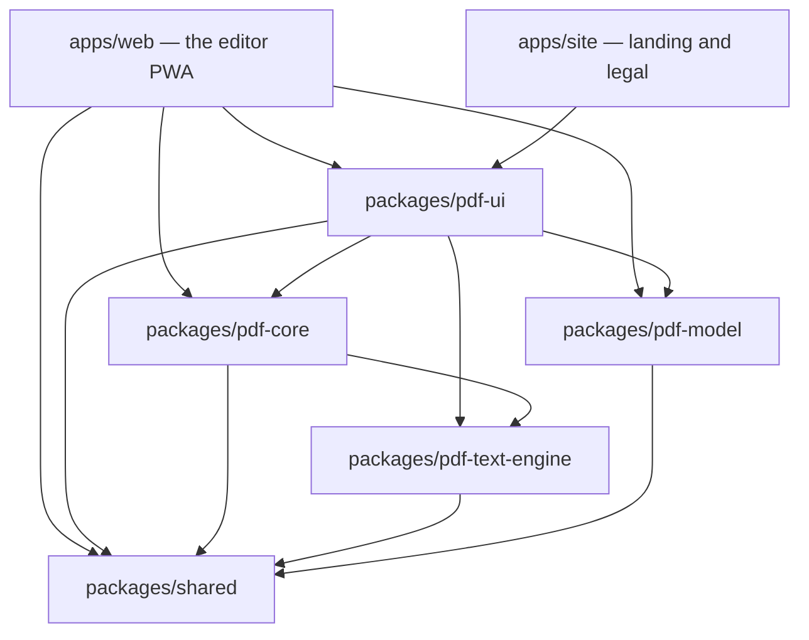
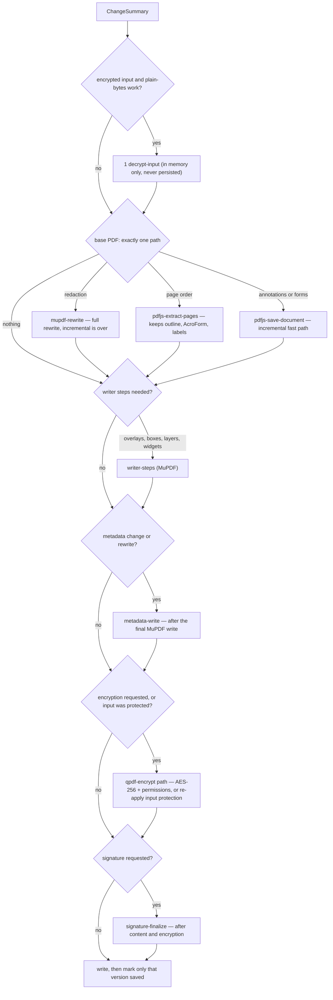
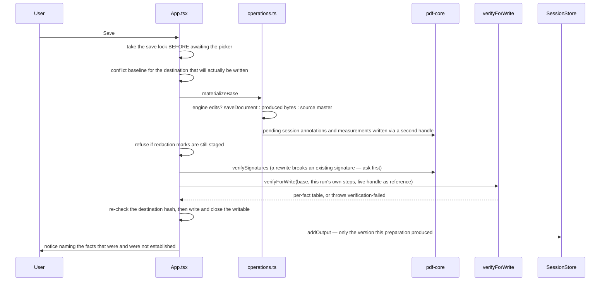

# Architecture

Internal design of SsPdfEditor. [`README.md`](README.md) describes what the product does
and how to run it; this document describes how it is built, which invariants hold it
together, and which parts are honest approximations.

Everything below is drawn from the code in this repository. Where a design rule is
enforced mechanically, the enforcing file is named. Where a claim is a measurement, the
measurement is named.

---

## 1. Design stance

Five rules explain most of the decisions in this codebase:

1. **Three engines, one contract.** pdf.js renders and reads, MuPDF writes (every writer,
   §5.1) and also erases and encrypts, Tesseract recognises. Each is reachable only through an adapter in
   `packages/pdf-core/src/engines/`; no component, panel or app file imports an engine
   package directly. Operations are `bytes in → bytes (or files) out` plus a report
   (`packages/pdf-core/src/ops/types.ts`).
2. **Document state is a data model, not a store library.** Sessions, the operation
   journal, drafts and the save router are plain TypeScript in `pdf-model`, DOM-free and
   Node-testable. React subscribes through `useSyncExternalStore`.
3. **Undo is chronological, across engines.** Every applied operation is a *new whole
   PDF*; the journal records that fact as data and keeps the bytes in a bounded snapshot
   store. There is no per-engine undo stack and no replay of engine payloads.
4. **A save verifies what it can and reports what it cannot.** Before bytes are written,
   the output is compared against the live document over twelve declared facts, an
   operation must declare which of them it may change, and every fact this build cannot
   check is reported `unsupported` or `degraded` instead of being counted as a pass. A
   promised fact that broke throws.
5. **Honesty is a feature.** Operations report what they lost (`OperationNote` with
   `kind: 'lost'`), verification has `unsupported` and `degraded` states rather than a
   boolean badge, signature verification has four independent fields, and the
   accessibility check refuses to produce a score.

---

## 2. Workspace and dependency graph

pnpm workspace (`pnpm-workspace.yaml`): `apps/*`, `packages/*`, `tools/spikes`.



Dependencies point one way: `web → ui → core → text-engine → shared`, and
`model → shared`. `pdf-core` may not import `pdf-ui` or `pdf-model`; `pdf-model` never
talks to an engine at all — that is what keeps it testable in Node. The one deliberate
exception is `apps/web`, which is the only place allowed to wire everything together.

There is **no build step** for the packages: each `package.json` maps its exports straight
at `src/*.ts`, and Vite compiles the TypeScript once, at the app boundary.

### Entry points are chosen for bundle shape, not tidiness

`pdf-ui` declares subpath exports (`./ui`, `./viewer`, `./panels`, `./dialog`, `./tools`,
`./printing`, `./palette`, `./text-edit`, `./tokens.css`) and `apps/web/src/App.tsx`
imports through them. The root barrel is not tree-shakeable in practice, so importing it
for a value pulls the whole surface into the first paint. Two concrete consequences are
recorded in the code:

- `packages/pdf-ui/src/shell/ShellSurface.tsx` is the `./ui` entry and is **only a re-export
  barrel** — it is the deliberate first-paint import surface, not a component. There is
  no `ShellSurface` component; the shell is `apps/web/src/App.tsx`.
- `packages/pdf-core/src/ops/index.ts` re-exports every operation **except `./sign`**. Routing
  signing through the barrel pulled `pkijs` + `asn1js` into the entry chunk (measured:
  302.66 KiB gzip against a locked ≤ 250 KiB budget); the sign dialog imports
  `pdf-core/ops/sign` directly so the ASN.1 stack keeps its own chunk.

Everything heavy is a dynamic `import()`: the pdf.js core, the viewer stack, the dialogs,
the dock panels, the print surface and the palette are all loaded on demand, and
`main.tsx` warms the engine, printer and palette chunks on idle so the first user action
does not pay for the download.
The writers the shell reaches only from a user action and imports nowhere else —
annotation removal, layer writes, attachments, the redaction audit and the font inventory
— go through `apps/web/src/lazy-ops.ts`: same signatures, loaded on the first call.
That took the entry chunk from 250.6 to 244.9 kB gzip (2026-10-04).

---

## 3. `pdf-shared` — the vocabulary

| Module | Responsibility |
|---|---|
| `errors.ts` | The single error contract. `ToolError` carries a stable code (29 of them, `TOOL_ERROR_CODES`), an i18n message key, an i18n hint key, and `details.engine` / `details.engineMessage` for diagnostics. Raw English engine text never reaches the UI. `toToolError()` is the last line of defence. |
| `limits.ts` | Two-tier limits (`LIMITS`), the build budgets (`BUILD_BUDGETS`), `checkDocumentLimits()` as the single verdict function, and `detectDeviceTier()`. |
| `i18n/` | The message catalogue: `MessageKey = keyof typeof tr`, `createTranslator(locale)` with per-key fallback to Turkish, and identical key sets in `tr` and `en`. |

Because `MessageKey` is a union of literal keys, passing an unknown key is a compile
error. That is why operation notes, dialog titles and error text are typed as `MessageKey`
rather than `string`: an untranslated sentence fails `pnpm typecheck` instead of shipping
as English. (A few surfaces where the key set is not yet merged into the catalogue use an
explicit, marked cast — `MEASURE_KEYS` in `MeasureLayer.tsx`, `BatchMessageKey`,
`A11Y_KEYS` — and render the key id rather than inventing English copy.)

---

## 4. `pdf-model` — sessions, history, drafts, save routing

### 4.1 Three versions of a document

`source.ts` keeps three things apart, and the distinction is load-bearing:

- **Source** — the immutable master bytes plus the SHA-256 hash and, when the file came
  from a File System Access picker, the `FileSystemFileHandle`. Engines never receive this
  buffer: they get `copyForEngine()`, because pdf.js may transfer (detach) a `Uint8Array`
  it is handed.
- **Working version** — what the journal currently applies to: a `stateId` that is stable
  across undo/redo (unlike `id`, which identifies a transition), an optional
  `ProducedDocument` with the newest produced bytes, and the pending overlay state.
- **Output version** — what was actually written where, including the verification record
  and the output hash.

The rule that falls out of it: the source master is never overwritten by a reconstruction,
and Export/Save distinguish "still the source" from "produced bytes" by
`working.produced === null`.

### 4.2 The operation journal

`journal.ts` holds one `OperationJournal` per document. Entries are **data** — engine, op
kind, JSON payload, schema version, i18n label key and params — never functions, because a
draft goes through structured cloning. `JOURNAL_SCHEMA = 2`.

Guarantees the class actually provides:

- `append()` truncates the redo tail and **returns** the discarded entries, so the caller
  can release the snapshots they pointed at.
- The entry array is replaced with a new array on append, never truncated in place.
  `entries` is handed out by reference and read across `await`; mutating it in place
  rewrote history callers already held.
- `fromJSON()` rejects an out-of-range cursor instead of clamping it — clamping would
  silently restore a different state than the user left.
- `#stepFor` in `session.ts` materialises one of three step kinds: `document` (swap the
  produced snapshot, or the source master when `before`/`after` is `null`), `overlays`
  (canvas-only edits), or `unavailable` when the bytes the step names are no longer held.

`DOCUMENT_CHANGE_KIND = 'document.change'` is the single op kind document capabilities write:

```ts
{ before: string | null, beforeOverlays, after: string, engine: string, steps: string[] }
```

One op kind is deliberate. Every capability ends the same way — the working document
becomes a new PDF — and engine-opaque operations revert through the nearest **snapshot**
rather than through a replayable payload. A capability that cannot describe its change as
data therefore cannot be wired in at all.

### 4.3 Snapshot retention

`SessionStore.#remember()` keeps produced documents in a bounded list per tab:

- budget: `max(3 × document size, 64 MiB)`, with `keepNewest = 2` always retained;
- on append, the **abandoned branch is released first** and the budget is applied second
  (`#releaseDiscarded`), because running the budget over a list that still held the
  snapshots the append was about to invalidate counted unreachable bytes as live and
  evicted reachable history to pay for them;
- release is precise: only snapshots that no entry *before the cursor* and no working
  version still names are dropped, so a branch that re-lands on an earlier state keeps its
  bytes. There is exactly one `keepNewest` constant in the tree; a second copy in
  `session.ts` had drifted to a different value.

### 4.4 Save routing

`save-router.ts` picks the paths a change set actually needs and orders them by
dependency. It is not a chain of engines run "just in case".



Contract points the router returns and the report shows:

- `incremental` is true **only** for the single pdf.js `saveDocument` path on an
  unencrypted input. Any other writer ends the fast path and says `incremental: false`.
- `rewritesStructure` is true for redaction, writer steps and page composition — those
  normalise object numbering, compression and XMP.
- `reprotects` is true when the input was encrypted and the user did not ask for
  protection to be removed: protection is never silently downgraded.
- Redaction forces the MuPDF full rewrite, because `canBeSavedIncrementally()` is false
  after `applyRedactions()` and an incremental write would keep the erased revision
  reachable through `/Prev`.

### 4.5 Drafts and the vault

`drafts.ts` is DOM-free **policy**; the OPFS implementation is `apps/web/src/drafts.ts`.

- A draft carries **model data only**: id, name, page count, size, dirty flag, the journal
  (with cursor), the working state id, the overlays, and the *engine-side* delta
  (`engineValues`: form values and annotation edits that live in pdf.js's annotation
  storage until a save).
- The master bytes belong to the **source vault**, not the draft. A source with a File
  System Access handle is referenced by an opaque key; a handle-less source is written to
  the vault **once** on open. `sourceKeyFor()` derives the key from the content hash, so
  the same document never writes twice and two tabs share one blob.
- `parseDraft()` treats stored data as untrusted input and validates the journal **as a
  unit**. A filtered array would be worse than a rejected one: the persisted cursor points
  into that array, so dropping one malformed entry silently shifts every later state.
  One bad entry makes the whole draft unreadable, and the caller reports that.
- `encodeEngineValues()` projects storage entries to JSON. Plain objects and `Blob`
  bitmaps survive (bitmaps as base64, under a 2 MiB budget); typed arrays, `Map`s, class
  instances and promises are counted as `dropped` rather than projected into something
  that would decode differently from what was stored.

`vault.ts` is the retention policy and its central rule is **uncertain references
retain**:

- a key may be deleted only when the whole inventory was read successfully and nothing
  references it — no manifest, no open document, no peer window;
- `enumerationFailed` or any `unreadable` manifest makes the plan **refuse**
  (`{ ok: false, reason: 'incomplete-inventory' }`) rather than sweep;
- sensitive documents own nothing (`keysForDraft` returns the source key and snapshot
  keys, and a sensitive document is never persisted at all);
- deletion is logical, not physical — it cannot overwrite the bytes underneath and cannot
  reach a downloaded copy, so the UI must not call it secure erasure.

### 4.6 Trust roots

`trust-roots.ts` stores exactly what the user imported: the certificate DER (base64), a
label and a timestamp, in a versioned file (`version: 1`). There is no built-in CA list,
because shipping one would vouch for certificates the user never chose. base64 is
implemented in the module rather than via `btoa`, so the code runs identically in Node and
the browser. A stored root that does not decode, or decodes to fewer than 64 bytes, is
dropped rather than trusted, and `trustRootFrom` derives the id from the DER, so importing
the same certificate twice is one entry.

---

## 5. `pdf-core` — engines and operations

### 5.1 Engine adapters

| Adapter | Upstream | Threading | Used for |
|---|---|---|---|
| `engines/pdfjs-handle.ts` | `pdfjs-dist` 6.3.289 | its own Web Worker (`/engines/pdfjs/pdf.worker.mjs`); painting on the main thread into a caller canvas | rendering, text, outline, page labels, annotation storage and its save, form field objects, attachments, operators, page composition |
| `engines/mupdf.ts` | `mupdf` 1.28.1 (wasm, ~9.93 MiB) | main thread, imported by **runtime URL** behind a `vite-ignore` marker | redaction, redaction find/audit, encryption, page boxes (auto-crop), page-label writing, text editing's erase stage, structured text extraction, the page layout behind the Word/Excel/CSV export (`ops/page-layout.ts`) |
| `engines/mupdf-write.ts` | `mupdf` (through `engines/mupdf.ts`) | as above | the shared writer vocabulary: open/save (`garbage,compress`, object numbers kept), the producer line, text-as-string, the embedded Noto face; used by document properties (`ops/metadata.ts`), attachments (`ops/attachments-write.ts`), layers (`ops/layer-write.ts`), links (`ops/link-edit.ts`), the outline (`ops/outline-edit.ts`), annotation removal, transforms and the session annotation writers (`ops/annotation-*.ts`, `ops/annotations.ts`), the font inventory (`ops/pdf-fonts.ts`, read-only), stamps (`ops/stamp.ts`), placed pictures and simple signatures (`ops/image-stamp.ts`), the conversion of other formats (`ops/convert.ts`), the image writers (`ops/image-opacity.ts`, `ops/image-edit.ts`, `ops/images.ts`), page boxes (`ops/page-boxes.ts`), blank documents (`ops/create.ts`), composition (`ops/compose.ts`), page insertion (`ops/page-insert.ts`), imposition (`ops/impose.ts`), compression (`ops/compress.ts`), forms (`ops/forms.ts`), the OCR text layer (`ops/ocr.ts`), text editing (`ops/text-edit.ts`) and find and replace (`ops/find-replace.ts`, with the document's own fonts read by `engines/doc-fonts.ts`); page drawing goes through `appendPageContent` (existing content wrapped in `q`/`Q`, one new stream), `wrapPageContent` (a transform around the existing streams) and `addPageResource` (fresh names in the page's own `/Resources`) |
| `engines/noto.ts` | the pinned Noto Sans files | `fetch` from our own origin, cached per session | the font bytes every writer embeds, whichever engine writes |
| `engines/tesseract.ts` | `tesseract.js` 6.0.1 + `tesseract.js-core` 6.1.2 | its own Web Worker(s) | OCR only |

**Every writer runs on MuPDF.** They were consolidated from pdf-lib one operation at a time
(2026-09-28/29): each move first got a behaviour test that passed against the pdf-lib writer
(where that writer could run the case at all), then the writer was ported and the same test
had to stay green. The moves, and the defects they fixed on the way:

- document properties (`ops/metadata.ts`);
- attachments (`ops/attachments-write.ts`), which now also keeps the embedded-file name tree
  sorted;
- the font inventory the Document information panel reads (`ops/pdf-fonts.ts`);
- layer writes (`ops/layer-write.ts`), which now also report a layer name that matched
  nothing — the pdf-lib writer returned before adding that warning;
- link edits (`ops/link-edit.ts`);
- outline edits (`ops/outline-edit.ts`), where two pdf-lib defects are fixed: nested items
  were never chained onto their parent, and a removal kept the removed item in the recount,
  so every bookmark delete was refused by the read-back;
- removing persisted annotations (`ops/annotation-remove.ts`), whose steps are now
  `load` / `annotations.remove` / `save` / `verify` — step ids no longer name an engine;
- moving and turning persisted annotations (`ops/annotation-transform.ts`), steps
  `load` / `annotations.transform` / `save` / `verify`;
- the session annotation writers the engine cannot finish: underline/strikeout/squiggly
  retag and marker resolution (`ops/annotations.ts`), shapes and marker strokes
  (`ops/annotation-shapes.ts`) and typed text (`ops/annotation-freetext.ts`). They append
  to `/Annots` only; pdf-lib's `addAnnot` also rewrapped the page's content in `q`/`Q`;
- measurement annotations (`ops/measure.ts`), whose `/M` is now a PDF date (the pdf-lib
  writer stored the ISO string);
- stamps, Bates numbers and watermarks (`ops/stamp.ts`), where the no-print group now carries
  its print state in `/Usage /Print`, the place the `/D /AS` print event reads — the pdf-lib
  writer put `/Print` directly on the group, where no reader looks;
- image opacity (`ops/image-opacity.ts`) and image replacement (`ops/image-edit.ts`), where the
  replacement is written into the object the page already names (`writeObject` +
  `writeRawStream`), and an ICC-based grey or RGB image now reads as grey or RGB samples —
  MuPDF tags device RGB with an sRGB profile, so without that an image replaced once could not
  be cropped or rotated again;
- a blank document (`ops/create.ts`, steps `create.blank` / `save`): empty pages of an ISO or
  US size in either orientation, with an empty content stream and no resources;
- a placed picture — a drawn, typed or photographed signature, initials, or an image
  (`ops/image-stamp.ts`, steps `load` / `annotations.stamp` / `save` / `verify`): one
  `/Stamp` whose `/AP /N` form draws the PNG (alpha kept as a soft mask) or JPEG over
  `BBox [0 0 w h]`. On a turned page the form carries the counter-turn as its `/Matrix`
  and the `/Rect` extents are swapped, so the picture stands upright on screen. `/Name` is
  `SsSignature`, `SsInitials` or `SsImage`, and `/Contents` holds the marker plus the kind.
  Resizing (`resizeImageStamp`, step `annotations.resize`) writes `/Rect` only — readers
  scale the appearance to it — and refuses anything that is not a `/Stamp`, whose geometry
  lives in more keys than the rectangle;
- other documents → PDF (`ops/convert.ts`, steps `convert.read` / `convert.layout` /
  `convert.write` / `save` / `convert.outline` / `convert.links` / `verify`). MuPDF 1.28.1
  opens DOCX/XLSX/PPTX itself, but only as reflowed text: a sheet lost its labels and grid, a
  slide became one paragraph and a Word table a list of cells. So each format is first read
  into HTML — DOCX through mammoth (BSD-2-Clause, `externalFileAccess` off), XLSX and PPTX by
  `ops/convert-ooxml.ts` over JSZip and `@xmldom/xmldom`, text and CSV by `ops/convert-text.ts`
  (UTF-8, else Windows-1254) — and HTML, EPUB and FB2 go to MuPDF as they are. Every part is
  laid out (`Document.style` adds only the `@page` margin, before `layout`) and run through
  one `DocumentWriter`. The source's outline and links are written afterwards by the
  existing writers (`applyOutlineEdit`, `applyLinkEdit`, schemes other than `http:`,
  `https:` and `mailto:` dropped and counted), and the result is reopened and its page
  count compared. `ops/convert-formats.ts` holds the extension table with no dependencies,
  so the shell can recognise a convertible file without loading the converters;
- PDF → Word, Excel and CSV (`ops/export-office.ts`, steps `office.read` / `office.tables` /
  `office.write` / `verify`). A download: nothing is written to the document. The ideas are
  pdf2docx's (MIT; none of its code), the table modes Tabula's. `ops/page-layout.ts` reads a
  page as layout. Characters with font, size, weight and colour come from the
  structured-text walker. Pictures are drawn through their own transform into a transparent
  pixmap: `Image.toPixmap()` gave raw samples, so an `/SMask` picture became a grey box with
  black corners, and the draw device did not apply the mask either, so `softMasked` folds it
  into the alpha. Ruling lines and drawn marks come from one pass of a JS `Device`.
  - **Tables.** MuPDF's own `table-hunt` was measured first: it took a page of Word
    paragraphs for a two-column table and found nothing in a ruled spreadsheet grid. So
    ruled tables are found from merged horizontal and vertical rules ("lattice"; a missing
    rule between two cells merges them). Tables without rules come from runs of rows that
    each hold two or more pieces of text, their columns being the gaps that run through
    every row ("stream"). Prose set in columns is told apart by its long pieces.
  - **Drawings.** Curves, polygons that are not rectangles, shadings and pictures seed
    regions that grow over every mark they touch. A region holding a line of prose is left
    to the text, and so is one crossing a table or covering most of the page. The region is
    rendered at 144 dpi as one picture, labels included, and its text leaves the flow. Above
    2000 marks a page counts as one drawing, since growing it mark by mark is quadratic.
  - **Word.** Each page is a section with the page's size, orientation and margins. Blocks
    are cut into paragraphs where a line ends short, a gap opens, the size changes or a
    bullet starts. A hyphen that breaks a word before a lower-case letter is removed.
    Paragraphs of several lines that start a third of the way across are a second column,
    and alignment and indents are measured in a paragraph's own column. Sizes at least
    1.3× the body size (1.15× when bold) become `Heading1`–`3` by rank. `w:lang` is the
    catalog's `/Lang`. The package is written by hand and read back with mammoth, whose
    word count must equal the words written.
  - **Excel.** A cell is a number only when it reads one way (`cellNumber`). The workbook
    is reopened and its cells counted. CSV rows are read back through `parseCsv`.
  - **mupdf.js 1.28.1 defect.** Device callbacks get their `Shade` and `Image` in wrappers
    that take no reference but are registered with the class finalizer. Under forced
    garbage collection the engine asserted (`remove non-existent hash entry`) and the next
    render failed (`Unexpected mesh type 0`). `borrowed()` takes those wrappers off the
    finalizer. Paths, stroke states and text are kept by the binding and need nothing, and
    the walker's fonts and images were measured sound;
- images → PDF (`ops/images.ts`, steps `images.create` / `images.embed` / `save`), where two
  pdf-lib-era defects are fixed: EXIF orientations 6 and 8 were turned the wrong way (an
  upright phone photo came out upside down) and `contain`/`cover` squashed a turned photo into
  the unturned aspect ratio. Every orientation is now one unit-square matrix, and the embedded
  JPEG's own tag is set to 1, because MuPDF-based readers apply it and would turn the picture
  a second time;
- page boxes, resize, scale, shift, content rotation and auto-crop (`ops/page-boxes.ts`), where
  a content transform wraps the page's streams through `wrapPageContent` and auto-crop now
  measures on the document it edits instead of opening a second copy;
- the rotation pass and the merge's metadata step after pdf.js `extractPages`
  (`ops/compose.ts`), steps `compose.rotate` / `metadata` / `save`; `compose.rotate` is now
  declared to the save verification (it may change `rotation`), where `pdf-lib.setRotation`
  was an unknown step;
- page insertion and replacement (`ops/page-insert.ts`), steps `pdfjs.extractPages` / `metadata`
  / `save`, with the base Info carried by `copyDocumentInfo` (raw keywords and PDF dates kept as
  written) and matched image pages drawn as form XObjects. One defect is fixed: inserting chosen
  pages of another document inserted its *first* pages instead (the plan's slot index was
  handed to the engine as the page number), so "insert pages 3-4 of this file" put in 1-2;
- imposition and the print layout (`ops/impose.ts`), where each source page is a form XObject
  (`pageAsForm`, resources grafted once per document). Two poster defects are fixed: every row
  of tiles but the last came out blank (the vertical offset had its sign reversed, so the top of
  a poster was never printed), and the enlargement took the larger of the two scales, which cut
  the page's right or bottom edge off the grid — it now fits the whole page;
- compression (`ops/compress.ts`): the structure mode is a MuPDF rewrite with deduplication,
  lossless font/image compression and object streams, and no longer regenerates form-field
  appearances (pdf-lib did, and warned); the raster mode replaces the selected pages **in
  place** (`assembleRaster`) instead of rebuilding the file, so the other pages, the outline
  and the rest of the catalog are kept. Its `assemble` step now declares what it really
  changes on those pages (`rotation`, `cropBox`, `annotations` besides the content);
- forms (`ops/forms.ts`): the field tree is walked by the writer itself (inherited `/FT`, `/Ff`,
  `/V`, `/DA`), and every text, choice, check and radio appearance it writes is drawn with the
  embedded Noto Sans (`/NotoForm` in `/AcroForm /DR`). MuPDF's own appearance synthesis was
  measured and not used: it places the baseline outside the widget box. Two defects are
  fixed: a field whose dictionary is also its widget reported no page (`pageIndex: null` for
  most real forms), and creating a text field always failed ("No /DA");
- the OCR text layer (`ops/ocr.ts` `writeOcrLayer`, step `ocr.layer`), one content stream per
  page where the pdf-lib writer opened one per word. A word Noto Sans can spell uses it; any
  other uses Tesseract's glyph-less design rebuilt in `engines/glyphless-font.ts` (Type 0
  over Identity-H, every CID drawing one empty glyph, `/ToUnicode` CID *n* → UTF-16 unit *n*).
  Tesseract's own copy of that font sits in its wasm data, which the build split at zero runs,
  so it could not be lifted out whole;
- the text-edit insert half (`ops/text-edit.ts`), steps `load` / `text.font` / `text.draw` /
  `save` after MuPDF's erase: a file font or Noto is embedded whole (`embedFontFile`), a
  standard-14 face is drawn through WinAnsiEncoding (`standardFace`) only when WinAnsi can
  spell the line, and a `doc:<name>` face is the page's own font (`engines/doc-fonts.ts`,
  §5.8); and the page geometry of the text source (`text-source.ts`);
- the batch runner's page count (`ops/batch.ts`), measured through `openForWrite`, so a
  password-locked item fails on its own with `encrypted-unsupported`;
- signing and signature verification (`ops/sign.ts`, `ops/signature-status.ts`); the Node
  gate `tools/spikes/sign-check.mts` loads the engine through `node-mupdf-hook.mjs`, which
  resolves the served engine URL to the installed package;
- accessibility (`ops/accessibility.ts`): the check, the tagger (marked content spliced into
  the page's own decoded bytes, the structure tree written with MuPDF) and the alt-text
  writer; images and pages are identified by object number.

`openForWrite` refuses a document that needs a password (`encrypted-unsupported`), as pdf-lib
did; one encrypted with an owner password only now opens and keeps its encryption on save.

pdf-lib is gone from the product: `engines/pdflib.ts` is deleted, no workspace the build
bundles declares it, and its licence texts left `dist/licenses/`. The unit tests write their
fixtures with MuPDF's object model, and so do the behaviour checks and the README recorder, through
`tools/spikes/mupdf-fixture.mjs` (text, images, links, outline, fields, metadata, XMP,
attachments; plus a reader for what an exported file carries) — no workspace declares
pdf-lib any more, and the lockfile has none. `@pdf-lib/fontkit`, the font parser the text
model measured with, is gone too (2026-10-04): glyph lookups and advances come from MuPDF's
`Font` over the same bytes, and the four header numbers from `readFontHeader` (§6).

Two binding rules every MuPDF writer relies on are written down in `engines/mupdf-write.ts`:
a plain JS string becomes a PDF *name* (text goes through `newString`), and a missing key is
the shared `PDFObject.Null`, which throws on `resolve()` — and a stream is only a stream by
its indirect reference.

There is **no shared engine interface**. The one shared handle type is
`PdfDocumentHandle`, implemented only by `openWithPdfjs`; the other adapters are function
modules, and the MuPDF writers share `engines/mupdf-write.ts`. The single cross-engine
vocabulary is `OperationEngine = 'pdfjs' | 'mupdf' | 'tesseract' | 'model'`.

Every adapter obeys the same two rules:

- **The caller's buffer is never handed to an engine.** `openPdf()` and `openWithPdfjs()`
  work on a disposable copy, because pdf.js may detach what it is given.
- **Engine errors are mapped once.** `mapMupdfError` (MuPDF's
  plain `Error`s whose message carries the MuPDF text) and the pdf.js exception classes
  all become `ToolError`s with a stable code; the verbatim engine string survives in
  `details.engineMessage` for diagnostics only.

`PdfDocumentHandle.saveDocument()` returns the document's own bytes (`getData()`) when the
engine's annotation storage is empty: there is nothing to serialise, and pdf.js otherwise
re-serialises and warns that `getData` was meant — measured on every export without a form
edit.

**Typed text** (`ops/annotation-freetext.ts`) is the one annotation writer that draws words:
the engine's `FREETEXT` writer uses a WinAnsi base font with no `ş ğ ı İ`, so notes stay
empty `/FreeText` shells and the `freetext` kind is written through MuPDF with the embedded Noto
Sans in its `/AP`. `planFreeTextLayout()` (pure) wraps the text inside the box — breaking a
word wider than the box between characters rather than letting the reader clip it — and the
writer re-opens its output and requires every mark back as a `/FreeText` with its marker and
an appearance, or throws `verification-failed`. It reports the `annotations.freetext` step,
which `OPERATION_TABLE`'s `annotations.*` entry declares. On a page with its own `/Rotate`
the overlay stores the box unturned about the centre the user typed at and carries the
counter-turn as the mark's rotation; `writeAnnotationsToFile` hands it to
`transformPdfAnnotations`, which turns the geometry and the appearance together, so the file
shows the text upright the way it was typed.

`assets.ts` centralises the same-origin asset paths (`/engines/**`, `/fonts/noto/**`). The
Tesseract paths are all passed explicitly to `createWorker` — worker, core (the SIMD+LSTM
`.wasm.js` **file**, not a directory, so the build variant is not chosen at runtime) and
language data — precisely because tesseract.js otherwise falls back to its CDN defaults.

### 5.2 The operation contract

`ops/types.ts`:

```ts
OperationContext  { signal: AbortSignal; onProgress? }
OperationOutcome  { bytes: Uint8Array; report: OperationReport }
OperationReport   { engine; steps[]; notes[]; inputBytes; outputBytes; pageCount; incremental }
OperationNote     { kind: 'lost' | 'preserved' | 'changed' | 'warning'; key: MessageKey; params? }
OutputFile        { name; bytes; mime }        // a produced file that is not the document
PageRect          { pageIndex; rect: [x0,y0,x1,y1] }
```

`steps` is not decoration: the step ids an operation reports are the vocabulary the save
verification uses to decide what the operation was allowed to change (§10). Notes carry
`kind: 'lost'` for anything the user must be told about, and the report panel renders lost
notes first.

Every long operation is cancellable through `OperationContext.signal`; `throwIfAborted()`
and engine-specific abort handling are checked between phases, and a cancelled OCR run
terminates its worker rather than abandoning it. No operation in the package is a stub.

### 5.3 The signature stack

Signing is the strictest part of the codebase, because a signature covers the bytes it was
made over.

**Writing (`ops/sign.ts`).** PAdES B-B: a `/Sig` field with `/SubFilter
/ETSI.CAdES.detached`, a visible or invisible appearance, and a detached CMS. The byte
mechanics are arranged around one number, `/ByteRange`:

1. `/Contents` is reserved as 16 KiB of zero bytes (written as a hex string of zeros) and
   `/ByteRange` as four integers of a fixed 10-digit width (`2000000000`).
2. The document is serialised **once** through the MuPDF writer base (no object streams,
   no appearance regeneration); an encrypted document is refused, since its placeholders
   would be encrypted too.
3. The `/Contents` placeholder is located in the produced bytes (uniqueness enforced); the
   real ByteRange is computed from those offsets and written over the same digits, with a
   length-equality assertion.
4. The two covered segments are hashed and signed, and the CMS is written into the
   placeholder after a size check against the reservation.
5. The produced bytes are re-read by **the same verifier the properties panel uses**; if
   the verdict is not `integrity: 'valid'`, the operation throws `verification-failed`
   rather than returning an unverifiable file.

A signed file is a *new version*: the shell never pretends the working document is the
signed one, and the save path warns before a rewrite that would break an existing
signature. What a save does to signatures is decided per file that can carry them
(`signatureWarning` in `apps/web/src/save-plan.ts`): the file the session opened and the
version it produced (e.g. by signing), each against its own bytes. Output identical to a
file → nothing to say about it; output that extends it → "a revision follows" (still
valid); anything else → "the signature will break"; the worst fate wins, and an unsigned
file is never warned about. Judging only the opened file warned on every export of a
document signed in the session; judging only the produced version missed an edit that had
already broken the opened file's signature.

**CMS (`signature-cms.ts`).** `pkijs` + `asn1js` for structure, WebCrypto for crypto — no
network. Signed attributes are `contentType`, `signingTime`, `messageDigest` and
`signingCertificateV2`; the attribute SET is DER-sorted (X.690 §11.6) and the bytes signed
are the DER of the attributes re-tagged to the universal `SET OF` tag (RFC 5652 §5.4) —
both measured against `openssl cms -verify`. Algorithms come from the key: RSA PKCS#1 v1.5
(with the explicit ASN.1 NULL parameter RSA requires) or ECDSA P-256/384/521, with
SHA-256/384/512.

**Identity (`signature-pkcs12.ts`).** PKCS#12 only, parsed with `checkIntegrity: true`, so
a wrong password or a damaged container cannot be signed with. The key is imported
**non-extractable** with `['sign']` only, and the container bytes are dropped after
parsing. There is no OS keychain integration.

**Verification (`ops/signature-status.ts`).** Signatures are found by **scanning the raw
bytes** for `/ByteRange` and the `/Contents` whose own offset falls inside the gap; a scan
entry is only accepted when its integers agree with the object graph's (read with MuPDF).
A file whose bytes never name `/ByteRange` is answered without loading an engine — the
verdicts are asked for as soon as a document opens. The ASN.1 walk is
hand-rolled and bounded (64 signatures, 1 024 revisions, 4 096 nodes). Two cryptographic
checks run: the digest of the concatenated ByteRange versus the `messageDigest` attribute,
**and** the CMS signature over the signed attributes verified with the signer certificate's
public key — the second exists because a digest alone can be recomputed by an attacker. An
algorithm WebCrypto cannot provide yields `unchecked`, not `invalid`.

The verdict has four independent fields, never one badge:

| Field | Values |
|---|---|
| `integrity` | `valid` / `invalid` / `unchecked` |
| `trust` | `trusted` / `untrusted` / `self-signed` / `indeterminate` / `not-checked` |
| `revocation` | **always `indeterminate`** — there is no OCSP and no CRL in this codebase |
| `coverage` | `covers-whole-document` / `covers-partial` / `unknown`, computed from the ByteRange |

plus `changesAfterSigning`, derived from the `startxref`/`/Prev` revision chain.
`adbe.pkcs7.detached` and `ETSI.CAdES.detached` are the accepted SubFilters;
`adbe.pkcs7.sha1` and `ETSI.RFC3161` are reported `unchecked` because their digest relation
differs — **timestamps are never validated**.

**Trust (`signature-trust.ts`).** Path building follows the RFC 5280 §6.1 shape: candidate
issuers matched by name and AKI/SKI, DFS bounded by depth 8 and 32 candidates, each link's
signature verified over the child's `tbsCertificate`, validity windows checked against the
supplied clock, and `basicConstraints` cA / `keyUsage.keyCertSign` / `pathLenConstraint` /
`nameConstraints` enforced. **Policy processing (RFC 5280 §6.1.5) is deliberately not
implemented**, and a critical extension outside the applied set forces `indeterminate`
rather than being ignored. With no roots imported the answer is `not-checked` with reason
`no-roots` — an absence of evidence is never reported as `untrusted`.

### 5.4 Redaction

Redaction removes content; it does not paint over it.

```mermaid
sequenceDiagram
    participant UI as RedactionLayer / dialog
    participant M as MuPDF adapter
    participant V as verifyRedaction
    participant A as auditRedactedDocument
    UI->>M: marks in app space (unrotated, y down from CropBox top)
    M->>M: createAnnotation('Redact') + setRect(rectToPageSpace(box, rotation))
    M->>M: structured-text coverage probe (empty marks are reported)
    M->>M: applyRedactions(black_boxes=false, lineArt=remove-if-touched, image/text method)
    M->>M: save garbage=compact,compress,clean (single revision, no /Prev)
    M->>V: produced bytes
    V-->>UI: re-opened, per-glyph check; a glyph >=50% covered fails verification
    UI->>A: needles read from the pre-redaction text inside the marks
    A-->>UI: residual terms, earlier revisions, orphan objects, structural markers
```

Details that matter:

- Marks travel in **app space** (unrotated user space, top-left origin, Y down from the
  unrotated CropBox top) and are converted through the verified four-rotation table. A
  rectangle stored in PDF user space is accepted silently by MuPDF and removes *nothing* —
  this is the single most expensive discovery recorded in the spikes.
- `black_boxes: false` is deliberate: a black bar would advertise the redaction and could
  be lifted. The erase is a content-stream operation.
- Line art touched by a mark is removed, because a rule that runs through the box would
  reveal where the covered text started and ended. (Text replacement uses the opposite
  setting — a different operation with a different contract.)
- The write uses `garbage=compact,compress,clean`, measured to leave a single revision
  with the erased stream's object dropped and the survivors renumbered.
- `verifyRedaction()` re-opens the **produced** bytes, inverts the page's actual transform
  and walks the structured text per character; a page where any non-whitespace glyph is
  ≥ 50 % covered throws `verification-failed`.
- `auditRedactedDocument()` is a raw-byte scan and **documents its own blind spot**: it
  cannot see inside deflated streams or object streams. It emits a `/FlateDecode` row and
  suppresses the orphan-object verdict entirely when `/ObjStm` is present, instead of
  implying a clean file.

### 5.5 OCR and accessibility

**OCR (`ops/ocr.ts`).** pdf.js renders the page at a DPI validated to 150–300 (outside the
range it fails rather than clamping) → Tesseract recognises it in a worker cached per
`quality|languages` → `writeOcrLayer` (MuPDF) writes an invisible text layer with Noto Sans,
one content stream per page, positioned through the page's unit viewport so the page's
rotation cancels exactly once. The font is embedded as the **complete** programme,
Identity-H with a `/ToUnicode` CMap — which is what makes the words selectable and
searchable at all. Noto Sans has no Arabic, Hebrew or CJK glyphs: such a word encoded as
glyph 0 and came back as nothing, so those words use the glyph-less font, whose codes are the
text's UTF-16 units. A right-to-left word is written in visual order (grapheme clusters
reversed), the order extractors undo with the bidi algorithm; written logically it came back
reversed. Words of Devanagari, Arabic, Hebrew, Korean and the glyph-less font get a space
beside them, because MuPDF found no gap between them and joined `नमस्ते दुनिया` into one
word. All of this is measured through both MuPDF and pdf.js extraction.

There are 27 languages (`OCR_LANGUAGE_CODES_ALL`). Turkish and English ship both models and
are in the offline package; the others ship `4.0.0_best_int` only. The `4.0.0` packs add the
legacy engine's data, which the LSTM-only worker never reads; for Chinese that is 27 MB, over
the 25 MiB asset limit. A `fast` run that includes one of them runs at `best`
(`effectiveOcrQuality`, one worker reads every language from one directory), and the report
says so. `existingText: 'skip' | 'overwrite'`
decides what happens to pages that already have text, and overwriting is reported as a
warning because it is additive. Cancellation is a real `worker.terminate()`, and the
`finally` awaits worker termination, so "memory is back" is true when the function
resolves.

**Accessibility (`ops/accessibility.ts`).** Three operations, and the first one is
deliberately not a score:

- `checkAccessibility()` returns findings with states `problem | ok | unchecked`, the
  checks that ran, and the checks that **did not** — reading order, tables, lists,
  contrast, font embedding, alt-text quality. There is no percentage and no conformance
  verdict.
- `tagDocument()` splices `/P <</MCID n>> BDC … EMC` into the page's original content
  bytes at instruction boundaries (existing bytes are copied verbatim, so nothing else can
  move), after matching text-showing operators to text-model blocks by tracking `q/Q`,
  `cm`, `BT`, `Tm`, `Td`, `TD`, `T*`, `TL` and `Tf`. It then writes `/StructTreeRoot` →
  `/Document` → one element per MCID with the parent tree a tagged PDF needs, and
  **re-opens the output** to compare marked-content sequences against the tree's MCRs. A
  document that already has a `/StructTreeRoot` is refused rather than merged.
- `setImageAlt()` writes `/Alt` on the image XObject and `/TU` on form fields; an empty
  alt text is refused, because decorative content would belong in an `/Artifact`, which
  this module does not write.

### 5.6 Encryption, batch and compare

`ops/security.ts` uses MuPDF as the crypto engine: AES-256 with a permissions bitmask,
and both `protectDocument()` and `unlockDocument()` **re-open their own output and
verify** (cipher and permissions for protect; page count plus a text sample for unlock),
because a mis-authenticated MuPDF save writes undecryptable garbage instead of failing.
The Security dialog's `resultKind` is `download`: the encrypted copy is handed over, never
applied to the open document (a protected file is read-only in the editor, so applying it
ended in a password prompt). A run may also overrule its dialog's `resultKind` for one result
with `OpRunResult.deliver` — the form-data **export** uses it to download its data file from a
`replace` dialog instead of replacing the document with it.

`ops/batch.ts` is not a second save router: every step names an existing operation, and
the order comes from the same dependency phases `save-router.ts` uses. Page-set changes go
through `openWithPdfjs` + `composeDocument` — the same route as the interactive page
actions — so there is no third composition path. Bounds: 256 items, per-item failures are
captured as mapped `ToolError` codes and the run continues, and cancellation is a report
rather than an exception.

`ops/compare.ts` offers two independent answers and always names the method: a line-level
LCS over text extracted by the **existing** text exporter (with word-level detail inside
changed pairs, and an explicit `truncated` reason when a bound is hit), and a pixel
comparison rendered at 40 DPI through an injected canvas surface, so the module stays
DOM-free.

### 5.7 Removing annotations — selection's writer

`ops/annotation-remove.ts` is what "delete a mark" means once the mark is in the file.
`removePdfAnnotations(bytes, { targets }, context)` is all-or-nothing and it never touches
page content: it writes no content stream, no page box and no page list, so what a reader
sees as the page is unchanged. Removing text or images is redaction's job (§5.4), and the two
must not be confused — deleting an annotation is not a forensic scrub.

A target is a **pdf.js annotation id on a stated page** — the pair `readAnnotations()`
reported. The id is pdf.js's spelling of an object reference (`17R`, `17R5`), parsed back to
`objectNumber`/`generationNumber` and matched against the indirect reference the stated
page's `/Annots` array holds, which is what keeps a stale target from deleting a different
annotation that shares its id. An id pdf.js synthesised for a direct dictionary (`annot_12`)
is refused rather than guessed at. A `/Widget` is refused outright, because a widget is a form
field's visible half and erasing it would silently drop the field from the document's form —
`flatten` or the form writer is the tool for that — and `/Widget` and `/Popup` are also
excluded from the selectable target universe for the same reason (§8.7).

Two dependency rules complete the picture, and both are about not leaving a file broken:

- **A comment's popup goes with its comment, and only when the file proves the ownership** —
  the popup's `/Parent` names the target. A popup that was the target instead clears its
  owning parent's `/Popup` key, because the parent survives.
- **An object is deleted only when nothing else points at it.** Replies (`/IRT`), another
  page's `/Annots` and a popup's `/Parent` are all read as references first; a reference that
  would dangle is left in place, and a surviving annotation's dictionary is never rewritten
  to make the delete look clean. A page that loses its last annotation loses its empty
  `/Annots` array too.

The write is MuPDF's rewrite (`engines/mupdf-write.ts`), which regenerates no appearance
stream — regenerating field appearances would rewrite the form the operation promises to
leave alone — and keeps object numbers, so every survivor keeps its pdf.js id. The report
says `incremental: false`, because the rewrite re-serialises the file and the incremental
fast path ends here. Steps reported: `load`, `annotations.remove`, `save`, `verify`, which
are the ids `operations.ts` declares in `OPERATION_TABLE` (§10.1).

**The read-back is the contract.** The produced bytes are re-opened and compared with what
the call predicted: every requested id is gone from its page, every other annotation of every
touched page is still there under the same id, no page gained an annotation, and each page's
`/Annots` entry count is its count before minus what was removed from it. A mismatch throws
`verification-failed` and the caller keeps the original file. An empty request returns the
input bytes untouched with a report, so "nothing selected" is not a rewrite.

### 5.8 Find and replace

`ops/find-replace.ts` replaces a text across the pages in scope. It reads every page once
through the text model (`readDocumentText`, one MuPDF document for all pages, then
`buildTextPage`), plans every match (`planFindReplace`, pure: every font question goes
through a `FaceSource`), and hands one `TextEditRequest` to the text editor's writer
(`applyTextEdit`), so the erase, the draw and the pdf.js verification are the text tool's
own. Steps: `text.find` (declared read-only in `OPERATION_TABLE`) and the writer's.

**Matching.** A block is a list of units — glyphs, word gaps and line breaks — and the search
compares NFKC-normalised code points, so `fi` matches `fi`; a match that would begin or end
inside one glyph is skipped and counted. A line-end hyphen before a lower-case letter is read
as hyphenation and joins the word. Without match case, `I` matches both `i` and `ı`, `İ`
matches `i`, and `ı` matches only `ı` — folding `ı` to `i` would make Turkish `sık` and `sik`
one word. Whole-word mode refuses a letter, digit or mark on either side.

**Placement**, per line of matches:

1. **Line** — a match that changes width with more text after it (within the column: a gap
   wider than 1 em is a tab stop) erases from the match to the end of that stretch and draws
   the replacement plus the rest again, moved by the difference, each run in the face that
   draws it exactly (`sameFace`: the page's own font, or the standard face it already was).
   Text after a tab stop stays while the moved text still ends a word gap before it. A
   deletion takes the following word gap along.
2. **In place** — the replacement at the first glyph's origin, size and colour, in the room
   up to the next word, or at a line end up to the nearest thing to its right: another
   block, or another line of the same block on the same band (MuPDF reports a table row as
   one block whose cells are lines sharing a baseline). Up to 20 % smaller to fit. A whole
   centred or right-aligned line stays centred or right-aligned.
3. **Paragraph** — a match across lines, or a line that cannot take the change, lays the
   block out again word by word (`placeParagraph`): every original run keeps its font, size
   and colour, the alignment is read from the lines (justified when every line that does not
   end a paragraph reaches the block's right edge), paragraphs and first-line indents are
   kept, and the paragraph grows into the free space below it before it shrinks (down to
   85 %). A block whose text cannot be drawn again run by run falls back to the text tool's
   one-face reflow (`planTextEdit`). A table-like block is never re-laid: a match that fits
   nowhere is drawn down to 60 % or left alone (`noRoom`).

**Faces.** A replacement uses the page's own font when it has a code for every character
**and** the document already draws each of them with that font — a subset holds only the
glyphs its producer used, and a glyph on the page is proof the file has it. Otherwise Noto
Sans when the old text was Noto Sans, a standard face of the same family, weight and slant
when WinAnsi can spell it, and Noto Sans after that. A substitute is sized so that it would
draw the old text as wide as the old font did, within ±15 %.

**The document's own fonts** (`engines/doc-fonts.ts`). A font is usable when new codes can
be found for it: a `/ToUnicode` CMap inverted (single-code-point entries), or a simple font's
base encoding (`WinAnsiEncoding`, `MacRomanEncoding` through the platform's own decoder,
`StandardEncoding`) with `/Differences` read for `uniXXXX`, single letters and the common
glyph names. Composite fonts must use `Identity-H`; Type3 fonts are not used. Widths come
from `/Widths` or `/W`/`/DW`, and a word gap the font has no space glyph for is drawn as a
`TJ` adjustment. MuPDF reports a font under its own spelling (`NimbusSans-Bold` for
`/BaseFont /Nimbus#20Sans#20Bold`), so names are compared without case, spaces or
punctuation, and the subset tags must agree. The writer finds the font again by name in the
page it draws on; the erase stage re-attaches a used font to the page's `/Resources` after
the redaction (`TEKeep`), because the redaction drops resources nothing draws with any more
and the compacting save would then drop the font itself.

**A MuPDF hazard this works around.** Resolving an image XObject of a page and then applying
redactions to that page made MuPDF 1.28.1 save the image as a dictionary without its stream:
every later render logged `format error: object is not a stream` and the picture was gone.
Reading the font dictionaries does not do this, so the erase stage reads page-level fonts
only (`pageFonts(page, { forms: false })`).

**Colours** come from the glyphs themselves: `readPageText` and `readDocumentText` take each
character's fill colour from MuPDF's text walk, and a block's colour is the one most of its
glyphs use. pdf.js's page-dominant colour is the fallback for a block MuPDF reported none
for; reading that one colour for every block turned a red heading black when it was edited.

**Verification.** The writer's checks apply, with two corrections this operation needed: a
replacement that contains the old text (`2024` → `2024–2025`) is not "erased text still
present" — the lines the operation drew are subtracted before the count — and text drawn word
by word is recognised as the operation's own at each word's position, not only at the line's
start.

---

## 6. `pdf-text-engine` — the text model

Pure by construction: plain data in, plain data out. No pdf.js, MuPDF or React
import; no DOM, no file or network access, and no dependency besides `pdf-shared`.

**Font metrics (`fonts.ts`).** `metricsFor(glyphs, bytes, text?)` takes the glyph lookups
as an argument — `GlyphSource`, the shape of MuPDF's `Font` (`encodeCharacter`,
`advanceGlyph`) — so the engine that embeds a face is the one that measures it.
`readFontHeader` reads the rest from the bytes: `unitsPerEm` (`head`) and
ascender/descender/line gap (`hhea`), every offset bounds-checked, WOFF/WOFF2 and
collections refused. Advances are scaled from em to font units and rounded. Over every
code point of both Noto faces this matches what `@pdf-lib/fontkit`, the parser it
replaced, reported: same coverage, same advances, same header numbers
(`text-source.test.ts` keeps fontkit's figures as the expected values).

The pieces, in the order the text-edit pipeline uses them:

1. **Text model (`model.ts`)** — `buildTextPage()` turns an extractor's per-character
   output into blocks → lines → words → glyph boxes, computes each block's style from the
   median glyph size and baseline distance, and classifies its alignment. A whitespace
   character the extractor reports is a word boundary by itself; the ink-gap test (0.15 em)
   is the fallback for producers that position words without one. The gap test alone glued
   italic words together, because a slanted glyph's bounding box reaches across the space.
2. **Editability (`editability.ts`)** — `measureEditability()` answers the only question
   that has an answer: *can this block's face be reproduced?* The verdict ladder is
   first-match-wins and documented: no glyphs → not editable; rotated or reversed →
   not editable (the write path draws horizontal lines only); skewed → not editable (a
   "small" skew is exactly what a user notices as damage); Type3 → not editable (it is
   vector artwork in a font wrapper); base-14 → editable but **substituted**; an embedded
   programme this package does not ship → **substituted**; a shipped face matching on
   family, weight and italic → **editable**.
3. **Reflow (`reflow.ts`)** — block-local reflow with `measureLineWidth()` and a font
   metric table.
4. **Fonts (`fonts.ts`)** — `createFontCatalog()`, `matchFont()`, `metricsFor()`,
   `describeFontName()` (subset prefix vs base-14 detection) and `DEFAULT_FONT_CANDIDATES`.
5. **The writer's request (`plan.ts`)** — `planTextEdit()` produces the serialisable
   `TextEditRequest` that `pdf-core`'s `applyTextEdit` consumes: one erase rectangle per
   line (padded, capped at half the distance to any neighbouring block so an erase can
   never reach another block's ink, merged where the block's own line boxes overlap), and
   the reflowed lines as `{text, x, y, fontSize, color, fontId, words}` with `y` the
   **baseline** start and `words` carrying justification.

**Coordinate space is fixed for the whole package**: unrotated PDF user space with a
top-left origin, unit = point, rects as `[x0, y0, x1, y1]` ascending with `y` measured
downwards. The writer does the rotation maths; nothing here is emitted in rotated page
space.

---

## 7. `pdf-ui` — the surfaces

### 7.1 State and data flow

`pdf-ui` is a controlled React library: **props and callbacks, no context, no store**. A
repo-wide search finds no `createContext`/`useContext`. The only module-level state is
what a preference needs — theme and locale in `localStorage`, the interface mode owned by
`apps/web/src/interface-mode.ts` and announced on `window` — plus one module-level
translator (`tools/labels.ts`) for surfaces with fixed prop contracts.

Document state lives in `pdf-model`; UI state lives in `apps/web/src/App.tsx`; engine
state lives inside the pdf.js viewer. The **one reverse channel** is the viewer's
imperative `ViewerApi`, handed back once through `onReady` and stored both in a ref and in
state (state, so the lazy tool layers re-render when it arrives).

### 7.2 The viewer and its overlays

`src/viewer/PdfViewerPane.tsx` mounts pdf.js's own `PDFViewer` stack — continuous
virtualised scrolling, buffered page rendering, the text layer with real selection and
`PDFFindController` for search with highlighting — over the `PdfDocumentHandle`. Zoom is
written as `viewer.currentScaleValue`; scroll and virtualisation belong entirely to
pdf.js; hand-tool panning writes `scrollLeft`/`scrollTop` directly.

`ViewerApi` is the seam everything else positions against:

- `pointToPage(clientX, clientY)` — viewport point → page index + point in unrotated user
  space with a top-left origin, via pdf.js's `PageViewport.convertToPdfPoint` plus a Y
  flip. This is MuPDF's page space, which is what redaction marks are expressed in.
- `pageGeometry(i)`, `pageRect(i)`, `containerRect()` — the three reads an overlay needs
  to place a mark. `containerRect()` answers the **origin of the scrolled content**
  (padding box minus the scroll offsets), so `pageRect − containerRect` is a page's offset in
  the content and does not change while the reader scrolls.
- `captureEngineValues()` / `applyEngineValues()` — the engine-side delta a draft carries.
- `captureAnnotationEntries()` / `dropAnnotationEntry()` — adopting recovered annotation
  records without letting `saveDocument()` write them twice. Form values share that storage
  but are not annotation editors, so they are filtered out and left alone.
- `refreshOptionalContent()` — redraw after changing the file's layer visibility.
  Native editor creation is disabled; controlled overlays own new marks.

The overlays render **inside the viewer's scroll container**, through the pane's `overlay`
slot: a host at the scrolled content's origin, sized from the active slot by a
`ResizeObserver`, so the compositor scrolls them with the pages. They used to be absolute
siblings of the pane, placed from `getBoundingClientRect()` once per React render; nothing
re-rendered on scroll, and a drawn mark stayed where it was on screen while the page scrolled
away (measured: a 150 px wheel scroll moved the page and not the rectangle). The host has no
z-index of its own (the highlight root multiplies against the page canvas and a stacking
context would isolate it); the scroll container is `isolate`d instead, which keeps every
mark layer below the find bar and the shell chrome. A zoom, spread change, resize or rewrite
changes the slot's box, and the pane reports that through `onLayoutChange` so the shell
re-renders the layers once. The same observer re-applies a preset zoom (`page-width`,
`page-fit`, `auto`) when the container width changes. Until the stack on screen has painted
its first page the host is `visibility: hidden` and the pane shows a "preparing pages"
status — a rewrite of the same document keeps the frozen pixels and never goes back to it.

The layers: `AnnotationLayer` (the creation gestures and the marks they produce),
`MeasureLayer`, `RedactionLayer` and `TextLayer`. The text layer stores block rectangles
in the model's page space and places them at render, so its boxes follow zoom and scroll. Each layer documents the projection factor
it uses: `MeasureLayer` keeps its own scale (`page.width / displaySize(geometry).width`) and
its docblock records that the annotation layer's projection does not multiply by zoom — the
kind of drift that produces "at 150 % a mark is drawn at two-thirds of its offset".

`MarkInteractionLayer` is the fifth and it is deliberately *not* an intercepting sibling: its
root is `pointer-events-none` and it listens on `window` in the capture phase rather than
putting a `<div>` over the canvas. That is what keeps pdf.js's own text selection and the form
widgets alive — a full-canvas listener turns every drag into a marquee and makes every field
unclickable. A press becomes the mark tools' only when it is over a page, off every protected
control (`PROTECTED_TARGETS`) and — in select mode — where the browser reports no text at all
(`caretPositionFromPoint`/`caretRangeFromPoint`, then the `.textLayer span` under the point).
The same layer draws selection outlines, staged redactions, the marquee and movement
previews in a `pointer-events-none` overlay. A single selected target the shell marks
`resizable` (a file `/Stamp`) also gets four corner buttons — the only part of the layer that
takes the pointer, and outside the page surfaces, so the window listeners leave their presses
alone. A drag scales the box about the opposite corner with its aspect kept and commits one
`onResize`; the arrow keys on a focused handle grow or shrink it by 5 %.

`StampPlacementLayer` arms one picture: a translucent copy follows the pointer over the pages
at its final size (a signature 160 pt wide, initials 60 pt, an image at 0.75 pt per pixel,
never more than 60 % of the page), clamped inside the page, and a click on a page surface
answers the page, the centre in app space and the upright size. Escape cancels it.

pdf.js renders `/Contents` verbatim into the hover popup of a markup annotation, and every
annotation this app writes carries its `pdf-editor-ann:<id>` marker there. `viewer/marker-text.ts`
watches the scroll container with a `MutationObserver` and rewrites popup text through
`commentText` — the reading the comments panel already used — so the file keeps the marker
and the page never shows it.

New annotation gestures are controlled by `AnnotationLayer`; pdf.js editor creation is
disabled. Text selection remains native. Pen/marker gestures store one continuous point
list, and highlight visuals blend with the page using Multiply in a non-isolated root.
The blend belongs on the outer SVG, not inside its isolated stacking context.

Tool/property changes leave the viewer mounted. Pending-only history reuses the document
handle and restores overlays without reopening the PDF. A byte rewrite in the same tab
uses two viewer slots: the old painted stack stays frozen until every replacement page
intersecting the viewport has emitted `pagerendered`. A superseded, unfinished replacement
does not discard that painted predecessor. `pagesloaded` is not a paint guarantee.
The pane's `onDocumentReleased` callback releases retired engine handles instead of a
fixed timeout. Page, requested zoom, spread and both scroll offsets are restored; carried
form state is reapplied to the replacement.
DOM-based tools and printing follow `[data-active-viewer]`, not the first slot. Pages retain
pdf.js's content-box sizing: Tailwind's border-box reset otherwise shrinks the canvas but
not the text layer, separating the rendered text, pointer coordinates and mark geometry.
Pending measurements remain mounted when selection replaces the ruler tool. Recovered
measurement copies are normalized at `materializeBase`, so every writer path avoids
duplicating marks already present in the PDF.

### 7.3 Dialog specs

Every capability the menus can run is described by exactly one `OperationDialogSpec`
(`dialogs/types.ts`): `{ id, titleKey, fields, run(params, context) → { files, report,
noticeKey }, resultKind, destructive, changesPageGeometry }`. Fields are a 14-variant
union (`pageScope`, `radio`, `select`, `number`, `text`, `choice`, `multiline`, `password`,
`checkbox`, `checkboxList`, `color`, `image`, `files`, `readOnlyText`), and validation is
`fieldErrors()` from `dialogs/fields.tsx`. A field marked `advanced` is rendered in one
closed "advanced options" section after the essential fields (it opens itself while one of
its fields is invalid); short controls — number, colour, select — share a row two by two
once the form's container is wider than 28 rem (a container query, because the same list
renders in the panel and in a modal). A select shows its option's **label** in the trigger
(`renderValue`): Kumo's trigger prints the raw value otherwise, and a stamp position read
"bottom-right". A file field is a labelled button over a hidden input that lists what was
picked, in the product's words rather than the browser's "Choose File".

**One host.** `OperationForm` (`dialogs/OperationForm.tsx`) is the whole of an operation's
surface — title, the two numbered steps (`DialogSteps`: settings, then review/result), the
fields, progress with a working cancel, the destructive second confirmation, the error with
its diagnostic, the report — and `App.tsx` shows it in the right dock's tools panel for
**every** operation. It replaced a modal `OperationDialog` and a separate inline runner that
had drifted: the runner had no destructive confirmation, and its "Close" applied the result
while the modal's discarded it. The first-step button reads *Preview* (`op.apply`) because it
runs the operation and shows the report; only the result's own action
(`RESULT_ACTIONS[resultKind]`: apply to the document / open in a new tab / download) changes
anything, and "Close" discards. Modals remain for decisions that block: password, unsaved
changes, signature warning, export choice, print, settings and the shortcut list.

The host (`handleDialogResult`) applies a result and closes the form itself once the result
has landed; the panel must not also go "back". Going back cancels the operation in flight,
and the panel used to do exactly that right after handing over its result, so every result
applied from the panel was aborted before it reached the document
(`e2e/editor-stability.spec.ts` fails with that call reinstated).

`ops/index.ts` registers **32** dialog ids against lazy `import()` loaders, so a
capability's field tables and page-scope logic stay out of the first paint. `App.tsx`
opens a dialog by id, and an id the registry does not know is a silent no-op — so the id
passed from a surface has to be the id the registry declares.

**Standalone operations** start a document instead of changing one (`standalone: true`, known
synchronously through `isStandaloneDialog`): a blank document (`new-document`,
`pdf-core/ops/create.ts`), a PDF from images (`images-to-pdf`), several PDFs merged into a
new one (`merge-files`, the first file as the base of `mergeDocuments`) and other documents
converted to PDF (`convert-to-pdf`, several files converted one by one and merged in order). They run with no
document open, their context carries no bytes, and their one result opens in a new tab. A
tab's tools panel is frozen against that tab and dismissed when it changes, so these get a
modal host instead (`dialogs/StartDialog.tsx`, the same `OperationForm` body) and their own
result path (`handleStartResult`). Before, `images-to-pdf` went through `openDialog`, which
returns without a tab — the command was enabled with no document and silently did nothing.

A multiple `files` field is an ordered list: a new pick appends, and each entry can be moved
up or down or removed, so the order of a merge or of the pages built from images is the
user's.

The command palette runs **one command per opening**: Enter reaches both the input's own
handler and the list's item activation, and a keyboard-chosen command used to run twice — a
tool toggle armed and disarmed itself, and an operation's second run was refused as
"another operation is running".

Shortcut help is not a document operation: `CommandHost.showShortcuts` opens app-owned state,
and `ShortcutsDialog` loads through `pdf-ui/dialog` even without an open PDF. Its rows and
the command hints derive from the same `SHELL_SHORTCUTS` table in `useShortcuts.ts` that
dispatches keyboard actions, keeping the displayed bindings and their behavior together.

`useOperationRun()` owns the run state machine
(`idle → running → done | error | cancelled`), the `AbortController`, and the mapping from
a thrown `ToolError` to translated message + hint text.

### 7.4 The armed tool, its properties and the responsive shell

**The armed tool is one value.** `CanvasToolId` (`tools/ToolProperties.tsx`) is the union of
everything a canvas gesture can be — `select`, `hand`, `highlight`, `underline`, `strikeout`,
`squiggly`, `ink`, `shapes`, `note`, `redact`, `measure`, `link`, `text`, `freetext`, `stamp`
— and the shell holds exactly one at a time. `stamp` is armed only with a picture to place
(the signature dialog or the image picker) and any other tool drops that picture. The tool rail (`apps/web/src/components/ToolRail.tsx`) is a
column **in the layout** beside the document and shows every one of them; the four
text-markup looks share one button that is pressed for any of them and arms the look used
last. It floated over the sheet before, covered page text below 1024 px, and offered seven
tools, so a tool armed from a menu had no pressed button anywhere. It replaced five parallel flags
(`annotationTool`/`textTool`/`redactionActive`/`measureMode`/`leftTool`), which could
disagree: the rail's pressed button, the menu's check mark, the palette's check mark and the
layer that actually owns the pointer now read the same value. Each command's `checked` field
carries it to the menu (rendered as a `menuitemcheckbox` with `aria-checked`) and to the
palette, and arming the armed tool again puts it away — so one command is both start and stop
and `checked` is never a lie. Sub-choices that are not a second tool stay separate: the
measurement mode is `null` unless the ruler owns the pointer.

**The tool strip shows only supported controls, in a fixed-height row.** It opens with one
sentence saying what the pointer does now. Text markup (including highlight), ink and shapes
carry colour, opacity, thickness and author; the markup looks are picked here; shapes also
expose geometry; notes carry colour and author; typed text carries its own colour and size.
Selection offers delete, quarter-turn rotation, drag movement, 5 pt directional nudges and
clear. Redaction shows the staged area count and Apply; the measure tool's own settings
render in the same row. A protected document shows the read-only notice and "create
unlocked copy" there instead. The row is 36 px whatever it holds and scrolls sideways rather
than wrapping: its height used to follow the armed tool and moved the document by up to
24 px on every tool change. Notices and progress float over the document
(`apps/web/src/components/ActivityOverlay.tsx`) for the same reason: as rows in the flow
they pushed the page down on every operation. A notice closes itself after 9 s unless the
pointer rests on it.

**Layout is a discovery problem, not a permission one.** Below 1024 px
(`COMPACT_VIEW_QUERY`, `(max-width: 1023px)`) both docks start collapsed and reopen as
overlaid panels, so the canvas keeps the width and the tools stay one click away. The page
and view controls (`PageNavigation`) live in the status bar's navigation slot, never over
the page. The header keeps identity, menus, four task toggles that show real state (tools
panel, reading pane, text-edit tool; convert and sign are one-shot actions), the document
switcher, the file actions and one settings button — language, theme, the interface mode,
privacy, storage and offline preparation are in `SettingsDialog`. Tooltips are one wrapper
(`components/Tooltip.tsx`) over Kumo's primitive: it portals to `document.body` so a
scrolling rail or a clipped panel cannot crop it, uses the declared contrast/inverse token
pair, never takes the pointer, and declares `role="tooltip"` itself — the primitive renders an
anonymous popup. The words stay on the trigger's `aria-label` as well, so assistive tech hears
them once rather than twice.

---

## 8. `apps/web` — the shell

`apps/web/src/App.tsx` is the composition root: one component holding the UI state, every
path in and out of the document, and the wiring between `pdf-model`, `pdf-core` and
`pdf-ui`. The supporting modules are where the testable logic lives:

| Module | Responsibility |
|---|---|
| `operations.ts` | `materializeBase()`, `applyProducedBytes()`, `applyPageAction()`, `verifyForWrite()`, `redactionNeedles()`, `removeMarkTargets()`, `pruneOverlays()`, `OPERATION_TABLE` |
| `annotation-interaction.ts` | The mark target universe and the removal split: `buildMarkTargets()`, `planMarkRemoval()`, `markTargetKey()` (§8.7) |
| `save-plan.ts` | `changeSetFor()` / `planSaveExecution()` — turns the applied journal into the change set and the executed-step list |
| `notices.ts` | Turns notice descriptors, verification results and failures into sentences (i18n keys and params only, no English literals) |
| `drafts.ts` | The OPFS half of draft storage |
| `vault-channel.ts` | Cross-window vault coordination |
| `offline.ts` | Capability manifests and readiness |
| `commands.ts`, `interface-mode.ts`, `useShortcuts.ts` | The command registry, the simple/advanced filter and the keyboard bindings |
| `recent.ts`, `recent-handles.ts`, `serviceWorkerUpdate.ts` | The recent list, the file handles behind it (§8.1) and the update banner |
| `components/HomeScreen.tsx`, `components/HomeToolGrid.tsx` | The home screen: start actions, the recent list and the tool grid laid out from the command registry (§8.1) |

### 8.1 The open path

`openFile()` guards the size limit **inside** the try block — thrown before it, an
oversized file produced no notice at all, because the drop zone and the home screen call
this fire-and-forget. It reads the bytes, then runs `openWithPdfjs(bytes)` and
`sha256Hex(bytes)` in parallel: the fingerprint only reads bytes, so on a large document it
costs nothing on the path the user waits on. The parsed handle's page count feeds the same
`checkDocumentLimits()` verdict. Encrypted inputs become **sensitive sessions** and are not
written to the vault. Four surfaces open a file (picker, drop zone, home screen, hidden
input) and all four go through one wrapper, so error handling cannot be forgotten at three
of them. That wrapper (`openFromSurface`) also routes files that are not PDFs. A format
`ops/convert-formats.ts` lists is converted with defaults (the locale's paper, landscape for
a spreadsheet, 15 mm margin) and opened as a new tab. The conversion's caveats are shown in
the notice. A picture becomes a page through `imagesToPdf`. DOC, XLS, PPT, OpenDocument
and RTF get their own sentence instead of "the document looks corrupt". The picker offers
a second filter with every convertible type.

A `password-required` or `wrong-password` failure is a question, not a failure: the shell
keeps the file (and its handle) and shows `PasswordDialog`, and the answer re-runs the open
with `openWithPdfjs(bytes, { password })`. The password is kept in memory for that tab only
(`lockedTabs`), never in a draft, and the tab is **read-only**: every writer re-opens the
bytes it edits without a password, and rewriting a protected file would mean dropping or
re-applying its protection without asking. "Create unlocked copy" runs `unlockDocument`
(MuPDF, authenticated and re-read) on the source and opens the result as a new tab.

While a file is read and parsed there is no tab to show, so the activity overlay says the
document is opening. A drop or a multi-file pick opens every PDF, each in its own tab, one
after the other (`openFilesFromSurface`), because an open holds the busy gate until it settles.

**The home screen** (`components/HomeScreen.tsx`) has two tabs that both act. *Start* holds
the ways to begin — open, a blank document, a PDF from images, merging several PDFs, a batch
run — and the recent list (search, sort, star, page count, an "open" badge for entries that
are a tab right now; removing an entry or clearing the list never touches a file, and the
clear asks first). *All tools* (`components/HomeToolGrid.tsx`, loaded with the tab) lays the
command registry out by task: each tile is a command id, its title is the command's label and
pressing it runs the command, so the grid cannot drift from the menus or the palette. It lists
every tool in either interface mode — the simple mode filters menus and the palette, it never
disables. With no document open, a tool that needs one records its command id
(`pendingHomeCommand`), asks for the file, and runs once the document's viewer is ready; a
cancelled picker (the File System Access `AbortError` or the plain input's `cancel` event)
drops the pending command, so it cannot run on a document opened later for another reason.

**Recent entries reopen their file.** Chromium hands a `FileSystemFileHandle` for a file picked
with `showOpenFilePicker` or dropped (`DataTransferItem.getAsFileSystemHandle`), and
`recent-handles.ts` keeps it in IndexedDB under the tab id — a reference to the file, never
its bytes, and none for a sensitive session. A recent entry then reopens the file itself: the
browser asks for read permission again on that click (`requestPermission` needs the gesture),
a refusal is reported and taken as the answer, and a file that has moved or gone is reported
before the picker is offered. A tab restored from a draft gets its handle back, so it can still
Save over its file rather than only Export. Handles whose entry has left the list are pruned
after the startup restore, which is the one reader that needs them. A reopened file keeps its
star: `addRecentDocument` used to drop it when the entry it replaced was starred.

Playwright's bundled Chromium (153) kills an off-the-record page that deserialises a file
handle from IndexedDB; Chrome 154 and Edge 154 in the same off-the-record context do not
(measured with `channel: 'chrome'` / `'msedge'`). The e2e suite stores no handle (it opens
files through the input, never the picker), so it never reaches that read.

Page actions from the status bar and the context menu act on the page panel's selection, or
on the page on screen when nothing is selected; before, they required a selection and
reported the refusal with an unfilled `{count}`.

### 8.2 The write pipeline



Ordering rules encoded here, each of which was a defect once:

- **Ownership is taken before anything can await.** The save lock is set before
  `showSaveFilePicker`, because that promise can stay open for minutes and a second Save
  would run a second preparation and a second write against the same document.
- **The conflict baseline belongs to the file about to be written**, not to the document
  that was opened — otherwise every Save As that is not a re-save of the original is
  rejected. The in-place path keeps the original/last-written protection.
- **Pending redaction marks refuse the save.** They are intents the user staged; the
  alternative is a Save that marks the tab clean while the delivered file still contains
  the content the user asked to remove.
- **A handle is attached only after the write succeeded**, so the next Save cannot write in
  place over a file this one never managed to commit.
- **`addOutput` records the version the preparation produced**, not the one captured before
  the picker, so an edit made while the picker was open is not recorded as saved.
- **A failed write leaves the tab dirty.** `dirty` flips back only when a write for that
  exact version succeeded.
- **Save and Export are offered only for an inspected version.** Both are enabled from the
  same verdict: the document-facts read (fonts, signatures, attachments, protection) *and*
  the form inventory must describe the tab's current `working.id`. A byte operation moves
  that id, so the two reads re-run and the buttons go quiet until the new answers land — a
  save cannot be prepared against a version nothing has looked at.

### 8.3 `materializeBase` — which bytes are the base

Exactly one base is chosen, in this order, and the order is the whole point:

1. **Engine-side edits exist** → `handle.saveDocument()` (the engine holds form values and
   annotation edits that are not in the bytes yet).
2. **Produced bytes exist** → `working.produced.bytes`.
3. **Otherwise** → a copy of the source master.

Then the session's own pending overlays are written: annotations first (through a second
handle, destroyed in a `finally` so a failed write cannot leak a worker), then
measurements. Getting this order wrong is how an operation silently discards a form value
the user just typed.

Structural page actions (rotate, delete, duplicate, move, insert, replace) go through
`composeDocument`, i.e. pdf.js `extractPages` on the live document, so annotations, form
values, outlines and page labels travel with the pages. `planPageAction()` computes the new
page list purely, so the effect of an action on the page order is reviewable without
rendering anything. Applying a result re-checks that the tab and working version it started
from are still current; if not, the operation throws `aborted` and the model is untouched.

### 8.4 Cross-window coordination

Two tabs of one origin share the OPFS vault, so "which blobs are still live" and "who
deletes, and when" need answers that span windows. `vault-channel.ts` uses
`BroadcastChannel` for the first and `navigator.locks` for the second, with a
`localStorage` + `storage`-event fallback for the first. Neither is assumed: with no lock
manager the work runs unserialised (every vault operation is idempotent, so the worst case
is a repeated `removeEntry`, not a lost document), and only when **both** channels are
unavailable does `canReachPeers()` return false — and then the sweep refuses to run,
because without peer knowledge "delete everything unreferenced" would delete another
window's only copy.

References are only ever **added**. A window that answers once and dies leaves its keys
pinned, which costs space; forgetting a live window's keys would cost a document.

### 8.5 Sensitive sessions, drafts and cleanup

Persistence is a shared callback used by both the manual OPFS save and the automatic draft
path, so the two cannot disagree about what was persisted. A restore does not rerun just
because the UI language changed, one unreadable draft does not stop the others from
recovering, and discarding a tab retains any source another valid draft still references.
When the inventory is unreadable or incomplete, the discard path deletes nothing and says
so.

Vault writes are serialised in-window through a single promise chain, and a writable that
rejects is aborted best-effort **without replacing the error that explains what went wrong**
— the caller must see the failure rather than a success.

### 8.6 Interface modes

The simple/advanced switch is a **discovery filter, not a permission system**
(`interface-mode.ts`): it decides which commands the palette and menus offer, which tool
groups are shown and which dock tabs appear. Nothing is removed from the build and no
keyboard shortcut stops working, because a mode that silently disabled a capability would
turn a preference into a bug report. The preference persists in `localStorage` and
announces itself on `window`, so every surface reacts without prop drilling.

### 8.7 The mark selection and the one removal intent

`annotation-interaction.ts` (model-side, DOM-free and testable on its own) builds the
canvas's **target universe** and splits a deletion. Four families reach it, each from the
model that owns it — the session's annotations, its measurements, its staged redaction
intents and the annotations the file already carries — and they become one list of
`MarkTarget`s: key, family, id, page, painted boxes, flattened polylines, stroke width and a
translated label. Selection, marquee, movement, rotation, `Ctrl+A`, `Delete`/Backspace and
both panels' rows therefore name the same objects, which is what replaced three partial
answers to "delete a mark".

**No edit before the inventory.** The list is only built once the file's own annotations
have been read for the bytes on screen, and selection, movement and deletion stay off until
then: an unread inventory is not an empty one, and editing against a stale one could remove
or move the wrong object after a rewrite. The wait was measured on 2026-09-28 (tool strip
locked, from the click on a page rotation until editable): 0.29–0.37 s on a 4-page text
document, 0.47–0.59 s on a larger one, 0.70–0.73 s on the 139-page scan — most of it the
operation itself, during which editing is off anyway. That is short enough that the guard
stays as it is.

Two rules make that list trustworthy:

- **Namespaced keys.** `markTargetKey()` is `family:id`, except for the file's own
  annotations, where it is `existing:<pageIndex>:<id>`: a PDF annotation id is unique per
  page, and it must never be able to collide with a session mark's `crypto.randomUUID()`.
- **One entry per mark, whichever side it is on.** Our own writer stamps
  `pdf-editor-ann:<id>` into the annotation's `/Contents` (`ops/annotations.ts`), so a file
  annotation carrying that marker *is* the session mark with the same id: the persisted entry
  is listed — deleting it is what removes bytes — and the pending copy is dropped, so the
  count the strip shows and what deletion removes are the same number.

Ids crossing into session state are **reminted**: an FDF import carries the `/NM` the file was
annotated with (`ops/annotation-data.ts`), which is not unique across documents, so an id
already in use becomes a fresh UUID. The import result also states its geometry space:
this app's own JSON and FDF records are in app space, while Acrobat's comment FDF is PDF user
space and is mirrored into app space with each page's top edge (`toAppSpace`) — read as
app space, every Acrobat comment landed mirrored about the page's middle. The records carry
`rect` and `fontSize` as well, because a note's place is its `rect` alone and a note used to
come back from its own export with no place on the page. The comments panel shows a saved
mark's words through `commentText()`, never the `pdf-editor-ann:<id>` marker itself. Duplicate ids would break React keys and make one deletion
remove several marks. New drawing gestures already use session UUIDs. Recovered engine
records are converted through their original storage keys and reminted; engine-local keys
must never become persistent mark identity.

**Threads.** A reply or a review state in the file is a `/Text` annotation whose `/IRT`
names the comment it answers (`ops/annotation-review.ts` writes them; the pure
`ops/annotation-threads.ts` reads them). `commentThreads()` folds every such record into
the comment its `/IRT` chain ends at: the panel lists replies under the comment and shows
the newest `Review` state beside it. A record whose comment is gone stays a row of its own.
Records are still targets, so the panel can remove a reply by identity, but they have no
boxes. They are written with an empty appearance (a state also with the Hidden flag), so
no reader stacks a second icon on the comment, and a pointer never lands on one.
`withThreadRecords()` widens a removal of a comment to its records before
`planMarkRemoval`, as readers with threads do. A session mark carries its replies and
review state on itself (`AnnotationMark.replies`, `.review`), and `writeAnnotationsToFile`
writes them once `markerTargets` has resolved the reference the mark was given. A reply to a
file comment is written at once through `writeFileAnnotation`, as one journal step. The
writer refuses a parent that is not on its page or is a popup, widget or link, and reads
every record back by `/NM`, `/IRT` and `/State`. pdf.js reports `/State` and `/StateModel`
as name objects (`{ name }`), which `readAnnotations` unwraps.

**XFDF** (`ops/annotation-xfdf.ts`, loaded on demand) exports the file's comments
(`readAnnotations`) and the session's marks together, each with its thread, in PDF user
space. Session marks are turned through each page's top edge. Elements are named by their
id, and replies and states point at their comment with `inreplyto`. The import reads
`highlight`, `underline`, `strikeout`, `squiggly`, `ink`, `square`, `circle`, `line`,
`text` and `freetext` into session marks in PDF user space (`toAppSpace` turns them).
Replies and states are attached to the mark their chain ends at. Every mark gets a fresh id:
a name like `5R` is an object number in some file, possibly the comment already on screen.
The browser's `DOMParser` parses it, and `@xmldom/xmldom` is used only where there is
none (Node); an attribute is read with `hasAttribute` first, because that package answers
`''` for a missing one. `toAppSpace` mirrors a line's two ends point by point. A line's
`rect` is its ends in drag order, and normalising it as a box turned the line around.

**FDF strings.** A value with any character outside ASCII is written whole as UTF-16BE
behind the `\376\377` BOM (`form-data.ts`). The writer used to escape only the non-ASCII
characters as two-byte units inside a single-byte string, so `gö` came back as `g\0ö`.
That broke Turkish form values and comments in every reader.

`planMarkRemoval(targets, keys)` turns a selection into the two paths it needs, and
`removeTargets()` is **the one removal intent** for Delete, the strip and both panels:

- **Pending only** — one `setOverlays` call, so a whole batch across all three session
  families is a single journal entry and a single undo step.
- **Anything the file already carries** — materialise native form/editor edits with pending
  annotations and measurements excluded, then remove the exact persisted ids. Surviving
  pending overlays stay pending, rather than being baked and also retained as duplicate
  overlays. `normalizePendingMarks` removes stale overlay copies already present in the file.
  Every await checks staleness; failure applies nothing. Engine values are checkpointed
  into the step's `before`, so undo restores typed form values.

Typing itself is checkpointed on every engine `input`/`change`, through
`setOverlays(…, 'ann.engineEdit', { coalesceWithinMs: 1500 })`: an edit that follows an
edit of the same label within the window amends that journal step
(`OperationJournal.amendLast`, a fresh id) instead of adding one, so a typed value is one
undo step rather than one per keystroke. A step that is the saved state or has a redo tail
is never amended, and the dirty flag still changes on the first keystroke.

`planMarkTransform()` splits the same target universe between pending and persisted marks.
Pending geometry changes in one overlay step; persisted changes use
`ops/annotation-transform.ts`. Its writer transforms `/Rect`, quads, paths and appearance
streams together, wraps shared appearances without mutating non-targets, and reads back
geometry, appearance references, page facts and form values. Directional pending marks
retain a quarter-turn value until export; JSON/FDF interchange preserves it. A mixed
selection remains one journal step. MuPDF raster regressions verify actual rotated pixels
and continuous marker strokes, rather than merely checking stored rectangles.

Placing and resizing a picture go through `writeFileAnnotation()`, which shares this
boundary: engine values checkpointed, the version re-checked after every `await`, pending
marks kept out of the base and handed back as the remaining overlays, and one journal step
that undo takes back whole. A placed stamp is selected as soon as the re-read inventory lists
it, so its handles are there at once. The simple-signature dialog (`pdf-ui/dialogs/SignatureDialog.tsx`)
draws on a canvas with speed-weighted quadratic strokes, renders a typed name in one of two
pinned handwriting faces (Dancing Script and Great Vibes, latin and latin-ext), or turns a
photo's paper transparent by luminance (`ops/stamp-source.ts`); everything is trimmed to its
ink and leaves as one PNG. A remembered signature is opt-in and stays in this browser's
`localStorage` (`apps/web/src/signature-store.ts`, six entries at most); a sensitive session
does not offer it. The dialog states that
the picture is not a certified signature.

Form fields, widgets and popups are **not** deletion targets: `isDeletableAnnotation()` drops
pdf.js's `Widget` (20) and `Popup` (16) types before a target is even built, and the writer
refuses a `/Widget` that arrives anyway. A saved link **is** a target — a persisted `/Link` is
an object like any other and selection has to reach it — so the layers report a press on a
link rather than refusing it, consume that press only when they actually handle a target, and
cancel the click navigation a consumed press owns. A link nobody handled, and every link while
no mark tool is armed, navigates exactly as it did before.

---

## 9. Coordinate spaces

Four spaces exist, and the conversions between them are the most defect-prone part of a
PDF editor, so each one is stated once:

| Space | Origin | Where |
|---|---|---|
| **App / page space** | unrotated page, **top-left**, Y down, points | every overlay, `RedactRect` (`space: 'app-v1'`), `PageRect`, the text engine's rects |
| **PDF user space** | bottom-left, Y up, points | what the writers write; `topLeftToUserPoint()` in the MuPDF adapter is the one flip |
| **MuPDF page space** | top-left, Y down, rotation included | what `page.search()` and `toStructuredText()` report; `rectToPageSpace()` converts through the verified four-rotation table |
| **Client pixels** | viewport | overlays; `pointToPage()` and each layer's projection handle zoom, rotation and offset |

Two facts are worth holding on to, both measured during the spikes and recorded in the
code:

- MuPDF **annotation** geometry lives in **rotated** page space, while content streams live
  in unrotated user space. Mixing them fails silently: the rectangle is accepted and
  nothing is removed.
- A rectangle that "merely touches" a table rule can change pixels of that rule, which is
  why the text editor's erase rectangles are per line and capped at half the distance to
  the nearest neighbouring block, rather than one padded block box.
- Movement uses unrotated page points and rotation uses the mark's own centre. The same
  projection places its preview, hit target and final appearance; zoom changes screen
  pixels, not the 5 pt nudge distance.

---

## 10. Verification model

### 10.1 Before a write

`verifyForWrite()` (`apps/web/src/operations.ts`) reads the produced bytes with pdf.js — the
same reader the app renders with — and compares them against the **live handle** the user
is looking at, fact by fact. Twelve facts exist, in report order:

```
pageCount · pageOrder · pageContent · textContent · rotation · cropBox ·
formFieldCount · formFieldValues · annotations · outlines · pageLabels · signatures
```

The operation's promise comes from a **table**, not a guess. `OPERATION_TABLE` maps every
step id a writer can report to the facts that step is *allowed* to change, with the reason
why. The rules:

- A fact the operation declared may change is still measured, but a change is not a
  failure; it records `degraded` / `changed`.
- A fact the operation did **not** declare is a preservation promise, and breaking it
  throws `verification-failed` naming the fact.
- A step id the table does not know makes the whole verification `unverified` and
  **named** — there is no silent fallback to "nothing may change".
- **Deleting annotations** reports `annotations.remove`, which may change
  `annotations` and nothing else. On top of that declaration the writer runs its own
  read-back of the produced file (§5.7), so a removal is checked twice: once against the
  facts the app cannot see (which annotation is on which page) and once against the live
  document the user is looking at.
- Pending pdf.js storage writes report `pdfjs.saveDocument`: field values and annotations
  may change, but a missing form field still breaks the preservation promise.
- The declaration comes from **this run's** steps. Historical steps are already inside the
  reference handle, so declaring them again would only weaken the promise.
- Page count is always strict: the bytes must carry the count the session model declares
  for them.

Check coverage and its honest edges: rotation and view box on every page; page text
identity (size plus the head of the extracted text) positionally on every page up to 64
pages and on first/middle/last above that; form names and values against the session's
inventory; outline titles and page labels read from both documents. Two facts are reported
`unsupported` **by construction** and never claimed: `annotations` (the reference's page
annotations do not include the engine's pending annotation storage, so a count could not
tell a dropped annotation from one this run is writing) and `signatures` (validity needs
the trust policy the save path runs separately). Above the memory budget (64 MiB) the text,
form, outline and label checks report `degraded` with reason `budget` rather than passing
quietly.

`WriteVerification.state` is one of `verified`, `degraded`, `unsupported` — and `failed` is
never *returned*: it is thrown, because a save that cannot be verified must not mark the
session saved. The table is stored on the output version, and the notice line names the
facts and their reasons, because "verified" without its list is a sentence this part of the
code exists to stop producing.

A `changeSetFor()` helper derives the change summary from the applied journal by matching
step ids against patterns. It is the *reporting* side, not the promise: the promise comes
from the operation table, which is keyed by exact ids the engines report rather than by a
label a dialog chose.

### 10.2 After a redaction

`redactionNeedles()` reads the page back **before** the erasure and collects the characters
whose own box centre lies inside a mark, producing needles of two or more characters —
single characters match everywhere and would turn the audit into noise. Those needles feed
`auditRedactedDocument()`, whose counts (never the content itself) are what the audit panel
shows.

---

## 11. Deliberate limits

- **Signing** is PAdES B-B: no RFC 3161 timestamp, no revocation data, no policy
  processing, and trust only from user-imported roots.
- **Accessibility** reports facts, not conformance, and does not evaluate reading order,
  tables, lists, contrast, font embedding or alt-text quality. Existing structure trees are
  refused rather than merged.
- **The redaction audit** cannot see inside deflated or object streams and says so.
- **Text editing** handles horizontal text in a shipped face only; everything else is
  marked not editable or substituted, in the UI, before the user types.
- **Find and replace** skips matches in text that is not editable and table cells with no
  room, and reports both. A paragraph laid out again has no hyphenation of its own, and a
  line-end hyphen before a lower-case letter is always read as hyphenation.
- **`adbe.pkcs7.sha1` and `ETSI.RFC3161`** signatures are reported `unchecked`, because
  their digest relation differs from the detached-CMS one this build verifies.

---

## 12. Offline and service worker versioning

`public/sw.js` is scoped to `/editor/` and caches static assets only. It refuses non-`GET`
requests and anything outside `/editor/`, `/engines/`, `/fonts/` and a few root files;
document bytes never enter `CacheStorage`. It re-applies the CORP/COOP/COEP headers to
cached responses so cross-origin isolation survives an offline load, and its one offline
answer is an explicit, un-cacheable 503 rather than a hang.

Versioning is the interesting half:

- `CACHE_NAME` is `pdf-editor-static-<version>`, and `<version>` is stamped at build time
  by `tools/assemble-dist.mjs` from the release stamp plus a digest over the pinned
  `path + sha256` list.
- The name therefore changes when a pinned asset changes. A release never reads the
  previous release's cache, and activation deletes only caches in **its own** namespace —
  the origin's storage is shared with other applications.
- Install fills the new cache without touching the old one, so an interrupted preparation
  leaves the working version exactly as it was.
- Readiness is a **set-containment** test over the exact paths in
  `apps/web/src/offline-packages.json` — the single list, read by the app *and* by the
  build. A capability is ready only when every path it needs is cached, with the missing
  ones named; a substring check would report a half-downloaded language pack as ready.
- A cache written under a different identity is not evidence for this build:
  `matchesBuild` is false and nothing may be called ready.
- The worker only ever caches paths from the build's own manifest. A page cannot hand it an
  arbitrary URL, and work started inside a message handler is registered with `waitUntil`,
  so an interrupted preparation is reported rather than silently truncated.

Cross-origin isolation is what makes the measurement and OCR paths possible at all, which
is why `/editor/*` carries COOP/COEP from the header file rather than from a browser flag:
the Playwright suite drives the built distribution with no launch flags, so it tests the
same policy users get.

---

## 13. Build, assets and release

### 13.1 Binaries are fetched, never committed

`tools/fetch-engines.mjs` copies engine artefacts **out of the local pnpm store** — there
are no URLs in the fetch path and nothing is downloaded from a CDN; only `pnpm install`
touches the network. It hashes each file (SHA-256, 1 MiB chunks) into
`tools/asset-pins.json` and reads each package's own version and licence rather than
hardcoding them. Modes: default = verify, `--update` = copy and rewrite the pins,
`--sync` = copy then verify against the committed pins (what the gate runs, rewriting nothing).

Inventory: 256 pinned files across seven groups — `mupdf` (3), `pdfjs` (200: worker,
cmaps, standard fonts, wasm), `tesseract` (33: module, worker, core `.wasm.js` + `.wasm`,
Turkish and English in `fast` and `best`, 25 more languages in `best`), `space-grotesk` (6), `dm-sans` (8), `noto` (2) and `handwriting` (4:
Dancing Script and Great Vibes, latin and latin-ext, for typed signatures).

`tools/verify-assets.mjs` is the verification half of the pair: it re-hashes every pinned
file and fails on any difference, never writing. `tools/hooks/guard.mjs` (pre-commit and
pre-push) blocks `public/engines/**`, `secrets/**`, key material, `.env` files,
wasm/traineddata/font binaries, and — on push — anything above 5 MiB. On commit it also
runs `biome check --staged`, so a file is formatted, import-sorted and lint-clean before it
enters git; a checkout without `node_modules` skips that step with a note.

Because the pins are the identity offline caching keys on, changing a pinned asset changes
the cache name, the manifest and the worker stamp together.

### 13.2 Assembling the distribution

`tools/assemble-dist.mjs` composes `dist/` from exactly three inputs (`apps/site/dist` →
root, `apps/web/dist` → `editor/`, `public/` → root), writes `offline-manifest.json`, stamps
`sw.js`, copies `LICENSE`, and copies every bundled licence text out of the installed
packages into `dist/licenses/`. Each of those steps is a **hard failure** when its input is missing:
a missing `LICENSE`, a missing licence text, a missing `__CACHE_VERSION__` placeholder, or a
missing `dist/index.html` / `dist/editor/index.html` / `dist/engines` aborts the run. The
final check is a list of paths that must exist, so a half-built distribution cannot be
deployed by accident.

Third-party obligations are carried by that licence directory rather than by a hand-written
inventory: `dist/licenses/INDEX.json` names the package every text came from, and the
assemble step checks the list against the packages the editor's source maps name, so a
new transitive dependency cannot ship without its text (`@noble/hashes`, under `pkijs`,
did until 2026-10-04).
`public/engines/pdfjs/**` carries its own `LICENSE_*` files for
the pinned CMaps, standard fonts and wasm. `pnpm check:licenses` prints copyleft
dependencies separately so the set that needs those texts stays visible.

### 13.3 Hosting policy from one file

`public/_headers` is the single source of truth for the production policy, and
`tools/vite/hosting.mjs` parses that same file to apply it to the Vite dev server and
`vite preview`. Consequences: the strict CSP — `script-src 'self' 'wasm-unsafe-eval'` with
no `'unsafe-inline'` and no `'unsafe-eval'`, and `style-src 'self' 'unsafe-inline'`, the one
relaxation, which inline `style` attributes need because the overlays position marks with
computed geometry — plus COOP/COEP on `/editor/*`, immutable caching on `/engines/*` and
`Service-Worker-Allowed: /editor/` are exercised locally rather than discovered in
production. The style relaxation is not script: no inline `<script>` and no `eval` path
exists in the build. The one dev-only relaxation appends `'unsafe-inline'` to `script-src`
because `@vitejs/plugin-react`'s refresh preamble needs it — and says so in the log. Preview
and production stay strict. The same plugin serves `public/` at the root in dev, and also
under `/editor/`: the dev server rewrites `index.html`'s root-absolute URLs to the base, and
`/editor/theme-boot.js` used to get the SPA's HTML back, so the theme bootstrap never ran in
dev (the build leaves those URLs alone).

`tools/preview-dist.mjs` serves the assembled `dist/` under the same parsed policy, which
is what both the browser harnesses and the Playwright suite run against.

### 13.4 Deployment

A single Cloudflare Worker serving `dist/` as static assets (`wrangler.jsonc`): no
Functions, no SSR, no database, and the request path never executes application JavaScript.
`html_handling: auto-trailing-slash` makes the extension-less legal paths resolve,
`not_found_handling: 404-page` serves the styled Turkish 404, and the custom domain is
declared in the config. Wrangler is pinned at 4.135.0 inside the deploy scripts.

The release path is local gates, then a deliberate push, then Cloudflare: the build pipeline
validates the pushed commit with `pnpm ci:verify` and its configured deploy command runs
`pnpm run worker:deploy` — the same command a maintainer can run by hand, and the one that
publishes <https://pdf.isolmaz.com/>. The `dist/_headers` file is part of the upload, so the
CSP and the COOP/COEP pair are host-enforced rather than dashboard settings. What was
deployed is then checked on the live surface; a green local gate is not evidence that the
deployed build behaves.

---

## 14. Testing strategy

Each layer is tested by the mechanism that would actually catch a regression in it.

| Layer | Mechanism |
|---|---|
| Pure logic (`pdf-model`, `pdf-shared`, `pdf-text-engine`, op planners) | Vitest in a Node environment (`pnpm unit`); the page-range parser, journal, session, drafts, save router, the save plan's byte facts and signature fate (`save-plan.test.ts`), vault policy, trust roots, pdf.js handle, Tesseract adapter, text source, the text model's word segmentation (`model.test.ts`), the typed-text layout and writer with the pinned face (`annotation-freetext.test.ts`), shapes, retagged text markup and marker resolution read back through pdf.js (`annotation-shapes.test.ts`), measurement geometry, scale, unit and comment (`measure.test.ts`), the MuPDF writer vocabulary (`mupdf-write.test.ts`), document properties and attachments against real MuPDF bytes, read back through the pdf.js reader (`metadata.test.ts`, `attachments-write.test.ts`), the font inventory over inherited, indirect and descendant-font resources (`pdf-fonts.test.ts`), layer toggles, order, rename and refusals read back through the viewer's layer reader (`layer-write.test.ts`), link add/remove on rotated pages with URI refusal and encoding read back through pdf.js (`link-edit.test.ts`), outline replace/add/rename/remove, counts, orphan objects and refusals read back through the outline reader (`outline-edit.test.ts`), footer, Bates and watermark placement on turned pages, extraction and the no-print group (`stamp.test.ts`), image opacity, listing, sample reads, in-place replacement and EXIF placement for all eight orientations (`image-opacity.test.ts`, `image-edit.test.ts`, `images.test.ts`), every page-box mode rendered back, turned pages included (`page-boxes.test.ts`), composition turns added to the page's own rotation and a merge keeping the base title and XMP through the real `extractPages` (`compose.test.ts`), matched blank and image pages, chosen pages of another document and replacement with the base Info kept (`page-insert.test.ts`), N-up cells, booklet reading order, turned and cropped sources, poster tiles and the duplex back side read back as text (`impose.test.ts`), the structure rewrite with and without Info and the in-place raster page keeping the outline (`compress.test.ts`), form reading, filling, creation, locking, flattening, calculation and data round trips read back through MuPDF's widget API (`forms.test.ts`), the OCR layer's placement on a turned page through pdf.js's own viewport (`ocr.test.ts`), text-edit erase, baseline placement, WinAnsi substitution and justified words (`text-edit.test.ts`), the batch runner resolving `all` per item and failing a locked item alone (`batch.test.ts`), signing verified by the product's own verifier, a tampered byte and an encrypted refusal (`sign.test.ts`), accessibility facts, tagging over real marked content and shared alt text (`accessibility.test.ts`), the font-bytes cache (`noto.test.ts`) and the comment-exchange round trip and space conversion (`annotation-data.test.ts`) all have specs |
| Model integrity | `tools/audit/typecheck-model.cjs` re-runs the root compiler options over `pdf-model`, `pdf-shared`, `pdf-text-engine` and `apps/web/src/drafts.ts` with paths mapped to source, so a regression that makes the model depend on the app fails even if the bundler would resolve it. The gate runs it as its own step |
| Mark selection and editing | `mark-interaction.test.ts` (projection, hit tests, identity), `annotation-remove.test.ts` (deletion and refusal), `annotation-transform.test.ts` (geometry and independent MuPDF raster readback), `annotations.test.ts` (recovered engine records), and history/save cases in `apps/web/src/operations.test.ts` |
| Source-level behaviour | `tools/audit/regressions.cjs` — browser-free checks (it prints its own count) that transpile the **real** sources and run them against doubles (OPFS, service worker, pdf.js handle), plus selected React callbacks extracted from `App.tsx` by AST. Subjects: Save/Save As semantics, draft validation and encoding, journal snapshot stability, branch release, service-worker offline behaviour and cache isolation, OPFS persistence and recovery, pdf.js loading paths, OCR worker cleanup, the redaction save guard, failed writes and dirtiness, and a final unhandled-rejection sweep |
| Gate integrity | `tools/audit/require-tests.mjs` fails the build when the unit run discovered zero test files, so an empty run cannot pass as a green gate |
| Built application | Playwright against assembled `dist/` under production headers: shell and shortcut help, real PDF rendering, persisted/session selection move/rotate/delete/undo, unchanged pending-edit canvases, note export/reopen, tooltip hover/focus/mobile, offline reload, shared vault and OCR (its two real documents live in the ignored `e2e/fixtures/local/`; without them those specs skip with a stated reason); `editor-stability.spec.ts` holds the document still — a mark scrolls with its page, arming every tool and posting a notice leave the viewer where it is, the status-bar rotate turns the page on screen, typed Turkish text reaches the file as `/FreeText`, a protected file asks for its password and opens read-only, and document properties, an attachment added then removed in the panel, and bookmarks added then deleted in the outline form, written by the in-browser MuPDF writer, reach the exported file. `e2e/flows-document.spec.ts` drives the editor flows the other specs do not: a non-PDF is refused and a valid file opens afterwards, page stepper and zoom, page duplicate/move/delete with undo checked against the exported bytes, search, a form value, a value typed into a field on the page undoing in one step, a redaction box removing text from the export, and closing an edited document and the recent list (its controls named in the interface language; `untranslated-labels.test.ts` is the unit guard for Turkish literals in attributes). `e2e/flows-pages.spec.ts` covers the page and file flows, each read back from the produced bytes: insert (blank and a page range of another file), merge at the start and end, extract (the page opens as `name-p2.pdf` while the source keeps its pages), split by ranges, export as images (PNG size at the chosen DPI, JPG chosen in the export dialog) and as text, print up to the browser print call (range, decoded sheets, a range error, the dialog in the interface language and its button reachable on a short window), opening by drop, reordering by drag, and a thumbnail's own rotate and delete buttons acting on that thumbnail's page (they once acted on the previous selection). `e2e/flows-modes.spec.ts` covers the modes and the release flow: two `Ctrl+Z` presses sent back to back undo two steps (history presses queue behind one another instead of being refused or lost), the status bar shows no zoom with no document open, reading mode (English text, arrow/page keys, Escape) and presentation mode (full screen, one page per key, Escape), the update banner and its Refresh against a second origin that ships a byte-different `/sw.js` (including a first-visit page, whose first update must reload too), and signing: the stamp on the page, a signature an independent `openssl cms -verify` accepts over the whole `/ByteRange`, no warning when exporting the file just signed, and the warning (then a broken signature on "Save anyway") when an edit after signing is exported — the save path judges every version the applied history produced, not only the newest. It also runs a menu-bar sweep (two-page/single spread, fit page, magnifier, theme, batch dialog, all in the interface language, and `<html lang>` following the detected locale). `e2e/flows-commands.spec.ts` drives the menu-bar commands the other specs leave out, one test per command or family, each read back from the produced bytes (`readProducedEntry` in `tool-fixture.ts` prints one object of the file): optimize (metadata cleared, pages rasterised), page boxes and labels, new form field with form data export (downloaded, document untouched) and import, replace pages, replace image, compare / accessibility tagging / redaction audit, page numbering, security (encrypted download with the permission bits) with remove password, link tool, layers written into `/OCProperties`, Select all and Rename (the header name edits in place; the export is named after it), browser storage (save, delete stored copies, sensitive session), underline/strikeout/squiggly, the home Combine card (the merge dialog opens on the file just chosen), the export dialog's compression level filling the Optimize form (`export-presets.ts`), a Bates batch started from the home screen, and an English check of every dialog's text and default values. `e2e/settings.ts` reaches the language, theme and interface mode through the settings dialog, as a user does |
| Cross-engine acceptance | `pnpm ci:behavior`: the annotate–fill–save acceptance sentence end to end in a real browser, the text-edit round trip that re-reads the produced bytes, and signing with an OpenSSL identity through the product's own import/sign/verify path including a one-byte tamper case |
| Numbers rather than assertions | `pnpm measure:model` reports journal append/undo/redo timings at depth 100/1k/10k, snapshot retention at 8/40/130 MiB versions, and engine-value encode/decode/drop counts. It is deliberately outside `pnpm unit` so a measurement can never become a build gate |

`tools/spikes/` keeps only what still runs: the three `ci:behavior` checks
(`phase3-check.mjs`, `phase4-check.mjs`, `sign-check.mts`), the fixture builders they use
(`mupdf-fixture.mjs`, `make-phase4-fixture.mjs`, `node-mupdf-hook.mjs`) and the README clip
recorder (`readme-media.mjs`, `readme-demo-pdf.mjs`). Nothing there ships. The early
prototype apps and one-off probes were removed before the public release; a source comment
that says a behaviour was measured in an **early engine spike** refers to one of them, and
the comment itself states what was measured.
